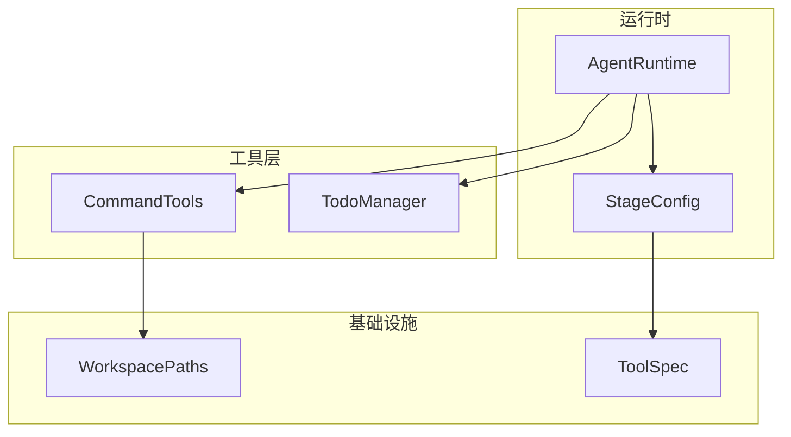
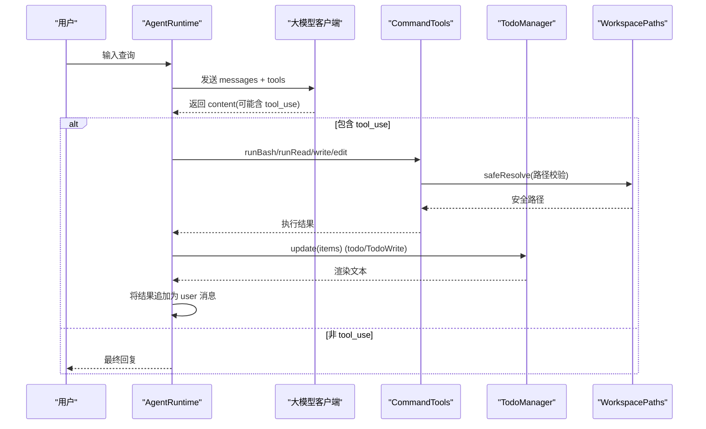
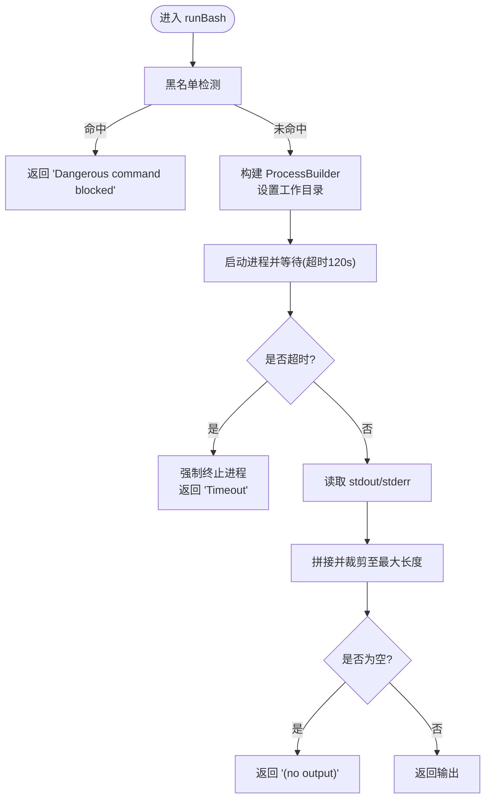
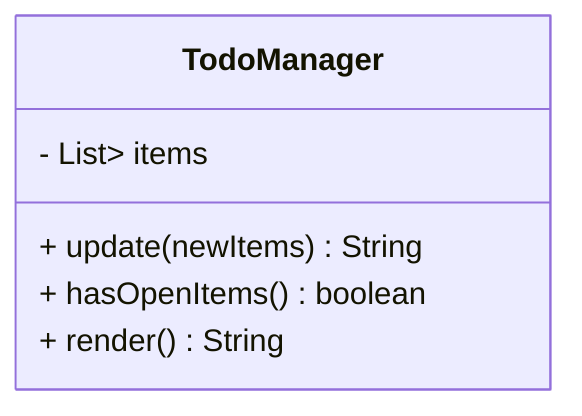
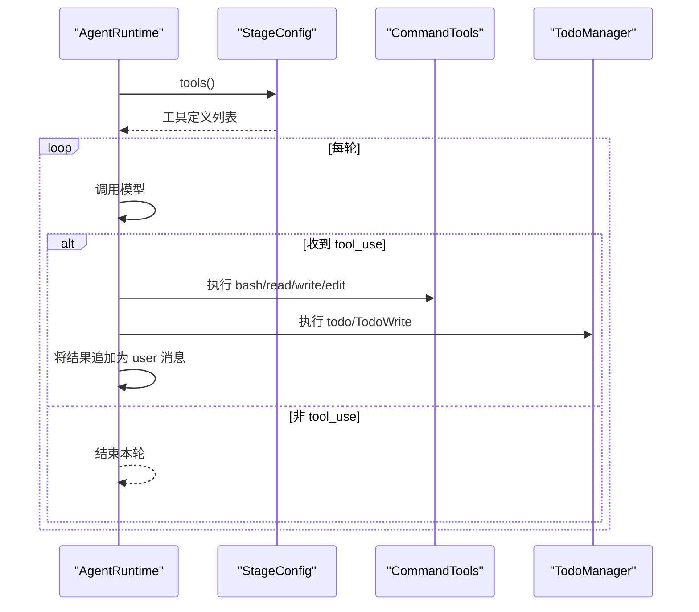
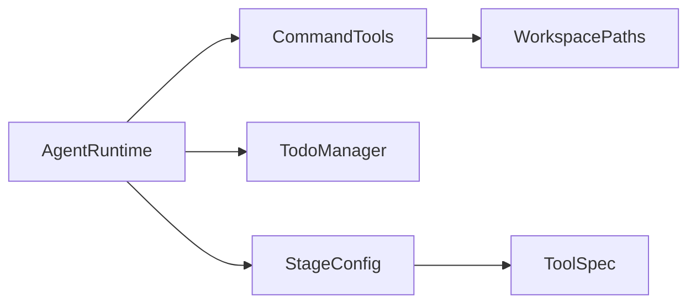

# 工具系统依赖

<cite>
**本文引用的文件**
- [CommandTools.java](file://src/main/java/com/learnclaudecode/tools/CommandTools.java)
- [TodoManager.java](file://src/main/java/com/learnclaudecode/tools/TodoManager.java)
- [AgentRuntime.java](file://src/main/java/com/learnclaudecode/agents/AgentRuntime.java)
- [StageConfig.java](file://src/main/java/com/learnclaudecode/agents/StageConfig.java)
- [WorkspacePaths.java](file://src/main/java/com/learnclaudecode/common/WorkspacePaths.java)
- [ToolSpec.java](file://src/main/java/com/learnclaudecode/model/ToolSpec.java)
- [AppContext.java](file://src/main/java/com/learnclaudecode/agents/AppContext.java)
</cite>

## 目录
1. [简介](#简介)
2. [项目结构](#项目结构)
3. [核心组件](#核心组件)
4. [架构总览](#架构总览)
5. [详细组件分析](#详细组件分析)
6. [依赖关系分析](#依赖关系分析)
7. [性能考虑](#性能考虑)
8. [故障排查指南](#故障排查指南)
9. [结论](#结论)
10. [附录：扩展与示例](#附录：扩展与示例)

## 简介
本文件聚焦于工具系统的依赖与实现，重点解析 CommandTools 与 TodoManager 的机制、调用链路与安全策略，并说明 AgentRuntime 如何统一调度工具。同时给出工具扩展方式、错误处理策略与使用示例路径，帮助读者在不直接阅读源码的情况下理解整体设计。

## 项目结构
工具系统位于 tools 包中，由 AgentRuntime 作为统一入口进行工具分发；StageConfig 负责声明式地暴露不同阶段可用的工具集合；WorkspacePaths 提供工作区安全路径能力；ToolSpec 描述工具元数据（名称、描述、输入 schema）。

图表来源
- [AgentRuntime.java:13-15](file://src/main/java/com/learnclaudecode/agents/AgentRuntime.java#L13-L15)
- [StageConfig.java:56-70](file://src/main/java/com/learnclaudecode/agents/StageConfig.java#L56-L70)
- [CommandTools.java:3-8](file://src/main/java/com/learnclaudecode/tools/CommandTools.java#L3-L8)
- [WorkspacePaths.java:11-49](file://src/main/java/com/learnclaudecode/common/WorkspacePaths.java#L11-L49)
- [ToolSpec.java:5-9](file://src/main/java/com/learnclaudecode/model/ToolSpec.java#L5-L9)

章节来源
- [AgentRuntime.java:13-15](file://src/main/java/com/learnclaudecode/agents/AgentRuntime.java#L13-L15)
- [StageConfig.java:56-70](file://src/main/java/com/learnclaudecode/agents/StageConfig.java#L56-L70)
- [CommandTools.java:3-8](file://src/main/java/com/learnclaudecode/tools/CommandTools.java#L3-L8)
- [WorkspacePaths.java:11-49](file://src/main/java/com/learnclaudecode/common/WorkspacePaths.java#L11-L49)
- [ToolSpec.java:5-9](file://src/main/java/com/learnclaudecode/model/ToolSpec.java#L5-L9)

## 核心组件
- CommandTools：封装文件系统操作（读、写、精确替换）、命令执行（shell）与进程管理（超时、输出截断、危险命令拦截）。
- TodoManager：维护任务列表，支持创建、更新、删除（通过覆盖更新）和状态跟踪（pending/in_progress/completed），并提供渲染与未完成项检查。
- AgentRuntime：统一接收模型的工具调用请求，按工具名路由到具体实现，并将结果回注消息历史。
- StageConfig：集中定义各阶段可用的工具集合与提示词模板，是“能力开关”的配置中心。
- WorkspacePaths：提供安全的路径解析与工作区目录访问，防止路径逃逸。
- ToolSpec：描述工具的名称、描述与输入 schema，对齐外部 API 约定。

章节来源
- [CommandTools.java:13-145](file://src/main/java/com/learnclaudecode/tools/CommandTools.java#L13-L145)
- [TodoManager.java:9-92](file://src/main/java/com/learnclaudecode/tools/TodoManager.java#L9-L92)
- [AgentRuntime.java:131-260](file://src/main/java/com/learnclaudecode/agents/AgentRuntime.java#L131-L260)
- [StageConfig.java:56-70](file://src/main/java/com/learnclaudecode/agents/StageConfig.java#L56-L70)
- [WorkspacePaths.java:36-49](file://src/main/java/com/learnclaudecode/common/WorkspacePaths.java#L36-L49)
- [ToolSpec.java:5-9](file://src/main/java/com/learnclaudecode/model/ToolSpec.java#L5-L9)

## 架构总览
AgentRuntime 在每轮循环中调用大模型，若返回 tool_use，则根据工具名分派到对应实现（如 bash、read_file、write_file、edit_file、todo 等），执行后将结果以 user 消息形式回注，驱动下一轮推理。工具的定义与可用范围由 StageConfig 控制，确保不同教学阶段仅暴露必要能力。

图表来源
- [AgentRuntime.java:131-260](file://src/main/java/com/learnclaudecode/agents/AgentRuntime.java#L131-L260)
- [CommandTools.java:36-144](file://src/main/java/com/learnclaudecode/tools/CommandTools.java#L36-L144)
- [WorkspacePaths.java:36-49](file://src/main/java/com/learnclaudecode/common/WorkspacePaths.java#L36-L49)
- [TodoManager.java:21-55](file://src/main/java/com/learnclaudecode/tools/TodoManager.java#L21-L55)

## 详细组件分析

### CommandTools：文件与命令工具
- 功能要点
  - 命令执行：runBash 基于 ProcessBuilder 启动 shell，限制超时（120s），合并 stdout/stderr，限制输出长度，并对危险命令进行黑名单拦截。
  - 跨平台 shell：shellCommand 根据操作系统选择 powershell 或 bash。
  - 文件操作：runRead 支持行数限制以避免上下文过大；runWrite 自动创建父目录；runEdit 采用精确文本替换，避免误改。
  - 安全边界：所有文件路径通过 WorkspacePaths.safeResolve 进行规范化与越界检查，防止路径逃逸。
- 复杂度与性能
  - 命令执行：I/O 绑定，受限于子进程生命周期与 I/O 大小；输出截断降低内存占用。
  - 文件读写：O(n) 读取/写入，limit 参数可显著减少大文件处理的成本。
- 错误处理
  - 捕获 InterruptedException/IOException，返回结构化错误信息；对空输出返回占位提示；对非法路径抛出异常。
- 调用点
  - AgentRuntime.agentLoop 中根据工具名分派到 runBash/runRead/runWrite/runEdit。

图表来源
- [CommandTools.java:36-65](file://src/main/java/com/learnclaudecode/tools/CommandTools.java#L36-L65)

章节来源
- [CommandTools.java:13-145](file://src/main/java/com/learnclaudecode/tools/CommandTools.java#L13-L145)
- [WorkspacePaths.java:36-49](file://src/main/java/com/learnclaudecode/common/WorkspacePaths.java#L36-L49)
- [AgentRuntime.java:189-193](file://src/main/java/com/learnclaudecode/agents/AgentRuntime.java#L189-L193)

### TodoManager：任务列表管理
- 功能要点
  - 更新：update 接收 items 列表，校验字段（text/content、status、id、activeForm），限制最多 20 条，且同一时间仅允许一个 in_progress 任务。
  - 状态跟踪：hasOpenItems 判断是否存在未完成项；render 生成带标记的文本看板。
  - 兼容多字段风格：同时支持 text 与 content 字段，兼容不同模型输出习惯。
- 复杂度与性能
  - 更新：O(n) 遍历校验与构造新列表；渲染：O(n) 生成文本。
- 错误处理
  - 非法状态、空内容、过多条目均抛出明确异常，便于上层统一处理。
- 调用点
  - AgentRuntime 中对 todo 与 TodoWrite 两个工具名统一路由到 TodoManager.update。

图表来源
- [TodoManager.java:12-92](file://src/main/java/com/learnclaudecode/tools/TodoManager.java#L12-L92)

章节来源
- [TodoManager.java:9-92](file://src/main/java/com/learnclaudecode/tools/TodoManager.java#L9-L92)
- [AgentRuntime.java:194-199](file://src/main/java/com/learnclaudecode/agents/AgentRuntime.java#L194-L199)

### AgentRuntime：工具调度中枢
- 角色与职责
  - 维护消息历史，循环调用模型，解析 tool_use 并分发到具体工具实现。
  - 集成后台任务、压缩、团队通信、工作树等高级能力，但工具层的核心仍围绕 CommandTools 与 TodoManager。
- 工具注册与启用
  - 工具定义由 StageConfig.baseTools 与各阶段方法组合而成；AgentRuntime 不硬编码工具清单，而是通过配置注入。
- 关键流程
  - agentLoop：每轮获取模型响应，若为 tool_use，则执行工具并将结果以 user 消息追加；必要时触发手动压缩。
  - runSubagent：子代理复用相同工具集（可按配置移除写权限），隔离上下文。

图表来源
- [AgentRuntime.java:131-260](file://src/main/java/com/learnclaudecode/agents/AgentRuntime.java#L131-L260)
- [StageConfig.java:56-70](file://src/main/java/com/learnclaudecode/agents/StageConfig.java#L56-L70)

章节来源
- [AgentRuntime.java:131-260](file://src/main/java/com/learnclaudecode/agents/AgentRuntime.java#L131-L260)
- [StageConfig.java:56-70](file://src/main/java/com/learnclaudecode/agents/StageConfig.java#L56-L70)

### WorkspacePaths：安全路径与目录访问
- 安全机制
  - safeResolve 将相对路径在工作区内规范化，并拒绝任何试图逃逸工作区的尝试。
- 常用目录
  - tasksDir、teamDir、inboxDir、skillsDir、transcriptDir、worktreesDir 等，用于组织运行期数据。
- 与工具的关系
  - CommandTools 的文件操作全部经由 safeResolve，确保只在工作区内读写。

章节来源
- [WorkspacePaths.java:11-149](file://src/main/java/com/learnclaudecode/common/WorkspacePaths.java#L11-L149)
- [CommandTools.java:87-144](file://src/main/java/com/learnclaudecode/tools/CommandTools.java#L87-L144)

### ToolSpec：工具元数据
- 作用
  - 描述工具名称、描述与输入 schema，对齐外部 API 约定，便于模型理解工具用法。
- 使用位置
  - StageConfig.tool 方法构造工具定义，供 AgentRuntime 传递给模型。

章节来源
- [ToolSpec.java:5-9](file://src/main/java/com/learnclaudecode/model/ToolSpec.java#L5-L9)
- [StageConfig.java:277-284](file://src/main/java/com/learnclaudecode/agents/StageConfig.java#L277-L284)

## 依赖关系分析
- 松耦合设计
  - AgentRuntime 通过构造函数注入 CommandTools、TodoManager 等组件，解耦了调度与实现。
  - StageConfig 集中管理工具定义，使“能力开关”与“执行逻辑”分离。
- 直接依赖
  - AgentRuntime 依赖 AnthropicClient、WorkspacePaths、SkillLoader、TaskManager、BackgroundManager、MessageBus、TeammateManager、WorktreeManager 等。
  - CommandTools 依赖 WorkspacePaths。
  - TodoManager 依赖模型中的 TodoItem（记录类型）与 Map 结构。
- 潜在风险
  - 工具分发 switch 分支较多，新增工具需同步更新 StageConfig 与 AgentRuntime 的分发逻辑。
  - 命令执行存在安全风险，需持续完善黑名单与沙箱策略。

图表来源
- [AgentRuntime.java:41-51](file://src/main/java/com/learnclaudecode/agents/AgentRuntime.java#L41-L51)
- [CommandTools.java:3-8](file://src/main/java/com/learnclaudecode/tools/CommandTools.java#L3-L8)
- [StageConfig.java:56-70](file://src/main/java/com/learnclaudecode/agents/StageConfig.java#L56-L70)

章节来源
- [AgentRuntime.java:41-51](file://src/main/java/com/learnclaudecode/agents/AgentRuntime.java#L41-L51)
- [CommandTools.java:3-8](file://src/main/java/com/learnclaudecode/tools/CommandTools.java#L3-L8)
- [StageConfig.java:56-70](file://src/main/java/com/learnclaudecode/agents/StageConfig.java#L56-L70)

## 性能考虑
- 命令执行
  - 超时保护（120s）避免长时间阻塞；输出截断降低内存压力。
- 文件操作
  - read 支持 limit 参数，避免一次性加载超大文件；write/edit 尽量最小化 IO 次数。
- 任务管理
  - TodoManager 限制最大条目数（20），防止列表膨胀影响渲染与传输。
- 上下文压缩
  - AgentRuntime 支持自动/手动压缩，减少长对话带来的上下文开销。

[本节为通用指导，不直接分析具体文件]

## 故障排查指南
- 命令执行失败
  - 检查是否命中危险命令黑名单；确认工作目录是否正确；查看 stderr 输出。
  - 参考路径：[CommandTools.runBash:36-65](file://src/main/java/com/learnclaudecode/tools/CommandTools.java#L36-L65)
- 文件读写异常
  - 确认路径是否通过 safeResolve；检查父目录是否存在；关注 IOException 详情。
  - 参考路径：[CommandTools.runRead/runWrite/runEdit:87-144](file://src/main/java/com/learnclaudecode/tools/CommandTools.java#L87-L144)、[WorkspacePaths.safeResolve:36-49](file://src/main/java/com/learnclaudecode/common/WorkspacePaths.java#L36-L49)
- Todo 更新报错
  - 检查 status 是否合法、是否有重复 in_progress、是否超过 20 条、text/content 是否为空。
  - 参考路径：[TodoManager.update:21-55](file://src/main/java/com/learnclaudecode/tools/TodoManager.java#L21-L55)
- 工具未生效
  - 确认 StageConfig.tools 是否包含该工具；检查 AgentRuntime 分发分支是否匹配。
  - 参考路径：[StageConfig.baseTools:56-70](file://src/main/java/com/learnclaudecode/agents/StageConfig.java#L56-L70)、[AgentRuntime.agentLoop 分发:189-233](file://src/main/java/com/learnclaudecode/agents/AgentRuntime.java#L189-L233)

章节来源
- [CommandTools.java:36-144](file://src/main/java/com/learnclaudecode/tools/CommandTools.java#L36-L144)
- [WorkspacePaths.java:36-49](file://src/main/java/com/learnclaudecode/common/WorkspacePaths.java#L36-L49)
- [TodoManager.java:21-55](file://src/main/java/com/learnclaudecode/tools/TodoManager.java#L21-L55)
- [StageConfig.java:56-70](file://src/main/java/com/learnclaudecode/agents/StageConfig.java#L56-L70)
- [AgentRuntime.java:189-233](file://src/main/java/com/learnclaudecode/agents/AgentRuntime.java#L189-L233)

## 结论
工具系统以 AgentRuntime 为核心，StageConfig 为能力编排器，CommandTools 与 TodoManager 分别承担“手脚”与“计划板”的职责。通过 WorkspacePaths 的安全路径约束与 StageConfig 的工具白名单，系统在灵活性与安全性之间取得平衡。未来可通过扩展 StageConfig 与 AgentRuntime 分发逻辑，平滑添加新工具。

[本节为总结性内容，不直接分析具体文件]

## 附录：扩展与示例

### 如何添加新工具函数
- 步骤一：在 StageConfig 中定义工具元数据（name、description、input_schema），可使用 baseTools 或阶段方法组合。
  - 参考路径：[StageConfig.tool:277-284](file://src/main/java/com/learnclaudecode/agents/StageConfig.java#L277-L284)
- 步骤二：在 AgentRuntime.agentLoop 的工具分发 switch 中添加新工具名的分支，映射到具体实现。
  - 参考路径：[AgentRuntime.agentLoop 分发:189-233](file://src/main/java/com/learnclaudecode/agents/AgentRuntime.java#L189-L233)
- 步骤三：如需文件操作，务必通过 WorkspacePaths.safeResolve 保证路径安全。
  - 参考路径：[WorkspacePaths.safeResolve:36-49](file://src/main/java/com/learnclaudecode/common/WorkspacePaths.java#L36-L49)

### 工具注册与使用示例（路径引用）
- 基础工具定义（bash/read_file/write_file/edit_file）
  - 参考路径：[StageConfig.baseTools:56-70](file://src/main/java/com/learnclaudecode/agents/StageConfig.java#L56-L70)
- 工具分发与执行（以 bash、read_file、write_file、edit_file、todo 为例）
  - 参考路径：[AgentRuntime.agentLoop 分发:189-199](file://src/main/java/com/learnclaudecode/agents/AgentRuntime.java#L189-L199)
- 命令执行与文件操作实现
  - 参考路径：[CommandTools.runBash:36-65](file://src/main/java/com/learnclaudecode/tools/CommandTools.java#L36-L65)、[CommandTools.runRead:87-101](file://src/main/java/com/learnclaudecode/tools/CommandTools.java#L87-L101)、[CommandTools.runWrite:110-121](file://src/main/java/com/learnclaudecode/tools/CommandTools.java#L110-L121)、[CommandTools.runEdit:131-144](file://src/main/java/com/learnclaudecode/tools/CommandTools.java#L131-L144)
- Todo 更新与渲染
  - 参考路径：[TodoManager.update:21-55](file://src/main/java/com/learnclaudecode/tools/TodoManager.java#L21-L55)、[TodoManager.render:71-91](file://src/main/java/com/learnclaudecode/tools/TodoManager.java#L71-L91)

### 安全与错误处理策略
- 命令执行安全
  - 黑名单拦截危险命令；超时保护；工作目录限定；输出长度限制。
  - 参考路径：[CommandTools.runBash:36-65](file://src/main/java/com/learnclaudecode/tools/CommandTools.java#L36-L65)
- 文件安全
  - 所有路径经 safeResolve 校验，防止路径逃逸。
  - 参考路径：[WorkspacePaths.safeResolve:36-49](file://src/main/java/com/learnclaudecode/common/WorkspacePaths.java#L36-L49)
- 错误反馈
  - 工具统一返回字符串结果，包含错误信息；AgentRuntime 将结果追加为 user 消息，便于模型感知错误并调整后续行为。
  - 参考路径：[AgentRuntime.agentLoop 结果回注:236-252](file://src/main/java/com/learnclaudecode/agents/AgentRuntime.java#L236-L252)

### 装配与入口
- AppContext 将 AgentRuntime 与其他服务装配在一起，对外暴露统一的 runtime。
  - 参考路径：[AppContext 装配:55-69](file://src/main/java/com/learnclaudecode/agents/AppContext.java#L55-L69)

章节来源
- [StageConfig.java:56-70](file://src/main/java/com/learnclaudecode/agents/StageConfig.java#L56-L70)
- [AgentRuntime.java:189-252](file://src/main/java/com/learnclaudecode/agents/AgentRuntime.java#L189-L252)
- [CommandTools.java:36-144](file://src/main/java/com/learnclaudecode/tools/CommandTools.java#L36-L144)
- [TodoManager.java:21-91](file://src/main/java/com/learnclaudecode/tools/TodoManager.java#L21-L91)
- [WorkspacePaths.java:36-49](file://src/main/java/com/learnclaudecode/common/WorkspacePaths.java#L36-L49)
- [AppContext.java:55-69](file://src/main/java/com/learnclaudecode/agents/AppContext.java#L55-L69)