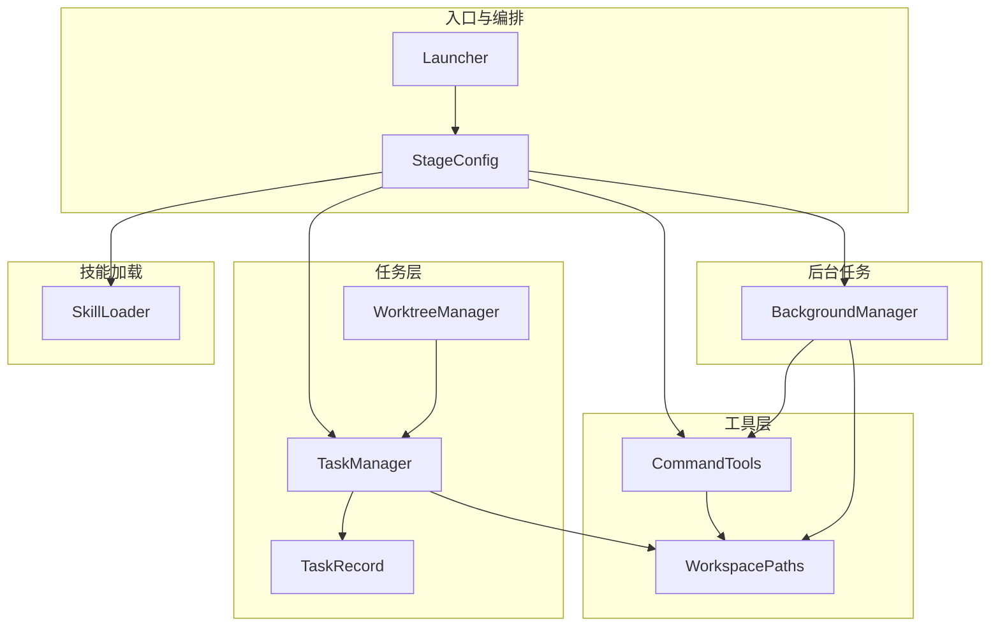
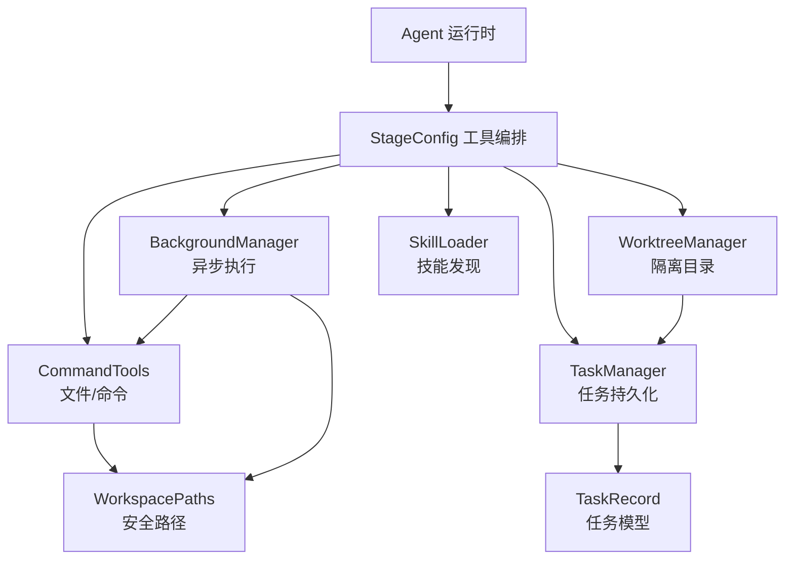
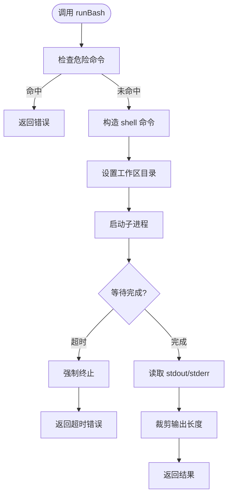
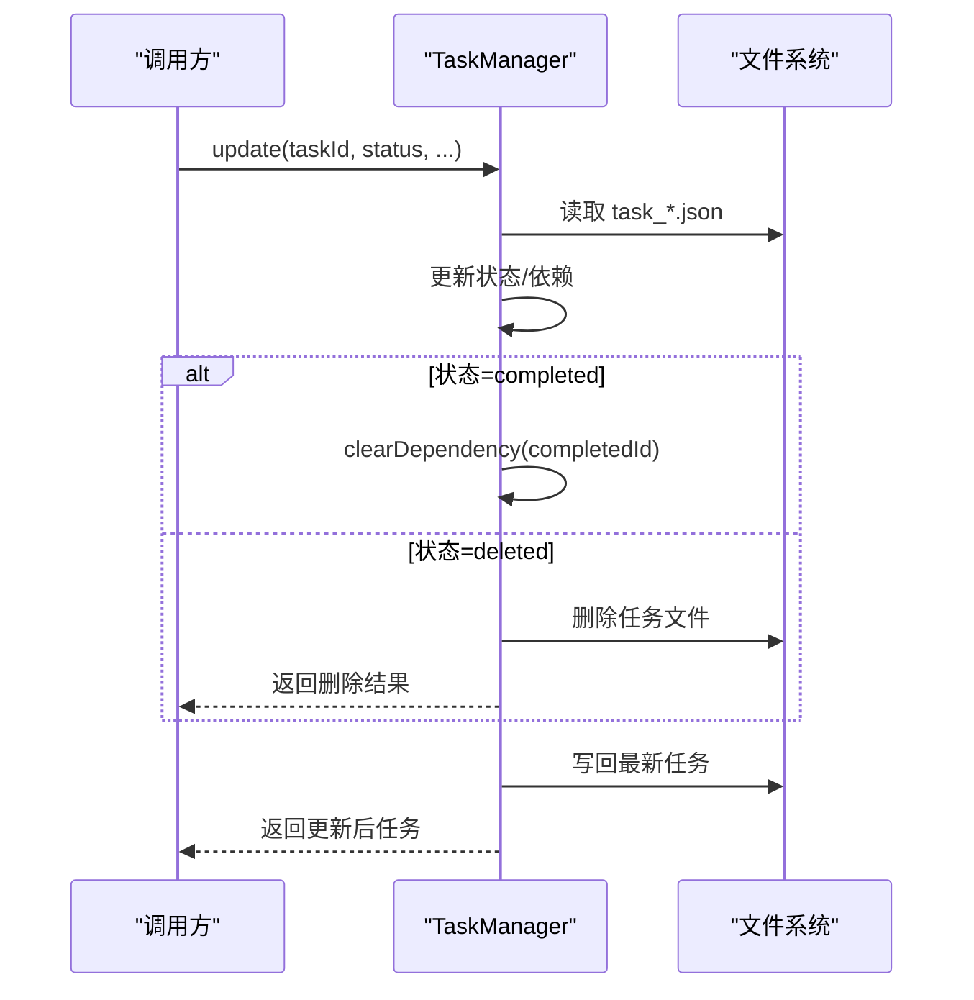
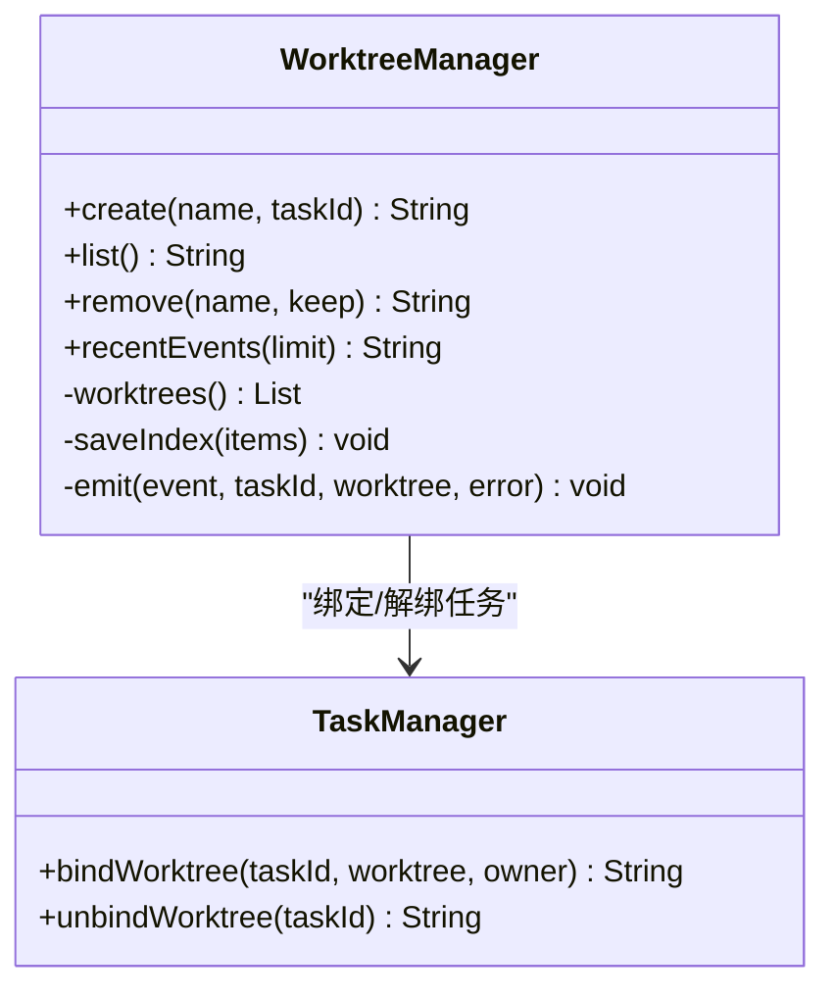
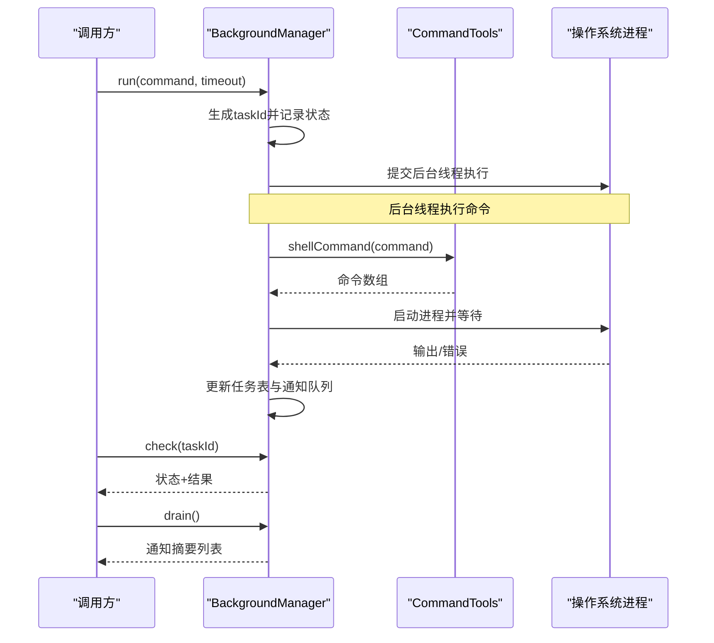
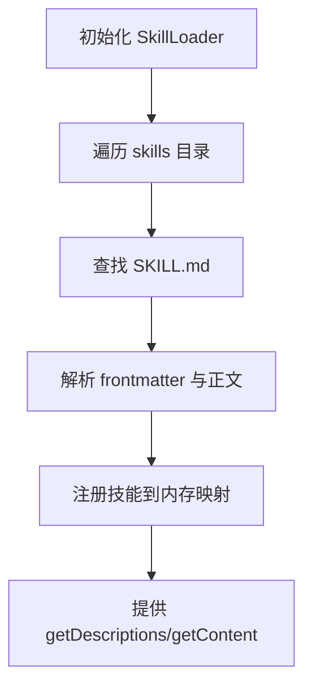
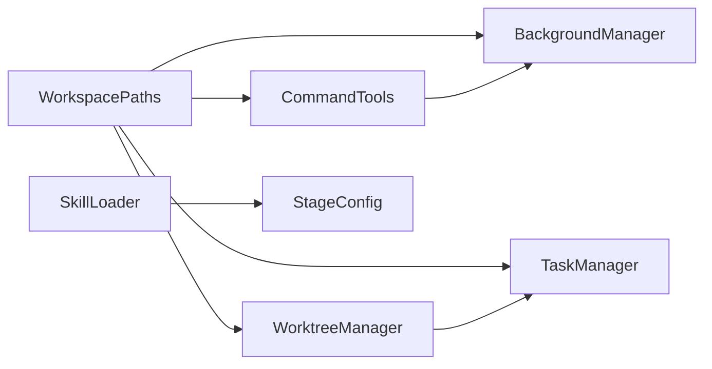

# 服务层关系

<cite>
**本文引用的文件**
- [CommandTools.java](file://src/main/java/com/learnclaudecode/tools/CommandTools.java)
- [TaskManager.java](file://src/main/java/com/learnclaudecode/tasks/TaskManager.java)
- [WorktreeManager.java](file://src/main/java/com/learnclaudecode/tasks/WorktreeManager.java)
- [BackgroundManager.java](file://src/main/java/com/learnclaudecode/background/BackgroundManager.java)
- [SkillLoader.java](file://src/main/java/com/learnclaudecode/skills/SkillLoader.java)
- [WorkspacePaths.java](file://src/main/java/com/learnclaudecode/common/WorkspacePaths.java)
- [TaskRecord.java](file://src/main/java/com/learnclaudecode/model/TaskRecord.java)
- [StageConfig.java](file://src/main/java/com/learnclaudecode/agents/StageConfig.java)
- [Launcher.java](file://src/main/java/com/learnclaudecode/agents/Launcher.java)
- [S07TaskSystem.java](file://src/main/java/com/learnclaudecode/agents/S07TaskSystem.java)
- [S08BackgroundTasks.java](file://src/main/java/com/learnclaudecode/agents/S08BackgroundTasks.java)
- [S05SkillLoading.java](file://src/main/java/com/learnclaudecode/agents/S05SkillLoading.java)
- [SKILL.md（示例技能）](file://skills/agent-builder/SKILL.md)
</cite>

## 目录
1. [简介](#简介)
2. [项目结构](#项目结构)
3. [核心组件](#核心组件)
4. [架构总览](#架构总览)
5. [详细组件分析](#详细组件分析)
6. [依赖关系分析](#依赖关系分析)
7. [性能与可扩展性](#性能与可扩展性)
8. [故障排查指南](#故障排查指南)
9. [结论](#结论)
10. [附录：使用示例](#附录使用示例)

## 简介
本文件聚焦于服务层关系，围绕工具系统、任务管理、后台任务和技能加载四大组件，系统性梳理其职责边界、接口设计、数据流与协作方式。重点说明：
- CommandTools 如何为其他组件提供安全的文件操作与命令执行能力；
- TaskManager 如何管理任务生命周期，并与 WorktreeManager 协同实现任务隔离；
- BackgroundManager 如何实现异步任务处理与通知机制；
- SkillLoader 如何实现动态技能发现与注入；
- 各组件如何通过松耦合设计与统一路径抽象实现解耦与扩展。

## 项目结构
本项目采用按领域分层的组织方式：
- tools：基础工具（文件读写、命令执行）
- tasks：任务管理与工作树隔离
- background：后台任务调度与通知
- skills：技能发现与加载
- common：公共能力（路径安全、JSON 工具等）
- model：领域模型（如任务记录）
- agents：阶段配置与启动器，编排不同能力组合

图表来源
- [Launcher.java:18-26](file://src/main/java/com/learnclaudecode/agents/Launcher.java#L18-L26)
- [StageConfig.java:56-69](file://src/main/java/com/learnclaudecode/agents/StageConfig.java#L56-L69)
- [CommandTools.java:16-28](file://src/main/java/com/learnclaudecode/tools/CommandTools.java#L16-L28)
- [TaskManager.java:27-42](file://src/main/java/com/learnclaudecode/tasks/TaskManager.java#L27-L42)
- [WorktreeManager.java:24-58](file://src/main/java/com/learnclaudecode/tasks/WorktreeManager.java#L24-L58)
- [BackgroundManager.java:20-34](file://src/main/java/com/learnclaudecode/background/BackgroundManager.java#L20-L34)
- [SkillLoader.java:18-38](file://src/main/java/com/learnclaudecode/skills/SkillLoader.java#L18-L38)
- [WorkspacePaths.java:11-49](file://src/main/java/com/learnclaudecode/common/WorkspacePaths.java#L11-L49)
- [TaskRecord.java:9-61](file://src/main/java/com/learnclaudecode/model/TaskRecord.java#L9-L61)

章节来源
- [Launcher.java:18-26](file://src/main/java/com/learnclaudecode/agents/Launcher.java#L18-L26)
- [StageConfig.java:56-69](file://src/main/java/com/learnclaudecode/agents/StageConfig.java#L56-L69)

## 核心组件
- CommandTools：封装工作区内的文件读取、写入、编辑与 shell 命令执行，提供安全路径校验与危险命令拦截。
- TaskManager：基于文件的任务板，支持创建、查询、更新、认领、依赖管理与 worktree 绑定。
- WorktreeManager：维护 .worktrees 下的索引与事件日志，负责创建/移除独立工作目录，并同步任务绑定状态。
- BackgroundManager：以单线程池执行后台命令，维护任务状态表与通知队列，提供结果轮询与摘要通知。
- SkillLoader：扫描 skills 目录下的 SKILL.md，解析 frontmatter，提供技能描述与内容检索。
- WorkspacePaths：集中管理工作区路径与安全解析，避免路径逃逸。
- StageConfig：编排不同阶段的工具集与提示词，驱动 Agent 运行时逐步解锁能力。

章节来源
- [CommandTools.java:16-145](file://src/main/java/com/learnclaudecode/tools/CommandTools.java#L16-L145)
- [TaskManager.java:27-337](file://src/main/java/com/learnclaudecode/tasks/TaskManager.java#L27-L337)
- [WorktreeManager.java:24-244](file://src/main/java/com/learnclaudecode/tasks/WorktreeManager.java#L24-L244)
- [BackgroundManager.java:20-159](file://src/main/java/com/learnclaudecode/background/BackgroundManager.java#L20-L159)
- [SkillLoader.java:18-105](file://src/main/java/com/learnclaudecode/skills/SkillLoader.java#L18-L105)
- [WorkspacePaths.java:11-148](file://src/main/java/com/learnclaudecode/common/WorkspacePaths.java#L11-L148)
- [StageConfig.java:56-301](file://src/main/java/com/learnclaudecode/agents/StageConfig.java#L56-L301)

## 架构总览
下图展示了服务层之间的依赖与交互关系：Agent 通过 StageConfig 暴露的工具调用底层服务；CommandTools 提供文件与命令能力；TaskManager 与 WorktreeManager 协作完成任务与隔离；BackgroundManager 在后台执行长耗时任务并通过通知队列回传结果；SkillLoader 动态注入技能知识到系统提示中。

图表来源
- [StageConfig.java:56-69](file://src/main/java/com/learnclaudecode/agents/StageConfig.java#L56-L69)
- [CommandTools.java:16-28](file://src/main/java/com/learnclaudecode/tools/CommandTools.java#L16-L28)
- [TaskManager.java:27-42](file://src/main/java/com/learnclaudecode/tasks/TaskManager.java#L27-L42)
- [WorktreeManager.java:24-58](file://src/main/java/com/learnclaudecode/tasks/WorktreeManager.java#L24-L58)
- [BackgroundManager.java:20-34](file://src/main/java/com/learnclaudecode/background/BackgroundManager.java#L20-L34)
- [SkillLoader.java:18-38](file://src/main/java/com/learnclaudecode/skills/SkillLoader.java#L18-L38)
- [WorkspacePaths.java:11-49](file://src/main/java/com/learnclaudecode/common/WorkspacePaths.java#L11-L49)
- [TaskRecord.java:9-61](file://src/main/java/com/learnclaudecode/model/TaskRecord.java#L9-L61)

## 详细组件分析

### CommandTools：文件与命令执行能力
- 职责：在工作区内安全地执行 shell 命令、读取/写入/编辑文件；限制危险命令与超时保护。
- 关键接口：
  - runBash(command)：执行命令，返回输出或错误信息
  - shellCommand(command)：根据操作系统构造命令数组
  - runRead(relativePath, limit)：读取文件内容，支持行数限制
  - runWrite(relativePath, content)：写入文件内容
  - runEdit(relativePath, oldText, newText)：精确文本替换
- 安全与健壮性：
  - 危险命令黑名单拦截
  - 超时强制终止进程
  - 通过 WorkspacePaths.safeResolve 防止路径逃逸
- 复杂度：I/O 为主，时间复杂度取决于文件大小与命令执行时间；空间复杂度受输出长度限制。

图表来源
- [CommandTools.java:36-78](file://src/main/java/com/learnclaudecode/tools/CommandTools.java#L36-L78)
- [CommandTools.java:87-145](file://src/main/java/com/learnclaudecode/tools/CommandTools.java#L87-L145)
- [WorkspacePaths.java:42-49](file://src/main/java/com/learnclaudecode/common/WorkspacePaths.java#L42-L49)

章节来源
- [CommandTools.java:16-145](file://src/main/java/com/learnclaudecode/tools/CommandTools.java#L16-L145)
- [WorkspacePaths.java:42-49](file://src/main/java/com/learnclaudecode/common/WorkspacePaths.java#L42-L49)

### TaskManager：任务生命周期与依赖管理
- 职责：创建、查询、更新、认领任务；维护任务依赖（blockedBy/blocks）；与 WorktreeManager 协作绑定/解除 worktree。
- 关键接口：
  - create(subject, description)：创建新任务
  - get(taskId)：获取任务详情
  - update(taskId, status, addBlockedBy, addBlocks)：更新状态与依赖
  - listAll()：列出看板视图
  - claim(taskId, owner)：认领任务
  - scanUnclaimed()：扫描可立即认领的任务
  - bindWorktree(taskId, worktree, owner)：绑定 worktree
  - unbindWorktree(taskId)：解除绑定
- 并发与一致性：
  - 方法级 synchronized 保证同一时刻仅一个线程修改任务
  - 任务完成后自动清理其他任务的 blockedBy 依赖
- 持久化：每个任务对应一个 JSON 文件，位于 .tasks 目录。

图表来源
- [TaskManager.java:84-133](file://src/main/java/com/learnclaudecode/tasks/TaskManager.java#L84-L133)
- [TaskManager.java:276-322](file://src/main/java/com/learnclaudecode/tasks/TaskManager.java#L276-L322)

章节来源
- [TaskManager.java:27-337](file://src/main/java/com/learnclaudecode/tasks/TaskManager.java#L27-L337)
- [TaskRecord.java:9-61](file://src/main/java/com/learnclaudecode/model/TaskRecord.java#L9-L61)

### WorktreeManager：任务隔离与工作树管理
- 职责：在 .worktrees 下创建/移除独立目录，维护 index.json 与 events.jsonl，同步任务绑定状态。
- 关键接口：
  - create(name, taskId)：创建工作树并绑定任务
  - list()：列出所有工作树
  - remove(name, keep)：移除工作树（可选保留文件）
  - recentEvents(limit)：读取最近的生命周期事件
- 与 TaskManager 的协作：
  - 创建时调用 TaskManager.bindWorktree
  - 移除时调用 TaskManager.unbindWorktree
- 事件追踪：每次变更追加一条事件到 events.jsonl，便于审计与排障。

图表来源
- [WorktreeManager.java:71-99](file://src/main/java/com/learnclaudecode/tasks/WorktreeManager.java#L71-L99)
- [WorktreeManager.java:122-166](file://src/main/java/com/learnclaudecode/tasks/WorktreeManager.java#L122-L166)
- [WorktreeManager.java:175-184](file://src/main/java/com/learnclaudecode/tasks/WorktreeManager.java#L175-L184)
- [WorktreeManager.java:194-244](file://src/main/java/com/learnclaudecode/tasks/WorktreeManager.java#L194-L244)
- [TaskManager.java:215-249](file://src/main/java/com/learnclaudecode/tasks/TaskManager.java#L215-L249)

章节来源
- [WorktreeManager.java:24-244](file://src/main/java/com/learnclaudecode/tasks/WorktreeManager.java#L24-L244)
- [TaskManager.java:215-249](file://src/main/java/com/learnclaudecode/tasks/TaskManager.java#L215-L249)

### BackgroundManager：异步任务处理与通知
- 职责：以独立线程执行后台命令，维护任务状态表与通知队列，提供查询与结果拉取。
- 关键接口：
  - run(command, timeoutSeconds)：启动后台任务
  - check(taskId)：查询任务状态与结果
  - drain()：取出累计的通知摘要
- 异步流程：
  - 启动时分配唯一 taskId，放入内存任务表
  - 提交到单线程执行器执行命令，超时则强制终止
  - 完成后更新任务表并向通知队列投递摘要
- 与 CommandTools 的协作：复用 shellCommand 构造命令，确保跨平台一致。

图表来源
- [BackgroundManager.java:43-53](file://src/main/java/com/learnclaudecode/background/BackgroundManager.java#L43-L53)
- [BackgroundManager.java:68-123](file://src/main/java/com/learnclaudecode/background/BackgroundManager.java#L68-L123)
- [BackgroundManager.java:131-158](file://src/main/java/com/learnclaudecode/background/BackgroundManager.java#L131-L158)
- [CommandTools.java:73-78](file://src/main/java/com/learnclaudecode/tools/CommandTools.java#L73-L78)

章节来源
- [BackgroundManager.java:20-159](file://src/main/java/com/learnclaudecode/background/BackgroundManager.java#L20-L159)
- [CommandTools.java:73-78](file://src/main/java/com/learnclaudecode/tools/CommandTools.java#L73-L78)

### SkillLoader：动态技能发现与注入
- 职责：扫描 skills 目录下的 SKILL.md，解析 frontmatter，提供技能描述与内容。
- 关键接口：
  - getDescriptions()：返回可用技能的简要说明
  - getContent(name)：返回指定技能的完整内容
- 发现流程：
  - 初始化时遍历 skills 目录，收集所有 SKILL.md
  - 解析 frontmatter 提取 name/description 等元信息
  - 将技能名映射到包含 meta/body/path 的结构
- 与 StageConfig 的协作：systemPrompt 中将 ${SKILLS} 占位符替换为技能描述，使 Agent 在运行时感知可用技能。

图表来源
- [SkillLoader.java:26-38](file://src/main/java/com/learnclaudecode/skills/SkillLoader.java#L26-L38)
- [SkillLoader.java:45-72](file://src/main/java/com/learnclaudecode/skills/SkillLoader.java#L45-L72)
- [SkillLoader.java:79-105](file://src/main/java/com/learnclaudecode/skills/SkillLoader.java#L79-L105)
- [StageConfig.java:44-49](file://src/main/java/com/learnclaudecode/agents/StageConfig.java#L44-L49)

章节来源
- [SkillLoader.java:18-105](file://src/main/java/com/learnclaudecode/skills/SkillLoader.java#L18-L105)
- [StageConfig.java:44-49](file://src/main/java/com/learnclaudecode/agents/StageConfig.java#L44-L49)

## 依赖关系分析
- 低耦合设计：
  - 所有组件通过 WorkspacePaths 访问路径，避免硬编码路径与权限问题
  - CommandTools 作为通用能力被 BackgroundManager 复用
  - WorktreeManager 与 TaskManager 通过明确接口协作，不直接共享内部状态
- 服务注册与发现模式：
  - 技能发现：SkillLoader 在初始化时扫描并注册技能到内存映射，供上层按需加载
  - 工具注册：StageConfig 聚合各阶段工具定义，形成“能力开关”式的注册机制
- 潜在循环依赖：当前无循环依赖；TaskManager 与 WorktreeManager 通过单向调用保持清晰边界

图表来源
- [WorkspacePaths.java:11-148](file://src/main/java/com/learnclaudecode/common/WorkspacePaths.java#L11-L148)
- [CommandTools.java:16-28](file://src/main/java/com/learnclaudecode/tools/CommandTools.java#L16-L28)
- [TaskManager.java:27-42](file://src/main/java/com/learnclaudecode/tasks/TaskManager.java#L27-L42)
- [WorktreeManager.java:24-58](file://src/main/java/com/learnclaudecode/tasks/WorktreeManager.java#L24-L58)
- [BackgroundManager.java:20-34](file://src/main/java/com/learnclaudecode/background/BackgroundManager.java#L20-L34)
- [SkillLoader.java:18-38](file://src/main/java/com/learnclaudecode/skills/SkillLoader.java#L18-L38)
- [StageConfig.java:44-49](file://src/main/java/com/learnclaudecode/agents/StageConfig.java#L44-L49)

章节来源
- [WorkspacePaths.java:11-148](file://src/main/java/com/learnclaudecode/common/WorkspacePaths.java#L11-L148)
- [StageConfig.java:56-301](file://src/main/java/com/learnclaudecode/agents/StageConfig.java#L56-L301)

## 性能与可扩展性
- 性能特征：
  - CommandTools：I/O 密集，输出截断避免上下文膨胀；超时控制防止长时间阻塞
  - TaskManager：文件读写开销随任务数量线性增长；适合中小规模任务场景
  - BackgroundManager：单线程执行器避免资源竞争；通知队列削峰填谷
  - SkillLoader：初始化时全量扫描，后续查询为 O(1) 内存访问
- 优化建议：
  - 对大文件读取增加分页与增量读取策略
  - 任务索引可引入轻量缓存或排序索引以提升 listAll 性能
  - 后台任务可引入线程池与优先级队列提升吞吐
  - 技能加载可支持热重载与增量扫描
- 扩展点：
  - 新增工具：在 StageConfig.baseTools 中声明工具定义，并在 Agent 运行时路由到具体实现
  - 新增技能：在 skills 目录下添加 SKILL.md，无需修改代码即可被发现
  - 任务状态机：可在 TaskManager.update 中扩展更多状态转换规则
  - 工作树策略：可在 WorktreeManager 中扩展分支/标签/合并策略

[本节为通用指导，不直接分析具体文件]

## 故障排查指南
- 命令执行失败：
  - 检查危险命令是否被拦截
  - 确认工作区路径是否正确且存在
  - 查看超时与异常堆栈
- 任务状态不一致：
  - 检查是否有并发更新导致覆盖
  - 验证依赖清理逻辑是否生效
  - 查看 .tasks 目录中的 JSON 文件完整性
- 后台任务无输出：
  - 确认命令是否产生标准输出或错误输出
  - 检查通知队列是否被消费
  - 查看任务状态是否为 completed/error/timeout
- 技能未加载：
  - 确认 skills 目录是否存在且包含 SKILL.md
  - 检查 frontmatter 格式是否正确
  - 查看 systemPrompt 中 ${SKILLS} 是否展开

章节来源
- [CommandTools.java:36-78](file://src/main/java/com/learnclaudecode/tools/CommandTools.java#L36-L78)
- [TaskManager.java:84-133](file://src/main/java/com/learnclaudecode/tasks/TaskManager.java#L84-L133)
- [BackgroundManager.java:68-123](file://src/main/java/com/learnclaudecode/background/BackgroundManager.java#L68-L123)
- [SkillLoader.java:45-72](file://src/main/java/com/learnclaudecode/skills/SkillLoader.java#L45-L72)

## 结论
本项目通过清晰的职责划分与松耦合设计，实现了工具、任务、后台任务与技能加载四大服务的有效协作。CommandTools 提供统一的安全文件与命令能力；TaskManager 与 WorktreeManager 共同支撑任务生命周期与隔离；BackgroundManager 提供异步执行与通知机制；SkillLoader 实现动态技能发现与注入。StageConfig 作为编排中枢，将能力以“开关”形式暴露给 Agent 运行时，便于教学与演进。整体架构具备良好的可扩展性与可维护性，适合在多阶段演示与真实场景中持续迭代。

[本节为总结性内容，不直接分析具体文件]

## 附录：使用示例
以下示例展示各服务间的协作方式（以步骤描述为主，不包含具体代码）：

- 示例一：使用工具进行文件操作与命令执行
  - 通过 StageConfig 暴露 bash/read_file/write_file/edit_file 工具
  - Agent 调用 CommandTools.runBash 执行构建命令，再调用 read_file 查看输出
  - 使用 runWrite/runEdit 修改配置文件并重新运行

- 示例二：任务系统与隔离协作
  - 使用 TaskManager.create 创建多个任务，并通过 update 设置依赖关系
  - 使用 WorktreeManager.create 为关键任务创建独立工作树，并绑定任务
  - 任务完成后，TaskManager 自动清理依赖，WorktreeManager 记录事件

- 示例三：后台任务与通知
  - 使用 BackgroundManager.run 启动长耗时命令，返回 taskId
  - 主循环周期性调用 check 与 drain 获取状态与摘要
  - 若超时或异常，BackgroundManager 更新状态为 timeout/error

- 示例四：动态技能加载
  - 在 skills 目录下新增 SKILL.md，包含 name/description
  - 初始化 SkillLoader，调用 getDescriptions 获取可用技能列表
  - 通过 load_skill 工具按需加载技能内容，注入到 systemPrompt

章节来源
- [StageConfig.java:56-69](file://src/main/java/com/learnclaudecode/agents/StageConfig.java#L56-L69)
- [CommandTools.java:36-145](file://src/main/java/com/learnclaudecode/tools/CommandTools.java#L36-L145)
- [TaskManager.java:51-133](file://src/main/java/com/learnclaudecode/tasks/TaskManager.java#L51-L133)
- [WorktreeManager.java:71-99](file://src/main/java/com/learnclaudecode/tasks/WorktreeManager.java#L71-L99)
- [BackgroundManager.java:43-53](file://src/main/java/com/learnclaudecode/background/BackgroundManager.java#L43-L53)
- [SkillLoader.java:26-38](file://src/main/java/com/learnclaudecode/skills/SkillLoader.java#L26-L38)
- [SKILL.md（示例技能）:1-130](file://skills/agent-builder/SKILL.md#L1-L130)