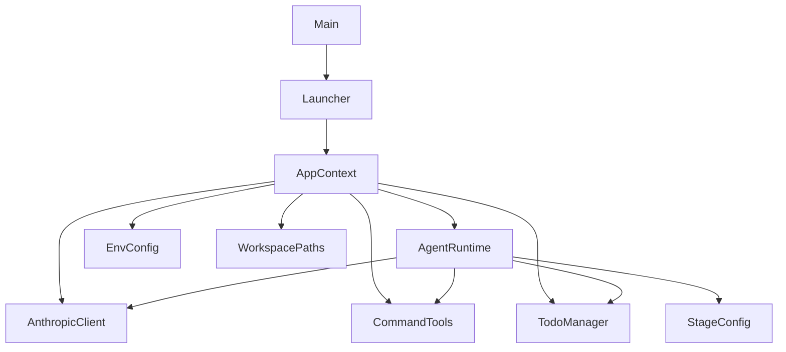
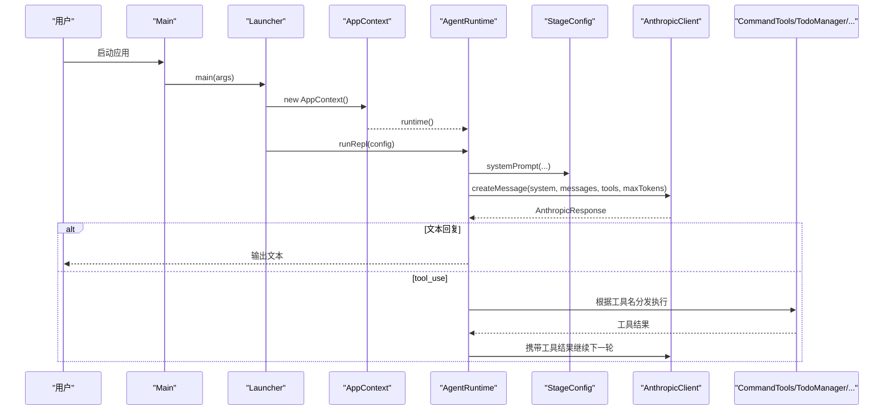
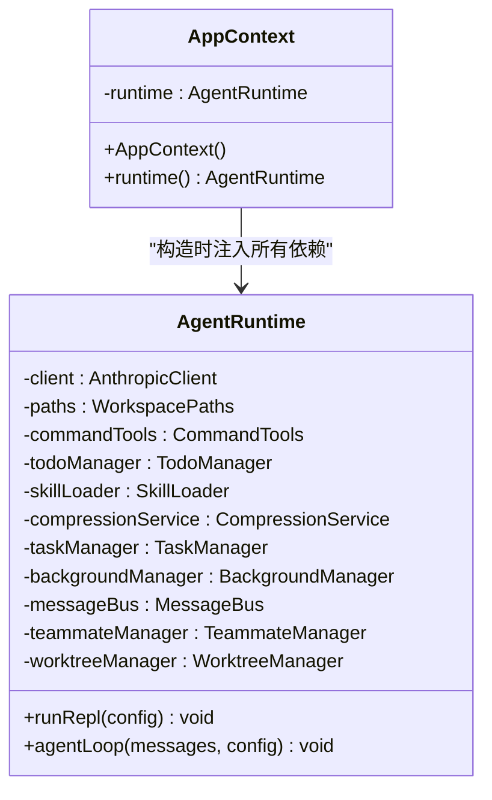
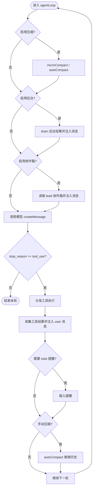
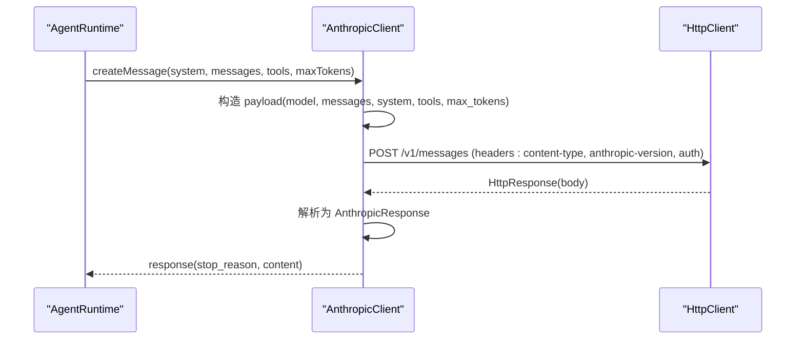
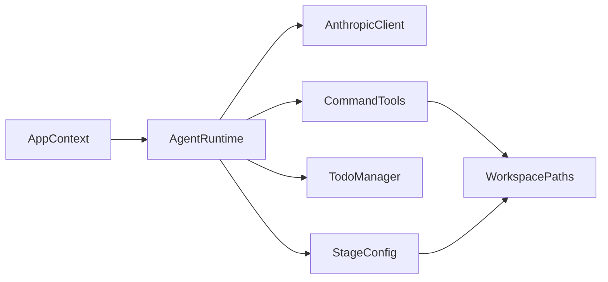

# 核心运行时依赖

<cite>
**本文引用的文件**
- [Main.java](file://src/main/java/com/learnclaudecode/Main.java)
- [Launcher.java](file://src/main/java/com/learnclaudecode/agents/Launcher.java)
- [AppContext.java](file://src/main/java/com/learnclaudecode/agents/AppContext.java)
- [AgentRuntime.java](file://src/main/java/com/learnclaudecode/agents/AgentRuntime.java)
- [StageConfig.java](file://src/main/java/com/learnclaudecode/agents/StageConfig.java)
- [AnthropicClient.java](file://src/main/java/com/learnclaudecode/common/AnthropicClient.java)
- [EnvConfig.java](file://src/main/java/com/learnclaudecode/common/EnvConfig.java)
- [WorkspacePaths.java](file://src/main/java/com/learnclaudecode/common/WorkspacePaths.java)
- [CommandTools.java](file://src/main/java/com/learnclaudecode/tools/CommandTools.java)
- [TodoManager.java](file://src/main/java/com/learnclaudecode/tools/TodoManager.java)
- [AnthropicResponse.java](file://src/main/java/com/learnclaudecode/model/AnthropicResponse.java)
</cite>

## 目录
1. [简介](#简介)
2. [项目结构](#项目结构)
3. [核心组件](#核心组件)
4. [架构总览](#架构总览)
5. [详细组件分析](#详细组件分析)
6. [依赖关系分析](#依赖关系分析)
7. [性能与可扩展性](#性能与可扩展性)
8. [故障排查指南](#故障排查指南)
9. [结论](#结论)
10. [附录：初始化顺序与循环依赖规避](#附录初始化顺序与循环依赖规避)

## 简介
本文件聚焦于“核心运行时依赖”的设计与实现，重点解释以下目标：
- AppContext 作为应用装配器如何集中创建并注入共享服务。
- AgentRuntime 作为统一执行器如何协调消息处理、工具调度与生命周期管理。
- AnthropicClient 与 Claude API（或兼容端点）的集成方式及复用模式。
- 依赖注入在 AppContext 中的具体实践，以及通过构造函数传递依赖的方式。
- 组件初始化顺序的重要性与避免循环依赖的策略。
- 通过代码级调用序列和数据流图展示组件间交互。

## 项目结构
本项目采用分层与按功能域组织相结合的方式：
- agents：应用装配与运行时编排（AppContext、AgentRuntime、StageConfig、Launcher）。
- common：通用基础设施（环境配置、工作区路径、HTTP 客户端封装）。
- tools：可被模型调用的本地能力（命令执行、文件读写、待办管理等）。
- model：数据契约（如 AnthropicResponse）。
- 其他模块（background、context、skills、tasks、team）提供扩展能力，由 AppContext 组装后交由 AgentRuntime 使用。

图表来源
- [Main.java:5-13](file://src/main/java/com/learnclaudecode/Main.java#L5-L13)
- [Launcher.java:23-26](file://src/main/java/com/learnclaudecode/agents/Launcher.java#L23-L26)
- [AppContext.java:35-59](file://src/main/java/com/learnclaudecode/agents/AppContext.java#L35-L59)
- [AgentRuntime.java:40-90](file://src/main/java/com/learnclaudecode/agents/AgentRuntime.java#L40-L90)
- [StageConfig.java:26-49](file://src/main/java/com/learnclaudecode/agents/StageConfig.java#L26-L49)

章节来源
- [Main.java:5-13](file://src/main/java/com/learnclaudecode/Main.java#L5-L13)
- [Launcher.java:23-26](file://src/main/java/com/learnclaudecode/agents/Launcher.java#L23-L26)
- [AppContext.java:35-59](file://src/main/java/com/learnclaudecode/agents/AppContext.java#L35-L59)

## 核心组件
- AppContext：应用装配器，负责读取环境、创建工作区路径、构建基础能力与高级服务，并将它们以构造函数参数形式注入到 AgentRuntime。
- AgentRuntime：统一执行器，维护 REPL 交互循环与单轮 Agent 主循环，负责消息历史管理、上下文压缩、后台任务合并、团队收件箱合并、工具分发执行、子代理执行等。
- AnthropicClient：轻量 HTTP 客户端，构造符合 Messages API 的请求体，发送请求并解析响应为 AnthropicResponse。
- StageConfig：阶段配置，决定 system prompt、可用工具集合与能力开关（如压缩、后台、团队、自治队友等）。
- EnvConfig：环境变量加载器，提供模型 ID、API Key、Base URL 与工作目录。
- WorkspacePaths：安全路径工具，提供工作区根目录与安全解析方法，防止路径逃逸。
- CommandTools：命令与文件操作工具，暴露 bash、read_file、write_file、edit_file 等能力。
- TodoManager：待办项管理与渲染，支持多字段风格与状态校验。

章节来源
- [AppContext.java:16-59](file://src/main/java/com/learnclaudecode/agents/AppContext.java#L16-L59)
- [AgentRuntime.java:23-90](file://src/main/java/com/learnclaudecode/agents/AgentRuntime.java#L23-L90)
- [AnthropicClient.java:15-52](file://src/main/java/com/learnclaudecode/common/AnthropicClient.java#L15-L52)
- [StageConfig.java:11-49](file://src/main/java/com/learnclaudecode/agents/StageConfig.java#L11-L49)
- [EnvConfig.java:9-29](file://src/main/java/com/learnclaudecode/common/EnvConfig.java#L9-L29)
- [WorkspacePaths.java:8-49](file://src/main/java/com/learnclaudecode/common/WorkspacePaths.java#L8-L49)
- [CommandTools.java:13-28](file://src/main/java/com/learnclaudecode/tools/CommandTools.java#L13-L28)
- [TodoManager.java:9-21](file://src/main/java/com/learnclaudecode/tools/TodoManager.java#L9-L21)

## 架构总览
下图展示了从入口到运行时执行的完整链路，包括装配、配置、消息循环与工具调度。

图表来源
- [Main.java:11-13](file://src/main/java/com/learnclaudecode/Main.java#L11-L13)
- [Launcher.java:23-26](file://src/main/java/com/learnclaudecode/agents/Launcher.java#L23-L26)
- [AppContext.java:35-59](file://src/main/java/com/learnclaudecode/agents/AppContext.java#L35-L59)
- [AgentRuntime.java:97-123](file://src/main/java/com/learnclaudecode/agents/AgentRuntime.java#L97-L123)
- [AgentRuntime.java:131-261](file://src/main/java/com/learnclaudecode/agents/AgentRuntime.java#L131-L261)
- [AnthropicClient.java:52-101](file://src/main/java/com/learnclaudecode/common/AnthropicClient.java#L52-L101)
- [StageConfig.java:44-49](file://src/main/java/com/learnclaudecode/agents/StageConfig.java#L44-L49)

## 详细组件分析

### AppContext：应用装配器与依赖注入
- 职责：集中创建共享服务并按“基础能力 -> 扩展机制 -> 总运行时”的顺序装配；将依赖以构造函数参数注入到 AgentRuntime。
- 关键流程：
  - 读取 EnvConfig 与 WorkspacePaths。
  - 构建 AnthropicClient、CommandTools、TodoManager、SkillLoader、CompressionService、TaskManager、BackgroundManager、MessageBus、TeammateManager、WorktreeManager。
  - 将这些实例全部注入到 AgentRuntime 构造函数中。
- 设计要点：
  - 通过构造函数注入明确表达依赖关系，便于测试与替换实现。
  - 初始化顺序确保底层依赖先于上层依赖创建，避免空引用与循环依赖。
  - 对外仅暴露 runtime()，隐藏内部装配细节。

图表来源
- [AppContext.java:29-68](file://src/main/java/com/learnclaudecode/agents/AppContext.java#L29-L68)
- [AgentRuntime.java:40-90](file://src/main/java/com/learnclaudecode/agents/AgentRuntime.java#L40-L90)

章节来源
- [AppContext.java:16-68](file://src/main/java/com/learnclaudecode/agents/AppContext.java#L16-L68)

### AgentRuntime：统一执行器与消息处理
- 职责：
  - 维护 REPL 交互循环，接收用户输入并追加到消息历史。
  - 执行单轮 Agent 主循环：上下文压缩、后台任务合并、团队收件箱合并、调用模型、工具分发执行、结果回写、条件触发提醒与手动压缩。
  - 子代理执行：隔离上下文，限制工具集，循环直到模型停止工具调用。
- 关键流程：
  - runRepl：读取输入 -> 加入 user 消息 -> agentLoop -> 输出 assistant 文本块。
  - agentLoop：
    - 可选压缩：microCompact 与 autoCompact。
    - 可选后台任务：drain 并注入 user 消息。
    - 可选收件箱：读取 lead 收件箱并注入 user 消息。
    - 调用模型：createMessage(systemPrompt, messages, tools, maxTokens)。
    - 若 stop_reason == tool_use：遍历 tool_use 块，分发到对应工具执行，收集结果并作为 user 消息回写。
    - 可选 todo 提醒：连续多轮未更新 todo 时插入提醒。
    - 可选手动压缩：compact 触发后自动压缩历史。
- 工具映射：
  - bash/read_file/write_file/edit_file -> CommandTools。
  - todo/TodoWrite -> TodoManager。
  - task -> runSubagent。
  - load_skill -> SkillLoader。
  - compact -> 标记手动压缩。
  - background_run/check_background -> BackgroundManager。
  - task_* -> TaskManager。
  - spawn_teammate/list_teammates/send_message/read_inbox/broadcast/shutdown_request/plan_approval/claim_task/idle -> TeammateManager/MessageBus。
  - worktree_* -> WorktreeManager。

图表来源
- [AgentRuntime.java:131-261](file://src/main/java/com/learnclaudecode/agents/AgentRuntime.java#L131-L261)

章节来源
- [AgentRuntime.java:97-310](file://src/main/java/com/learnclaudecode/agents/AgentRuntime.java#L97-L310)

### AnthropicClient：Claude API 集成与复用
- 职责：构造符合 Messages API 的请求体，设置模型、消息、system、tools、max_tokens，发送 HTTP 请求并解析响应。
- 关键点：
  - Base URL 可配置，便于接入第三方兼容端点。
  - 同时发送 x-api-key 与 authorization 头，兼容官方与第三方服务。
  - 错误处理：非 2xx 直接抛出异常，包含响应体便于调试；IO/中断统一包装为业务异常。
- 复用模式：
  - AgentRuntime 在每轮决策时调用 createMessage。
  - 子代理也复用同一客户端，但拥有独立消息上下文。

图表来源
- [AnthropicClient.java:52-101](file://src/main/java/com/learnclaudecode/common/AnthropicClient.java#L52-L101)
- [AgentRuntime.java:171-176](file://src/main/java/com/learnclaudecode/agents/AgentRuntime.java#L171-L176)

章节来源
- [AnthropicClient.java:15-101](file://src/main/java/com/learnclaudecode/common/AnthropicClient.java#L15-L101)
- [AnthropicResponse.java:8-13](file://src/main/java/com/learnclaudecode/model/AnthropicResponse.java#L8-L13)

### StageConfig：能力开关与工具定义
- 职责：
  - 生成系统提示词，动态替换工作区路径与技能描述。
  - 提供基础工具集合 baseTools。
  - 定义 s01-s12 与 s_full 的能力组合，控制是否启用 todo 提醒、压缩、后台、收件箱、子代理可写、自治队友等。
- 关键点：
  - 工具列表去重策略：同名工具保留最后一次定义。
  - s_full 合并各阶段工具，形成完整视图。

章节来源
- [StageConfig.java:11-301](file://src/main/java/com/learnclaudecode/agents/StageConfig.java#L11-L301)

### 其他关键组件
- EnvConfig：从 .env 与系统环境变量加载模型 ID、API Key、Base URL 与工作目录。
- WorkspacePaths：安全解析相对路径，防止路径逃逸；提供 tasks/team/inbox/skills/transcript/worktrees 等目录访问。
- CommandTools：命令执行（黑名单保护）、文件读取（支持 limit）、写入、编辑（精确替换）。
- TodoManager：待办项校验（状态、数量、进行中唯一性）、渲染看板。

章节来源
- [EnvConfig.java:22-95](file://src/main/java/com/learnclaudecode/common/EnvConfig.java#L22-L95)
- [WorkspacePaths.java:21-149](file://src/main/java/com/learnclaudecode/common/WorkspacePaths.java#L21-L149)
- [CommandTools.java:36-145](file://src/main/java/com/learnclaudecode/tools/CommandTools.java#L36-L145)
- [TodoManager.java:21-91](file://src/main/java/com/learnclaudecode/tools/TodoManager.java#L21-L91)

## 依赖关系分析
- 低耦合高内聚：
  - AppContext 仅负责装配，不持有业务逻辑。
  - AgentRuntime 通过构造函数注入依赖，避免全局状态与隐式耦合。
  - AnthropicClient 仅关注网络协议与响应解析，对上层透明。
- 直接依赖链：
  - Main -> Launcher -> AppContext -> AgentRuntime。
  - AgentRuntime -> AnthropicClient、CommandTools、TodoManager、StageConfig 等。
- 间接依赖：
  - StageConfig 依赖 SkillLoader 与 WorkspacePaths 用于生成 system prompt。
  - CommandTools 依赖 WorkspacePaths 进行安全路径解析。
- 潜在循环依赖：
  - 当前设计中，AppContext 单向注入依赖至 AgentRuntime，AgentRuntime 不反向引用 AppContext，避免循环。
  - 各服务之间通过接口/对象组合而非静态全局变量，降低循环风险。

图表来源
- [AppContext.java:35-59](file://src/main/java/com/learnclaudecode/agents/AppContext.java#L35-L59)
- [AgentRuntime.java:40-90](file://src/main/java/com/learnclaudecode/agents/AgentRuntime.java#L40-L90)
- [CommandTools.java:26-28](file://src/main/java/com/learnclaudecode/tools/CommandTools.java#L26-L28)
- [StageConfig.java:44-49](file://src/main/java/com/learnclaudecode/agents/StageConfig.java#L44-L49)

章节来源
- [AppContext.java:35-59](file://src/main/java/com/learnclaudecode/agents/AppContext.java#L35-L59)
- [AgentRuntime.java:40-90](file://src/main/java/com/learnclaudecode/agents/AgentRuntime.java#L40-L90)

## 性能与可扩展性
- 性能考虑：
  - 上下文压缩：microCompact 与 autoCompact 控制历史长度，减少 token 消耗与延迟。
  - 工具输出截断：命令与文件操作返回内容限制最大长度，避免过大响应阻塞。
  - 超时控制：命令执行与 HTTP 请求均设置超时，防止长时间阻塞。
- 可扩展性：
  - 新增工具：在 StageConfig.tools 中添加定义，并在 AgentRuntime.agentLoop 的工具 switch 中增加分支。
  - 新增服务：在 AppContext 中创建实例并注入到 AgentRuntime 构造函数。
  - 兼容端点：通过 EnvConfig 配置 Base URL，无需修改客户端逻辑即可切换后端。

[本节为通用指导，不直接分析具体文件]

## 故障排查指南
- API 调用失败：
  - 检查环境变量 MODEL_ID、ANTHROPIC_API_KEY、ANTHROPIC_BASE_URL 是否正确。
  - 查看 AnthropicClient 抛出的异常信息，包含 HTTP 状态码与响应体，便于定位兼容性问题。
- 命令执行失败：
  - 检查黑名单拦截是否误判。
  - 确认命令超时（默认 120 秒）与输出截断策略。
- 路径安全问题：
  - 使用 WorkspacePaths.safeResolve 确保路径在工作区内，避免逃逸。
- Todo 更新失败：
  - 检查状态值是否为 pending/in_progress/completed。
  - 确保最多只有一个 in_progress 项。

章节来源
- [AnthropicClient.java:87-101](file://src/main/java/com/learnclaudecode/common/AnthropicClient.java#L87-L101)
- [CommandTools.java:36-65](file://src/main/java/com/learnclaudecode/tools/CommandTools.java#L36-L65)
- [WorkspacePaths.java:42-49](file://src/main/java/com/learnclaudecode/common/WorkspacePaths.java#L42-L49)
- [TodoManager.java:21-55](file://src/main/java/com/learnclaudecode/tools/TodoManager.java#L21-L55)

## 结论
- AppContext 通过构造函数注入实现了清晰的依赖关系与可控的初始化顺序，是应用装配的核心。
- AgentRuntime 作为统一执行器，将消息处理、工具调度与生命周期管理集中在一个闭环中，体现了典型的 Agent 运行机制。
- AnthropicClient 提供了与 Claude API（或兼容端点）的稳定集成，并通过配置化 Base URL 与认证头实现灵活复用。
- StageConfig 以声明式方式控制能力开关与工具集合，使不同教学阶段可在同一运行时上渐进增强。
- 通过合理的初始化顺序与依赖注入，避免了循环依赖，提升了可测试性与可维护性。

[本节为总结性内容，不直接分析具体文件]

## 附录：初始化顺序与循环依赖规避
- 初始化顺序：
  - 先创建 EnvConfig 与 WorkspacePaths，作为基础环境。
  - 再创建 AnthropicClient、CommandTools、TodoManager 等基础能力。
  - 然后创建 SkillLoader、CompressionService、TaskManager、BackgroundManager、MessageBus、TeammateManager、WorktreeManager 等扩展服务。
  - 最后创建 AgentRuntime，并注入所有依赖。
- 避免循环依赖：
  - AppContext 不依赖 AgentRuntime 的业务逻辑，仅负责装配。
  - AgentRuntime 通过构造函数获取依赖，不反向引用 AppContext。
  - 各服务之间通过对象组合而非静态全局变量，降低耦合。
- 代码示例（调用关系与数据流向）：
  - 入口启动：Main.main -> SFull.main -> Launcher.launch -> AppContext.runtime().runRepl。
  - 消息循环：runRepl 读取用户输入 -> 加入 history -> agentLoop -> 调用模型 -> 工具分发 -> 结果回写 -> 继续循环。
  - 工具执行：agentLoop 根据工具名分发到 CommandTools/TodoManager/... -> 返回结果 -> 作为 user 消息注入历史。

章节来源
- [Main.java:11-13](file://src/main/java/com/learnclaudecode/Main.java#L11-L13)
- [Launcher.java:23-26](file://src/main/java/com/learnclaudecode/agents/Launcher.java#L23-L26)
- [AppContext.java:35-59](file://src/main/java/com/learnclaudecode/agents/AppContext.java#L35-L59)
- [AgentRuntime.java:97-261](file://src/main/java/com/learnclaudecode/agents/AgentRuntime.java#L97-L261)