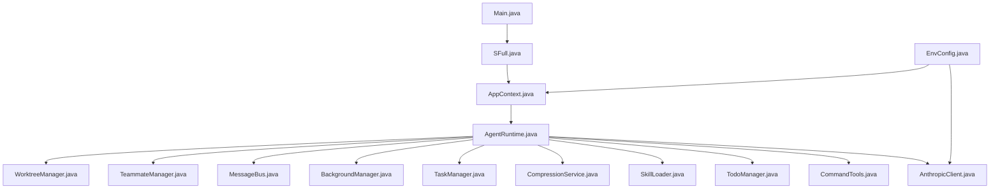
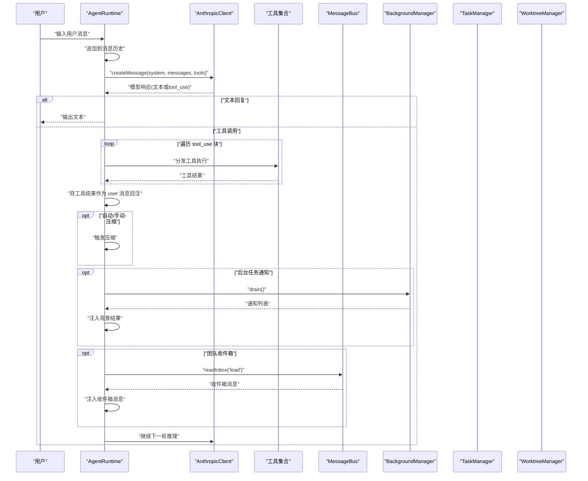
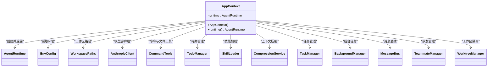
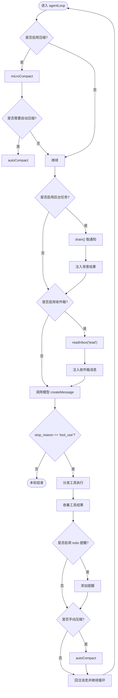
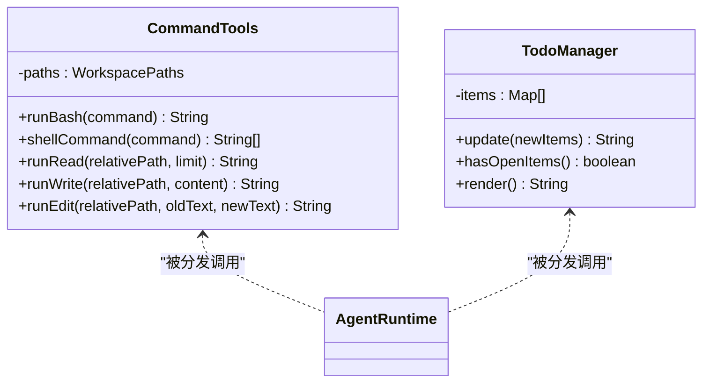
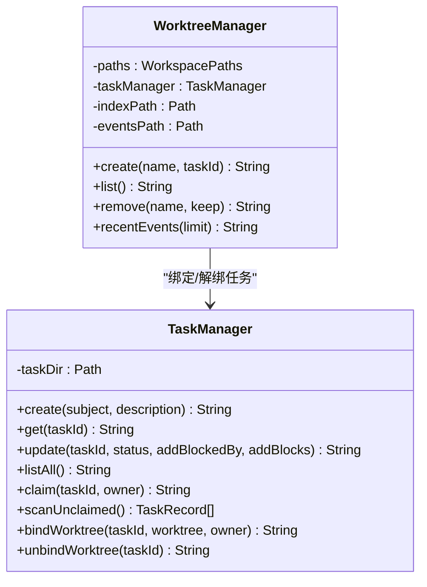
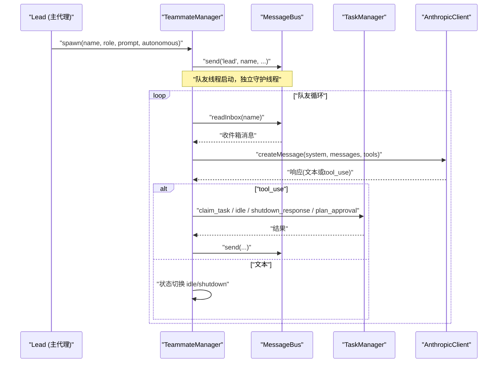
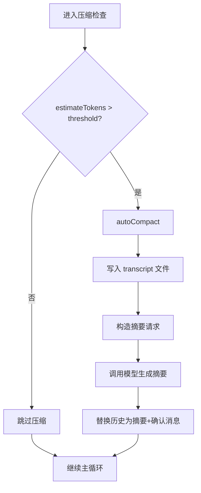
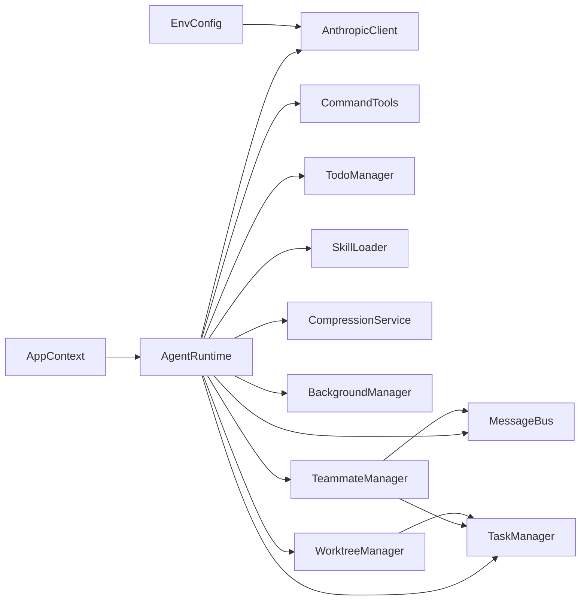

# 组件关系与依赖

<cite>
**本文引用的文件**
- [Main.java](file://src/main/java/com/learnclaudecode/Main.java)
- [pom.xml](file://pom.xml)
- [AppContext.java](file://src/main/java/com/learnclaudecode/agents/AppContext.java)
- [AgentRuntime.java](file://src/main/java/com/learnclaudecode/agents/AgentRuntime.java)
- [StageConfig.java](file://src/main/java/com/learnclaudecode/agents/StageConfig.java)
- [SFull.java](file://src/main/java/com/learnclaudecode/agents/SFull.java)
- [EnvConfig.java](file://src/main/java/com/learnclaudecode/common/EnvConfig.java)
- [AnthropicClient.java](file://src/main/java/com/learnclaudecode/common/AnthropicClient.java)
- [CommandTools.java](file://src/main/java/com/learnclaudecode/tools/CommandTools.java)
- [TodoManager.java](file://src/main/java/com/learnclaudecode/tools/TodoManager.java)
- [SkillLoader.java](file://src/main/java/com/learnclaudecode/skills/SkillLoader.java)
- [CompressionService.java](file://src/main/java/com/learnclaudecode/context/CompressionService.java)
- [TaskManager.java](file://src/main/java/com/learnclaudecode/tasks/TaskManager.java)
- [BackgroundManager.java](file://src/main/java/com/learnclaudecode/background/BackgroundManager.java)
- [MessageBus.java](file://src/main/java/com/learnclaudecode/team/MessageBus.java)
- [TeammateManager.java](file://src/main/java/com/learnclaudecode/team/TeammateManager.java)
- [WorktreeManager.java](file://src/main/java/com/learnclaudecode/tasks/WorktreeManager.java)
</cite>

## 目录
1. [简介](#简介)
2. [项目结构](#项目结构)
3. [核心组件](#核心组件)
4. [架构总览](#架构总览)
5. [详细组件分析](#详细组件分析)
6. [依赖关系分析](#依赖关系分析)
7. [性能考量](#性能考量)
8. [故障排查指南](#故障排查指南)
9. [结论](#结论)
10. [附录](#附录)

## 简介
本文件聚焦 Learn Claude Code Java 项目的组件关系与依赖，系统性说明装配器 AppContext 如何协调服务创建与初始化，AgentRuntime 作为核心运行时如何统一管理消息处理、工具调度与生命周期，并梳理工具系统、任务管理、团队协作等模块间的耦合关系。文档同时提供组件依赖图与数据流向图，展示从用户输入到模型调用、工具执行、结果回注的完整链路，并阐述松耦合设计原则、接口抽象与依赖倒置的实践，以及版本兼容性与扩展点设计。

## 项目结构
项目采用分层与按能力划分的组织方式：
- 入口与装配层：Main、SFull、AppContext、StageConfig
- 运行时核心：AgentRuntime
- 基础能力：EnvConfig、AnthropicClient、WorkspacePaths（由路径相关类使用）
- 工具与技能：CommandTools、TodoManager、SkillLoader
- 上下文与压缩：CompressionService
- 任务与工作区隔离：TaskManager、WorktreeManager
- 后台任务：BackgroundManager
- 团队协作：MessageBus、TeammateManager
- 外部依赖：通过 Maven 管理（Jackson、dotenv-java），Java 17 编译目标

图表来源
- [Main.java:1-15](file://src/main/java/com/learnclaudecode/Main.java#L1-L15)
- [SFull.java:1-13](file://src/main/java/com/learnclaudecode/agents/SFull.java#L1-L13)
- [AppContext.java:1-70](file://src/main/java/com/learnclaudecode/agents/AppContext.java#L1-L70)
- [AgentRuntime.java:1-351](file://src/main/java/com/learnclaudecode/agents/AgentRuntime.java#L1-L351)
- [EnvConfig.java:1-96](file://src/main/java/com/learnclaudecode/common/EnvConfig.java#L1-L96)
- [AnthropicClient.java:1-103](file://src/main/java/com/learnclaudecode/common/AnthropicClient.java#L1-L103)

章节来源
- [Main.java:1-15](file://src/main/java/com/learnclaudecode/Main.java#L1-L15)
- [pom.xml:1-68](file://pom.xml#L1-L68)

## 核心组件
- AppContext：应用装配器，集中创建共享服务并按“基础能力 -> 扩展机制 -> 总运行时”的顺序组装，最终返回统一的 AgentRuntime。
- AgentRuntime：通用 Agent 运行时，实现 REPL 交互循环与单轮 Agent 主循环，负责消息历史维护、模型调用、工具分发、后台任务与团队消息注入、上下文压缩触发与执行。
- AnthropicClient：轻量级模型客户端，构造请求体、发送 HTTP 请求、解析响应，屏蔽网络细节。
- CommandTools：命令执行与文件读写编辑的基础工具，包含安全黑名单与超时控制。
- TodoManager：待办项校验与渲染，支持不同字段风格。
- SkillLoader：扫描 skills 目录下的 SKILL.md，解析 frontmatter 并提供内容加载。
- CompressionService：三层压缩策略（micro compact、auto compact、transcript 落盘），估算 token 并触发压缩。
- TaskManager：基于文件的轻量任务板，支持创建、更新、认领、依赖管理与持久化。
- BackgroundManager：异步后台任务执行与通知队列，支持超时与状态查询。
- MessageBus：文件型消息总线，实现 inbox 语义与广播。
- TeammateManager：队友生命周期管理、自治模式、协议处理（关闭、计划审批）、工具集裁剪。
- WorktreeManager：工作区隔离（worktree）管理，索引与事件记录，与 TaskManager 联动绑定。

章节来源
- [AppContext.java:16-70](file://src/main/java/com/learnclaudecode/agents/AppContext.java#L16-L70)
- [AgentRuntime.java:23-351](file://src/main/java/com/learnclaudecode/agents/AgentRuntime.java#L23-L351)
- [AnthropicClient.java:15-103](file://src/main/java/com/learnclaudecode/common/AnthropicClient.java#L15-L103)
- [CommandTools.java:13-146](file://src/main/java/com/learnclaudecode/tools/CommandTools.java#L13-L146)
- [TodoManager.java:9-93](file://src/main/java/com/learnclaudecode/tools/TodoManager.java#L9-L93)
- [SkillLoader.java:15-106](file://src/main/java/com/learnclaudecode/skills/SkillLoader.java#L15-L106)
- [CompressionService.java:18-172](file://src/main/java/com/learnclaudecode/context/CompressionService.java#L18-L172)
- [TaskManager.java:17-338](file://src/main/java/com/learnclaudecode/tasks/TaskManager.java#L17-L338)
- [BackgroundManager.java:17-160](file://src/main/java/com/learnclaudecode/background/BackgroundManager.java#L17-L160)
- [MessageBus.java:16-123](file://src/main/java/com/learnclaudecode/team/MessageBus.java#L16-L123)
- [TeammateManager.java:24-438](file://src/main/java/com/learnclaudecode/team/TeammateManager.java#L24-L438)
- [WorktreeManager.java:16-245](file://src/main/java/com/learnclaudecode/tasks/WorktreeManager.java#L16-L245)

## 架构总览
整体架构围绕“装配器 + 运行时 + 能力模块”展开：
- 装配阶段：AppContext 读取环境配置与工作区路径，依次创建基础能力（命令、文件、技能加载、上下文压缩）、扩展机制（任务、后台任务、团队通信、worktree），最后构建 AgentRuntime。
- 运行阶段：AgentRuntime 驱动 REPL 与主循环，统一调度模型调用与工具执行；根据 StageConfig 的能力开关启用压缩、后台任务、团队收件箱等功能。
- 协作阶段：TeammateManager 在独立线程中运行队友循环，通过 MessageBus 与 TaskManager 进行通信与任务认领；WorktreeManager 提供任务隔离的工作空间。

图表来源
- [AgentRuntime.java:97-261](file://src/main/java/com/learnclaudecode/agents/AgentRuntime.java#L97-L261)
- [AnthropicClient.java:52-101](file://src/main/java/com/learnclaudecode/common/AnthropicClient.java#L52-L101)
- [BackgroundManager.java:43-158](file://src/main/java/com/learnclaudecode/background/BackgroundManager.java#L43-L158)
- [MessageBus.java:54-121](file://src/main/java/com/learnclaudecode/team/MessageBus.java#L54-L121)

## 详细组件分析

### 装配器 AppContext：服务创建与初始化
- 职责：集中装配共享服务，确保所有模块以一致的环境与路径启动。
- 顺序：先基础能力（EnvConfig、WorkspacePaths、AnthropicClient、CommandTools、TodoManager、SkillLoader），再扩展机制（CompressionService、TaskManager、BackgroundManager、MessageBus、TeammateManager、WorktreeManager），最后构建 AgentRuntime。
- 设计要点：避免重复装配代码；清晰分层便于教学与扩展；统一入口返回运行时实例。

图表来源
- [AppContext.java:16-70](file://src/main/java/com/learnclaudecode/agents/AppContext.java#L16-L70)

章节来源
- [AppContext.java:16-70](file://src/main/java/com/learnclaudecode/agents/AppContext.java#L16-L70)

### 运行时 AgentRuntime：消息处理、工具调度与生命周期
- 职责：REPL 交互循环、单轮 Agent 主循环、工具分发、上下文压缩、后台任务与团队消息注入、子代理执行。
- 关键流程：
  - 每轮先做 micro compact，必要时 auto compact。
  - 周期性 drain 后台任务通知并注入主上下文。
  - 读取 lead 收件箱并注入对话历史。
  - 调用模型获取下一步动作（文本或 tool_use）。
  - 工具分发映射到本地实现（bash、文件操作、todo、task、skill、background、team、worktree）。
  - 将工具结果作为 user 消息回注，直到模型停止调用工具。
- 生命周期：runRepl 维持会话；agentLoop 完成一轮任务；runSubagent 提供隔离的子代理上下文。

图表来源
- [AgentRuntime.java:131-261](file://src/main/java/com/learnclaudecode/agents/AgentRuntime.java#L131-L261)
- [CompressionService.java:69-170](file://src/main/java/com/learnclaudecode/context/CompressionService.java#L69-L170)
- [BackgroundManager.java:154-158](file://src/main/java/com/learnclaudecode/background/BackgroundManager.java#L154-L158)
- [MessageBus.java:83-101](file://src/main/java/com/learnclaudecode/team/MessageBus.java#L83-L101)

章节来源
- [AgentRuntime.java:97-310](file://src/main/java/com/learnclaudecode/agents/AgentRuntime.java#L97-L310)

### 工具系统：CommandTools 与 TodoManager
- CommandTools：
  - 安全黑名单拦截危险命令。
  - 跨平台 shell 命令构造（Windows PowerShell / Unix bash）。
  - 文件读取支持 limit 控制，写入与精确编辑。
  - 超时控制与异常封装。
- TodoManager：
  - 校验待办项数量、状态合法性、进行中唯一性。
  - 支持多字段风格（text/content、activeForm）。
  - 渲染看板文本，统计完成进度。

图表来源
- [CommandTools.java:13-146](file://src/main/java/com/learnclaudecode/tools/CommandTools.java#L13-L146)
- [TodoManager.java:9-93](file://src/main/java/com/learnclaudecode/tools/TodoManager.java#L9-L93)
- [AgentRuntime.java:189-234](file://src/main/java/com/learnclaudecode/agents/AgentRuntime.java#L189-L234)

章节来源
- [CommandTools.java:30-146](file://src/main/java/com/learnclaudecode/tools/CommandTools.java#L30-L146)
- [TodoManager.java:21-93](file://src/main/java/com/learnclaudecode/tools/TodoManager.java#L21-L93)
- [AgentRuntime.java:189-234](file://src/main/java/com/learnclaudecode/agents/AgentRuntime.java#L189-L234)

### 任务管理：TaskManager 与 WorktreeManager
- TaskManager：
  - 基于 .tasks 目录的文件持久化。
  - 创建、获取、更新（含依赖 blockedBy/blocks）、认领、列出。
  - 完成时清理其他任务的阻塞依赖。
  - 扫描可认领任务（pending、无 owner、无阻塞）。
  - 绑定/解绑 worktree，推进状态为 in_progress。
- WorktreeManager：
  - 在 .worktrees 下创建/移除独立目录。
  - 维护 index.json 与 events.jsonl。
  - 与 TaskManager 联动，同步任务绑定关系。
  - 提供最近事件查询。

图表来源
- [TaskManager.java:27-338](file://src/main/java/com/learnclaudecode/tasks/TaskManager.java#L27-L338)
- [WorktreeManager.java:24-245](file://src/main/java/com/learnclaudecode/tasks/WorktreeManager.java#L24-L245)

章节来源
- [TaskManager.java:51-249](file://src/main/java/com/learnclaudecode/tasks/TaskManager.java#L51-L249)
- [WorktreeManager.java:71-184](file://src/main/java/com/learnclaudecode/tasks/WorktreeManager.java#L71-L184)

### 团队协作：MessageBus 与 TeammateManager
- MessageBus：
  - 文件型 inbox（.team/inbox/*.jsonl），每条消息一行 JSON。
  - send、readInbox（读后即清空）、broadcast。
  - 类型白名单限制（message、broadcast、shutdown_request、shutdown_response、plan_approval_response）。
- TeammateManager：
  - spawn 队友线程，设置角色与初始提示。
  - 队友循环消费 inbox、调用模型、执行工具（受限工具集）。
  - 自治模式：idle 后尝试自动认领任务或恢复消息驱动。
  - 协议处理：shutdown_request/response、plan_approval/response。
  - 成员状态持久化（config.json）。

图表来源
- [TeammateManager.java:81-273](file://src/main/java/com/learnclaudecode/team/TeammateManager.java#L81-L273)
- [MessageBus.java:54-121](file://src/main/java/com/learnclaudecode/team/MessageBus.java#L54-L121)
- [TaskManager.java:168-197](file://src/main/java/com/learnclaudecode/tasks/TaskManager.java#L168-L197)
- [AnthropicClient.java:52-101](file://src/main/java/com/learnclaudecode/common/AnthropicClient.java#L52-L101)

章节来源
- [TeammateManager.java:81-438](file://src/main/java/com/learnclaudecode/team/TeammateManager.java#L81-L438)
- [MessageBus.java:16-123](file://src/main/java/com/learnclaudecode/team/MessageBus.java#L16-L123)

### 上下文压缩：CompressionService
- 三层策略：
  - micro compact：清理较老的 tool_result 大文本，保留最近若干条。
  - auto compact：转存完整历史到 transcript 文件，生成摘要并替换旧历史。
  - needsAutoCompact：基于 JSON 长度估算 token 数，超过阈值触发压缩。
- 与 AgentRuntime 集成：每轮先 micro compact，必要时 auto compact；手动 compact 在本轮结束后执行。

图表来源
- [CompressionService.java:56-170](file://src/main/java/com/learnclaudecode/context/CompressionService.java#L56-L170)
- [AgentRuntime.java:136-145](file://src/main/java/com/learnclaudecode/agents/AgentRuntime.java#L136-L145)

章节来源
- [CompressionService.java:18-172](file://src/main/java/com/learnclaudecode/context/CompressionService.java#L18-L172)
- [AgentRuntime.java:136-145](file://src/main/java/com/learnclaudecode/agents/AgentRuntime.java#L136-L145)

### 技能加载：SkillLoader
- 扫描 skills 目录下的 SKILL.md 文件。
- 解析简单 frontmatter（name/description）。
- 提供 getDescriptions 与 getContent 方法，供 AgentRuntime 分发 load_skill 工具调用。

章节来源
- [SkillLoader.java:15-106](file://src/main/java/com/learnclaudecode/skills/SkillLoader.java#L15-L106)
- [AgentRuntime.java:201-201](file://src/main/java/com/learnclaudecode/agents/AgentRuntime.java#L201-L201)

## 依赖关系分析
- 装配依赖：AppContext 依赖 EnvConfig、WorkspacePaths 与各能力模块，最终装配 AgentRuntime。
- 运行时依赖：AgentRuntime 依赖 AnthropicClient、CommandTools、TodoManager、SkillLoader、CompressionService、TaskManager、BackgroundManager、MessageBus、TeammateManager、WorktreeManager。
- 协作依赖：TeammateManager 依赖 MessageBus、TaskManager、AnthropicClient、CommandTools；MessageBus 依赖 WorkspacePaths；TaskManager 与 WorktreeManager 双向协作（绑定/解绑）。
- 外部依赖：Maven 管理的 Jackson（JSON 序列化/反序列化）、dotenv-java（环境变量读取），Java 17 编译目标。

图表来源
- [AppContext.java:35-59](file://src/main/java/com/learnclaudecode/agents/AppContext.java#L35-L59)
- [AgentRuntime.java:41-90](file://src/main/java/com/learnclaudecode/agents/AgentRuntime.java#L41-L90)
- [TeammateManager.java:40-70](file://src/main/java/com/learnclaudecode/team/TeammateManager.java#L40-L70)
- [WorktreeManager.java:24-58](file://src/main/java/com/learnclaudecode/tasks/WorktreeManager.java#L24-L58)
- [EnvConfig.java:12-29](file://src/main/java/com/learnclaudecode/common/EnvConfig.java#L12-L29)

章节来源
- [pom.xml:19-35](file://pom.xml#L19-L35)
- [AppContext.java:35-59](file://src/main/java/com/learnclaudecode/agents/AppContext.java#L35-L59)
- [AgentRuntime.java:41-90](file://src/main/java/com/learnclaudecode/agents/AgentRuntime.java#L41-L90)

## 性能考量
- 模型调用频率控制：AgentRuntime 仅在需要时调用模型，工具结果回注后再继续，避免无效调用。
- 上下文大小控制：CompressionService 通过 micro compact 与 auto compact 降低上下文体积，减少 token 消耗。
- 后台任务超时：BackgroundManager 对命令执行设置超时，防止长时间占用资源。
- 文件 I/O 优化：TaskManager、MessageBus、WorktreeManager 使用 jsonl 追加与批量读取，减少频繁小文件操作。
- 工具输出截断：CommandTools 与 BackgroundManager 对输出进行长度限制，避免过大结果影响上下文。

[本节提供一般性指导，不直接分析具体文件]

## 故障排查指南
- 环境变量缺失：EnvConfig 在缺少 MODEL_ID 等必填变量时抛出异常，需检查 .env 或系统环境变量。
- 模型 API 失败：AnthropicClient 在 HTTP 错误或非 2xx 状态码时抛出异常，包含响应体便于调试兼容端点。
- 命令执行异常：CommandTools 捕获 IO 与中断异常，返回错误信息；注意黑名单拦截与安全策略。
- 任务文件读写失败：TaskManager 与 WorktreeManager 在文件操作失败时抛出异常，检查权限与磁盘空间。
- 消息总线写入失败：MessageBus 在写入 inbox 失败时返回错误信息，检查 .team/inbox 目录权限。
- 后台任务超时或异常：BackgroundManager 记录状态为 timeout/error，可通过 check 查询详情。

章节来源
- [EnvConfig.java:37-39](file://src/main/java/com/learnclaudecode/common/EnvConfig.java#L37-L39)
- [AnthropicClient.java:87-101](file://src/main/java/com/learnclaudecode/common/AnthropicClient.java#L87-L101)
- [CommandTools.java:43-65](file://src/main/java/com/learnclaudecode/tools/CommandTools.java#L43-L65)
- [TaskManager.java:276-322](file://src/main/java/com/learnclaudecode/tasks/TaskManager.java#L276-L322)
- [MessageBus.java:68-75](file://src/main/java/com/learnclaudecode/team/MessageBus.java#L68-L75)
- [BackgroundManager.java:68-123](file://src/main/java/com/learnclaudecode/background/BackgroundManager.java#L68-L123)

## 结论
本项目通过 AppContext 的集中装配与 AgentRuntime 的统一调度，实现了清晰的模块化与松耦合设计。工具系统、任务管理、团队协作等模块通过明确的接口与文件协议交互，具备良好的可扩展性与可维护性。上下文压缩、后台任务与团队通信增强了 Agent 的实用性与鲁棒性。建议在后续演进中进一步抽象工具接口、引入配置化能力开关、完善错误处理与监控指标，以提升系统的稳定性与可观测性。

[本节总结性内容，不直接分析具体文件]

## 附录
- 版本兼容性：
  - Java 17 编译目标，确保现代语言特性与性能。
  - Jackson 2.17.2 用于 JSON 序列化/反序列化，保持与第三方服务的兼容。
  - dotenv-java 3.0.0 用于环境变量读取，支持 .env 与系统环境变量覆盖。
- 扩展点设计：
  - 工具扩展：在 AgentRuntime 的工具分发 switch 中添加新工具名与实现。
  - 技能扩展：在 skills 目录下新增 SKILL.md，SkillLoader 自动发现。
  - 团队协议扩展：在 MessageBus.VALID_TYPES 中添加新消息类型，并在 TeammateManager 中处理。
  - 压缩策略扩展：在 CompressionService 中调整阈值与策略，或在 AgentRuntime 中调整触发时机。
  - 工作区隔离扩展：在 WorktreeManager 中增强目录结构与事件记录，与 TaskManager 联动。

章节来源
- [pom.xml:12-35](file://pom.xml#L12-L35)
- [AgentRuntime.java:189-234](file://src/main/java/com/learnclaudecode/agents/AgentRuntime.java#L189-L234)
- [SkillLoader.java:26-38](file://src/main/java/com/learnclaudecode/skills/SkillLoader.java#L26-L38)
- [MessageBus.java:20-26](file://src/main/java/com/learnclaudecode/team/MessageBus.java#L20-L26)
- [CompressionService.java:43-48](file://src/main/java/com/learnclaudecode/context/CompressionService.java#L43-L48)
- [WorktreeManager.java:71-99](file://src/main/java/com/learnclaudecode/tasks/WorktreeManager.java#L71-L99)