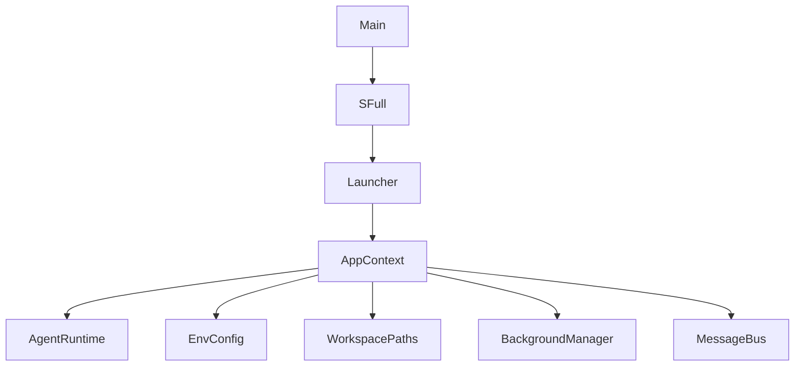
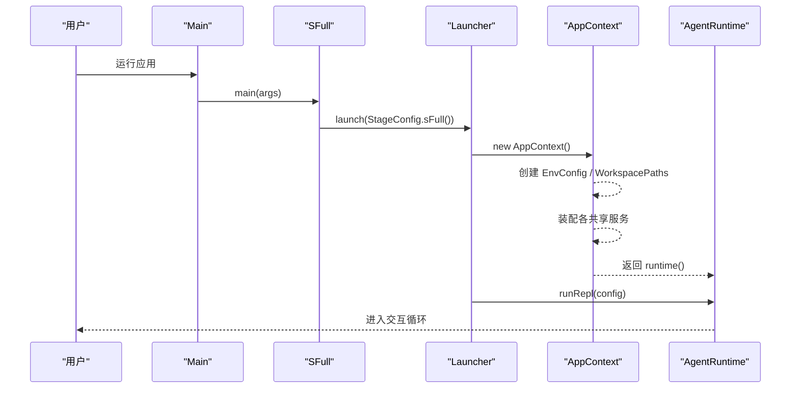
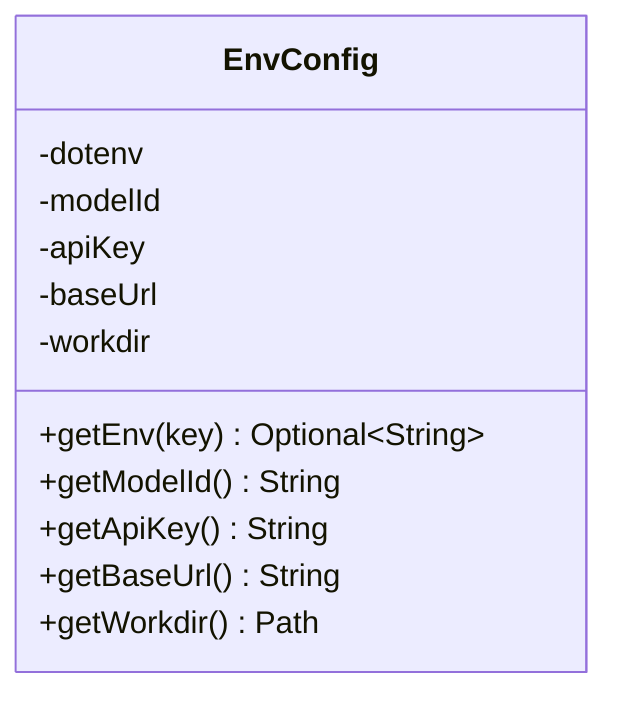
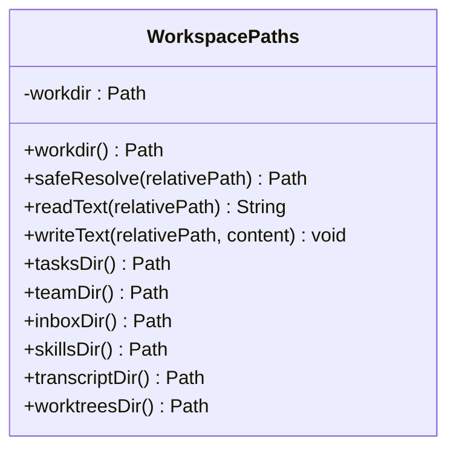
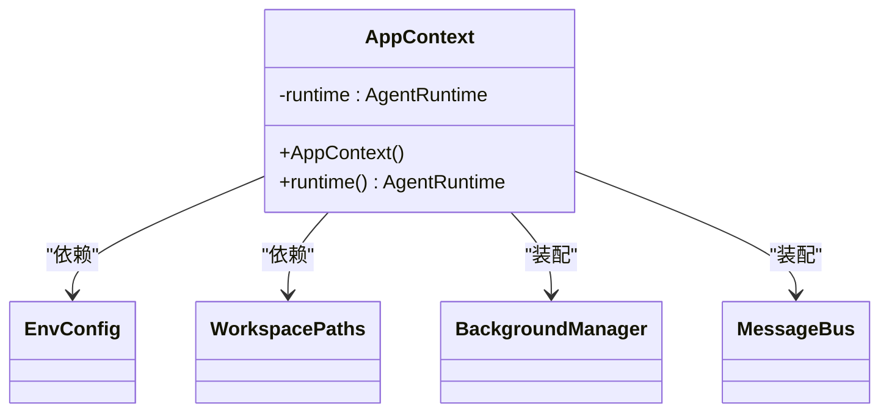
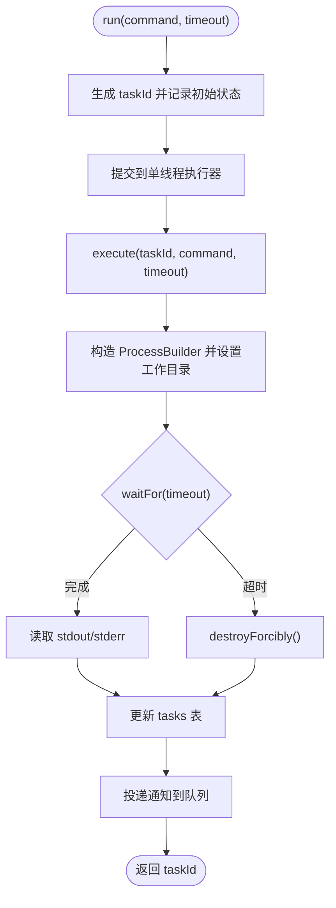
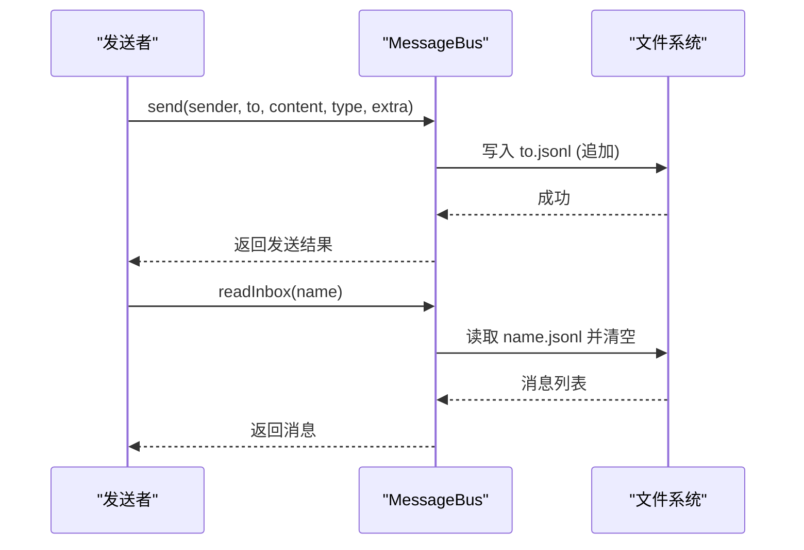
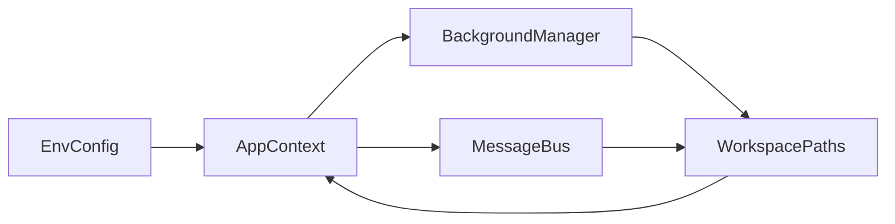

# 单例模式应用

<cite>
**本文引用的文件**
- [EnvConfig.java](file://src/main/java/com/learnclaudecode/common/EnvConfig.java)
- [WorkspacePaths.java](file://src/main/java/com/learnclaudecode/common/WorkspacePaths.java)
- [AppContext.java](file://src/main/java/com/learnclaudecode/agents/AppContext.java)
- [Launcher.java](file://src/main/java/com/learnclaudecode/agents/Launcher.java)
- [SFull.java](file://src/main/java/com/learnclaudecode/agents/SFull.java)
- [StageConfig.java](file://src/main/java/com/learnclaudecode/agents/StageConfig.java)
- [BackgroundManager.java](file://src/main/java/com/learnclaudecode/background/BackgroundManager.java)
- [MessageBus.java](file://src/main/java/com/learnclaudecode/team/MessageBus.java)
</cite>

## 目录
1. [简介](#简介)
2. [项目结构](#项目结构)
3. [核心组件](#核心组件)
4. [架构总览](#架构总览)
5. [详细组件分析](#详细组件分析)
6. [依赖关系分析](#依赖关系分析)
7. [性能考量](#性能考量)
8. [故障排查指南](#故障排查指南)
9. [结论](#结论)
10. [附录](#附录)

## 简介
本文件围绕项目中“全局服务管理”的视角，系统解析单例模式在资源管理与状态共享中的重要作用。重点说明 EnvConfig、WorkspacePaths 等关键组件如何通过“单一实例 + 集中装配”的方式，避免重复创建开销、保证配置一致性、提供全局访问点。同时，结合 AppContext 的装配流程与 Launcher 的统一入口，梳理生命周期控制与线程安全考虑，并给出分布式环境下的实现建议与现代替代方案。

## 项目结构
- 应用入口：Main -> SFull -> Launcher -> AppContext -> AgentRuntime（运行时）
- 基础能力与环境：EnvConfig（环境变量与模型配置）、WorkspacePaths（工作区路径与安全校验）
- 共享服务：CommandTools、TodoManager、SkillLoader、CompressionService、TaskManager、BackgroundManager、MessageBus、TeammateManager、WorktreeManager
- 阶段配置：StageConfig（不同教学阶段的工具与能力开关）

图表来源
- [SFull.java:9-11](file://src/main/java/com/learnclaudecode/agents/SFull.java#L9-L11)
- [Launcher.java:23-26](file://src/main/java/com/learnclaudecode/agents/Launcher.java#L23-L26)
- [AppContext.java:35-59](file://src/main/java/com/learnclaudecode/agents/AppContext.java#L35-L59)

章节来源
- [Main.java:5-13](file://src/main/java/com/learnclaudecode/Main.java#L5-L13)
- [SFull.java:9-11](file://src/main/java/com/learnclaudecode/agents/SFull.java#L9-L11)
- [Launcher.java:23-26](file://src/main/java/com/learnclaudecode/agents/Launcher.java#L23-L26)
- [AppContext.java:35-59](file://src/main/java/com/learnclaudecode/agents/AppContext.java#L35-L59)

## 核心组件
- EnvConfig：负责读取 .env 与系统环境变量，提供模型 ID、API Key、Base URL 与工作目录。通过私有字段与只读 getter 暴露不可变配置，适合以单例形式在全局共享。
- WorkspacePaths：封装工作区根路径，提供安全解析 safeResolve 与常用子目录访问方法，确保所有文件操作不逃逸出工作区。适合作为全局唯一的路径上下文。
- AppContext：集中装配共享服务，将 EnvConfig 与 WorkspacePaths 作为基础依赖注入到各服务中，形成“一次创建、多处复用”的全局状态中心。
- Launcher：统一启动器，屏蔽具体 StageConfig 差异，调用 AppContext 构建运行时。
- BackgroundManager：后台任务管理器，使用并发容器与队列维护任务状态与通知，体现进程内单例式共享状态。
- MessageBus：基于文件的消息总线，提供 send/readInbox/broadcast，内部同步写入 inbox 文件，体现跨组件的状态共享。

章节来源
- [EnvConfig.java:12-95](file://src/main/java/com/learnclaudecode/common/EnvConfig.java#L12-L95)
- [WorkspacePaths.java:11-149](file://src/main/java/com/learnclaudecode/common/WorkspacePaths.java#L11-L149)
- [AppContext.java:29-68](file://src/main/java/com/learnclaudecode/agents/AppContext.java#L29-L68)
- [Launcher.java:11-26](file://src/main/java/com/learnclaudecode/agents/Launcher.java#L11-L26)
- [BackgroundManager.java:20-159](file://src/main/java/com/learnclaudecode/background/BackgroundManager.java#L20-L159)
- [MessageBus.java:19-122](file://src/main/java/com/learnclaudecode/team/MessageBus.java#L19-L122)

## 架构总览
下图展示了从应用启动到共享服务装配的关键流程，体现了“集中装配 + 全局共享”的设计思想。

图表来源
- [Main.java:11-13](file://src/main/java/com/learnclaudecode/Main.java#L11-L13)
- [SFull.java:9-11](file://src/main/java/com/learnclaudecode/agents/SFull.java#L9-L11)
- [Launcher.java:23-26](file://src/main/java/com/learnclaudecode/agents/Launcher.java#L23-L26)
- [AppContext.java:35-59](file://src/main/java/com/learnclaudecode/agents/AppContext.java#L35-L59)

## 详细组件分析

### EnvConfig：配置型单例
- 设计要点
  - 通过私有构造与只读属性暴露配置，天然适合以单例形式持有。
  - 优先读取系统环境变量，其次回退到 .env，便于本地与 CI 覆盖。
  - 对必填项进行强校验，缺失时立即抛出异常，避免后续错误扩散。
- 单例化建议
  - 使用类级静态 final 实例或枚举单例，确保 JVM 内唯一。
  - 对外仅暴露 getter，保持配置不可变。
- 线程安全
  - 构造完成后即只读，天然线程安全。
- 生命周期
  - 随应用进程启动而初始化，随进程结束而销毁。

图表来源
- [EnvConfig.java:12-95](file://src/main/java/com/learnclaudecode/common/EnvConfig.java#L12-L95)

章节来源
- [EnvConfig.java:22-58](file://src/main/java/com/learnclaudecode/common/EnvConfig.java#L22-L58)
- [EnvConfig.java:65-94](file://src/main/java/com/learnclaudecode/common/EnvConfig.java#L65-L94)

### WorkspacePaths：路径型单例
- 设计要点
  - 接收 workdir 并规范化为绝对路径，作为全局工作区根。
  - safeResolve 强制相对路径解析后校验是否仍在 workdir 下，防止路径逃逸。
  - 提供 tasksDir/teamDir/inboxDir/skillsDir/transcriptDir/worktreesDir 等常用子目录访问。
- 单例化建议
  - 以单例持有当前工作区根路径，供所有文件相关服务复用。
- 线程安全
  - 构造后只读；safeResolve 无副作用，线程安全。
- 生命周期
  - 与 AppContext 同生命周期，随应用启动创建。

图表来源
- [WorkspacePaths.java:11-149](file://src/main/java/com/learnclaudecode/common/WorkspacePaths.java#L11-L149)

章节来源
- [WorkspacePaths.java:21-49](file://src/main/java/com/learnclaudecode/common/WorkspacePaths.java#L21-L49)
- [WorkspacePaths.java:58-75](file://src/main/java/com/learnclaudecode/common/WorkspacePaths.java#L58-L75)
- [WorkspacePaths.java:86-148](file://src/main/java/com/learnclaudecode/common/WorkspacePaths.java#L86-L148)

### AppContext：集中装配与全局共享
- 职责
  - 创建 EnvConfig 与 WorkspacePaths，并以此为基座装配其他共享服务。
  - 将各服务注入到 AgentRuntime，形成统一的执行上下文。
- 单例模式体现
  - 虽然当前代码每次 new AppContext()，但可将其改造为单例，使整个进程内共享同一份运行时与服务集合。
- 生命周期
  - 由 Launcher 在启动时创建，贯穿整个应用运行期。

图表来源
- [AppContext.java:29-68](file://src/main/java/com/learnclaudecode/agents/AppContext.java#L29-L68)

章节来源
- [AppContext.java:35-59](file://src/main/java/com/learnclaudecode/agents/AppContext.java#L35-L59)

### Launcher：统一入口
- 职责
  - 屏蔽 StageConfig 差异，统一调用 AppContext 启动运行时。
- 单例模式体现
  - 本身是工具类，无需实例化；可将 AppContext 改为单例，进一步简化启动逻辑。

章节来源
- [Launcher.java:11-26](file://src/main/java/com/learnclaudecode/agents/Launcher.java#L11-L26)
- [SFull.java:9-11](file://src/main/java/com/learnclaudecode/agents/SFull.java#L9-L11)

### BackgroundManager：进程内状态共享
- 设计要点
  - 使用 ConcurrentHashMap 保存任务状态，BlockingQueue 收集通知。
  - 每个后台命令独立线程执行，主循环非阻塞。
- 单例模式体现
  - 适合作为进程内单例，集中管理所有后台任务的生命周期与状态。
- 线程安全
  - 并发容器与队列保障多线程安全；execute 中对任务状态更新原子性良好。

图表来源
- [BackgroundManager.java:43-53](file://src/main/java/com/learnclaudecode/background/BackgroundManager.java#L43-L53)
- [BackgroundManager.java:68-123](file://src/main/java/com/learnclaudecode/background/BackgroundManager.java#L68-L123)

章节来源
- [BackgroundManager.java:20-159](file://src/main/java/com/learnclaudecode/background/BackgroundManager.java#L20-L159)

### MessageBus：文件型消息总线
- 设计要点
  - 以 .team/inbox/*.jsonl 协议持久化消息，支持 send/readInbox/broadcast。
  - 读写方法加同步锁，保证多代理并发下的文件一致性。
- 单例模式体现
  - 适合作为进程内单例，集中管理所有团队通信通道。
- 线程安全
  - 方法级别 synchronized 保证并发安全。

图表来源
- [MessageBus.java:54-75](file://src/main/java/com/learnclaudecode/team/MessageBus.java#L54-L75)
- [MessageBus.java:83-102](file://src/main/java/com/learnclaudecode/team/MessageBus.java#L83-L102)

章节来源
- [MessageBus.java:19-122](file://src/main/java/com/learnclaudecode/team/MessageBus.java#L19-L122)

## 依赖关系分析
- AppContext 依赖 EnvConfig 与 WorkspacePaths，并装配 BackgroundManager、MessageBus 等服务。
- BackgroundManager 依赖 WorkspacePaths 与 CommandTools。
- MessageBus 依赖 WorkspacePaths。
- 这些依赖关系使得 EnvConfig 与 WorkspacePaths 成为全局共享的基础设施。

图表来源
- [AppContext.java:35-59](file://src/main/java/com/learnclaudecode/agents/AppContext.java#L35-L59)
- [BackgroundManager.java:20-34](file://src/main/java/com/learnclaudecode/background/BackgroundManager.java#L20-L34)
- [MessageBus.java:19-42](file://src/main/java/com/learnclaudecode/team/MessageBus.java#L19-L42)

章节来源
- [AppContext.java:35-59](file://src/main/java/com/learnclaudecode/agents/AppContext.java#L35-L59)
- [BackgroundManager.java:20-34](file://src/main/java/com/learnclaudecode/background/BackgroundManager.java#L20-L34)
- [MessageBus.java:19-42](file://src/main/java/com/learnclaudecode/team/MessageBus.java#L19-L42)

## 性能考量
- 避免重复创建开销：将 EnvConfig、WorkspacePaths、BackgroundManager、MessageBus 等作为单例，减少对象创建与 I/O 初始化成本。
- 配置一致性：单例保证全进程内配置一致，避免多实例导致的环境变量或路径不一致问题。
- 线程安全：对共享可变状态（如 BackgroundManager 的任务表、MessageBus 的文件写入）采用并发容器或同步方法，避免竞态条件。
- 资源管理：后台任务需限制超时与资源占用，防止失控进程影响整体性能。

[本节为通用指导，不直接分析具体文件]

## 故障排查指南
- 环境变量缺失
  - 现象：启动时报错提示缺少必填环境变量。
  - 处理：检查 .env 与系统环境变量是否正确设置，必要时在 CI 或 IDE 运行配置中覆盖。
- 路径逃逸异常
  - 现象：调用 safeResolve 抛出非法参数异常。
  - 处理：确认传入的相对路径未包含 “../” 等逃逸序列，确保目标在工作区内。
- 后台任务超时或异常
  - 现象：check 返回 timeout 或 error。
  - 处理：检查命令合法性、工作目录权限与超时时间；查看 drain 获取的通知摘要。
- 消息总线写入失败
  - 现象：send 返回错误信息。
  - 处理：检查 .team/inbox 目录是否存在与可写权限；确认消息类型合法。

章节来源
- [EnvConfig.java:37-39](file://src/main/java/com/learnclaudecode/common/EnvConfig.java#L37-L39)
- [WorkspacePaths.java:42-49](file://src/main/java/com/learnclaudecode/common/WorkspacePaths.java#L42-L49)
- [BackgroundManager.java:68-123](file://src/main/java/com/learnclaudecode/background/BackgroundManager.java#L68-L123)
- [MessageBus.java:54-75](file://src/main/java/com/learnclaudecode/team/MessageBus.java#L54-L75)

## 结论
本项目通过“集中装配 + 基础能力单例化”的方式，实现了全局配置与路径管理的唯一性与一致性。EnvConfig 与 WorkspacePaths 作为基础设施，配合 AppContext 的装配流程，为各共享服务提供了稳定的上下文。在此基础上，BackgroundManager 与 MessageBus 展现了进程内状态共享的典型实践。对于生产环境，建议将上述组件显式实现为单例，并结合依赖注入框架统一管理生命周期与线程安全。在分布式环境中，应引入外部配置中心与分布式协调服务，以避免进程内单例带来的局限。

[本节为总结性内容，不直接分析具体文件]

## 附录

### 单例模式的实现方式与最佳实践
- 静态实例管理
  - 使用类级 static final 实例或枚举单例，确保唯一性与线程安全。
- 线程安全考虑
  - 对共享可变状态使用并发容器或同步方法；对只读配置保持不可变。
- 生命周期控制
  - 在应用启动时初始化，在关闭时释放资源（如线程池、文件句柄）。
- 使用场景示例（路径参考）
  - 配置读取：参见 [EnvConfig.java:22-58](file://src/main/java/com/learnclaudecode/common/EnvConfig.java#L22-L58)
  - 路径管理：参见 [WorkspacePaths.java:21-49](file://src/main/java/com/learnclaudecode/common/WorkspacePaths.java#L21-L49)
  - 后台任务：参见 [BackgroundManager.java:43-53](file://src/main/java/com/learnclaudecode/background/BackgroundManager.java#L43-L53)
  - 消息总线：参见 [MessageBus.java:54-75](file://src/main/java/com/learnclaudecode/team/MessageBus.java#L54-L75)

### 分布式环境中的单例模式
- 进程内单例无法跨节点共享，需改用：
  - 外部配置中心（如 Nacos、Apollo、Consul Config）
  - 分布式协调服务（如 ZooKeeper、etcd）用于选举与锁
  - 分布式缓存（如 Redis）作为共享状态层
- 注意事项
  - 幂等性与容错：网络分区与重试策略
  - 数据一致性：最终一致性与冲突解决
  - 可观测性：指标与日志追踪

[本节为概念性内容，不直接分析具体文件]

### 现代 Java 开发中的替代方案
- 依赖注入框架（Spring、Guice）
  - 通过 @Singleton 或作用域管理生命周期，解耦装配逻辑。
- 配置管理
  - 使用 Spring Boot 的 @ConfigurationProperties 或 Micronaut 的配置机制。
- 事件驱动与消息中间件
  - 用 Kafka/RabbitMQ 替代文件型消息总线，提升可扩展性与可靠性。
- 微服务拆分
  - 将配置、任务、消息等功能拆分为独立服务，通过 API 或事件总线协作。

[本节为概念性内容，不直接分析具体文件]