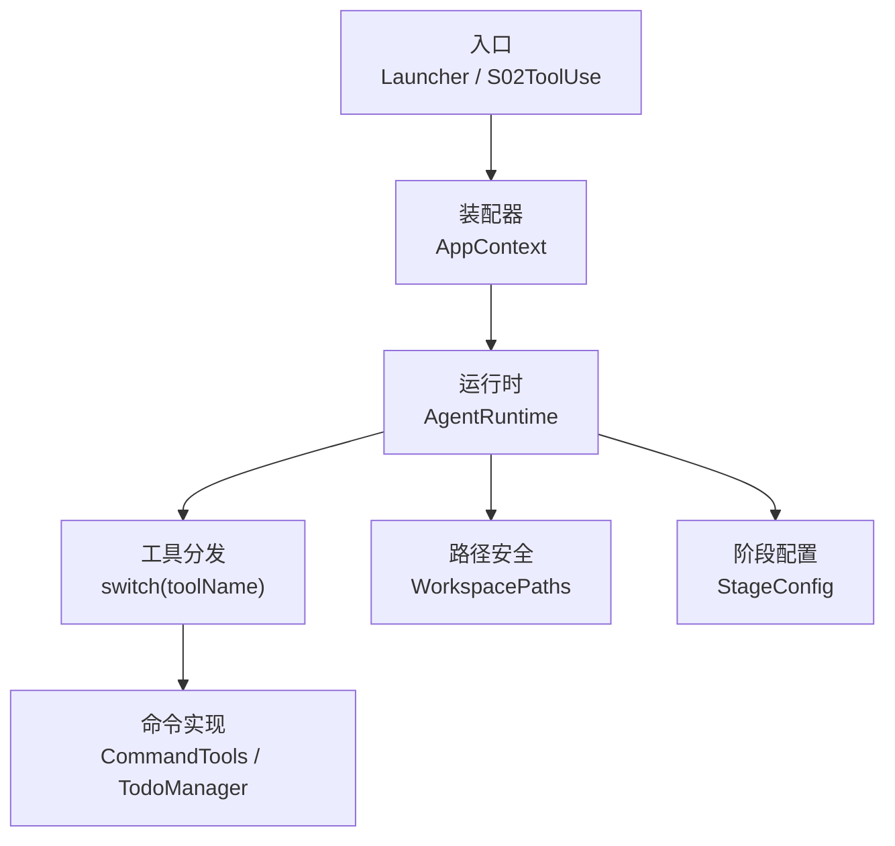
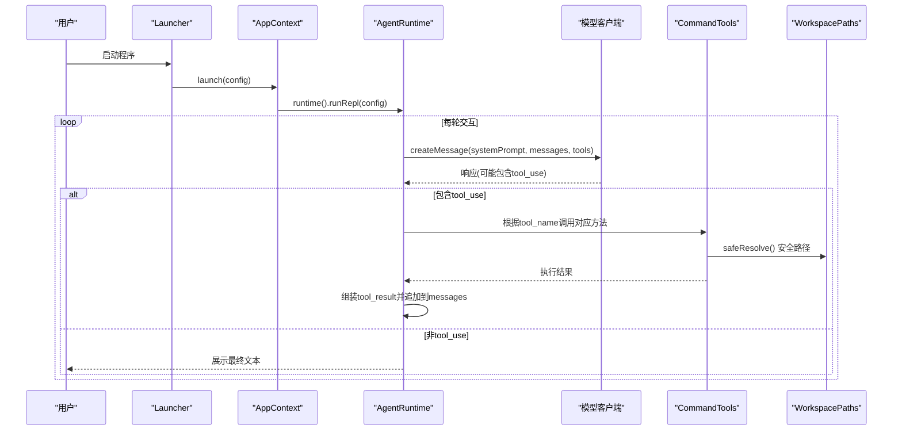
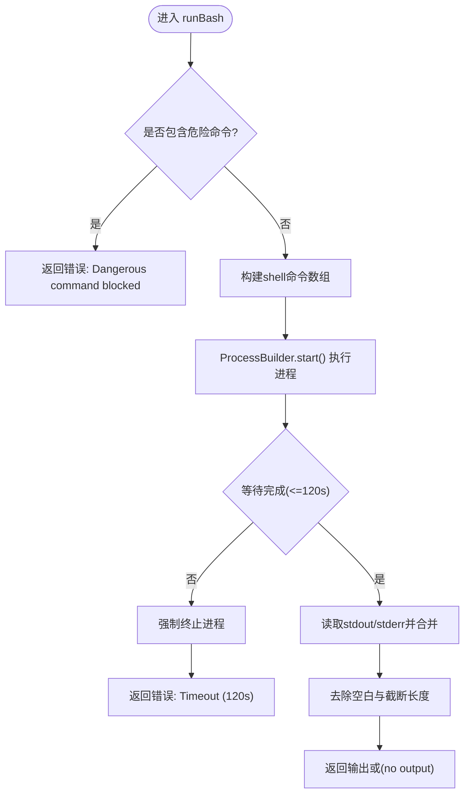
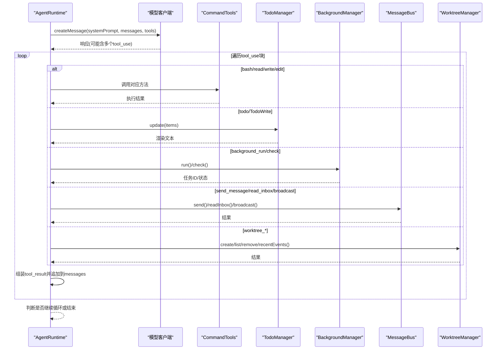
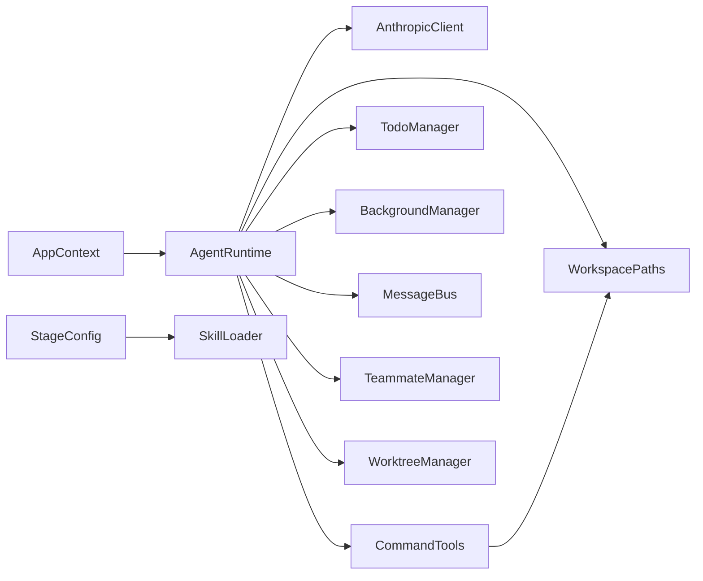

# 命令模式应用

<cite>
**本文引用的文件**
- [ToolSpec.java](file://src/main/java/com/learnclaudecode/model/ToolSpec.java)
- [CommandTools.java](file://src/main/java/com/learnclaudecode/tools/CommandTools.java)
- [AgentRuntime.java](file://src/main/java/com/learnclaudecode/agents/AgentRuntime.java)
- [StageConfig.java](file://src/main/java/com/learnclaudecode/agents/StageConfig.java)
- [AppContext.java](file://src/main/java/com/learnclaudecode/agents/AppContext.java)
- [Launcher.java](file://src/main/java/com/learnclaudecode/agents/Launcher.java)
- [S02ToolUse.java](file://src/main/java/com/learnclaudecode/agents/S02ToolUse.java)
- [WorkspacePaths.java](file://src/main/java/com/learnclaudecode/common/WorkspacePaths.java)
- [TodoManager.java](file://src/main/java/com/learnclaudecode/tools/TodoManager.java)
</cite>

## 目录
1. [简介](#简介)
2. [项目结构](#项目结构)
3. [核心组件](#核心组件)
4. [架构总览](#架构总览)
5. [详细组件分析](#详细组件分析)
6. [依赖关系分析](#依赖关系分析)
7. [性能与可扩展性](#性能与可扩展性)
8. [故障排查指南](#故障排查指南)
9. [结论](#结论)

## 简介
本文件围绕“命令模式”在工具系统中的设计与实现展开，重点解释：
- ToolSpec 如何定义统一的工具规格接口（以消息 API 对齐的 tool 描述结构）。
- CommandTools 如何实现具体的工具命令（文件操作、命令执行等）。
- AgentRuntime 如何将模型返回的工具调用声明映射为本地可执行的命令对象，并支持延迟执行、日志记录与错误处理。
- 命令模式在系统中的作用：将工具调用封装为对象、统一调度、便于扩展与测试。
- 从模型声明工具调用到本地执行并返回结果的完整流程示例。
- 如何通过命令模式提升系统的可扩展性与可测试性。

## 项目结构
本项目采用分层组织方式：
- 模型层：定义工具规格与消息结构（如 ToolSpec）。
- 工具层：提供具体命令实现（如 CommandTools、TodoManager）。
- 运行时层：编排 Agent 循环、工具分发与结果回传（AgentRuntime）。
- 配置层：按阶段暴露不同能力集合（StageConfig）。
- 装配层：集中创建共享服务并注入运行时（AppContext）。
- 入口层：统一启动器与各阶段入口（Launcher、S02ToolUse、Main）。

图表来源
- [Launcher.java:18-26](file://src/main/java/com/learnclaudecode/agents/Launcher.java#L18-L26)
- [AppContext.java:35-59](file://src/main/java/com/learnclaudecode/agents/AppContext.java#L35-L59)
- [AgentRuntime.java:97-123](file://src/main/java/com/learnclaudecode/agents/AgentRuntime.java#L97-L123)
- [AgentRuntime.java:131-261](file://src/main/java/com/learnclaudecode/agents/AgentRuntime.java#L131-L261)
- [StageConfig.java:56-70](file://src/main/java/com/learnclaudecode/agents/StageConfig.java#L56-L70)
- [WorkspacePaths.java:42-49](file://src/main/java/com/learnclaudecode/common/WorkspacePaths.java#L42-L49)

章节来源
- [Launcher.java:18-26](file://src/main/java/com/learnclaudecode/agents/Launcher.java#L18-L26)
- [AppContext.java:35-59](file://src/main/java/com/learnclaudecode/agents/AppContext.java#L35-L59)
- [AgentRuntime.java:97-123](file://src/main/java/com/learnclaudecode/agents/AgentRuntime.java#L97-L123)
- [StageConfig.java:56-70](file://src/main/java/com/learnclaudecode/agents/StageConfig.java#L56-L70)
- [WorkspacePaths.java:42-49](file://src/main/java/com/learnclaudecode/common/WorkspacePaths.java#L42-L49)

## 核心组件
- ToolSpec：定义工具名称、描述与输入 schema，用于与消息 API 对齐，作为工具能力的元数据契约。
- CommandTools：实现基础命令（bash、read_file、write_file、edit_file），包含安全校验、超时控制、输出截断与异常处理。
- AgentRuntime：实现 Agent 主循环，负责调用模型、解析 tool_use 块、分发到具体命令、收集结果并回写上下文。
- StageConfig：按教学阶段组合工具集合与能力开关，决定当前可用的命令集。
- AppContext：集中装配共享服务（命令工具、任务管理、后台任务、团队通信等）并注入运行时。
- WorkspacePaths：提供工作区路径的安全解析与常用目录访问，防止路径逃逸。
- TodoManager：实现任务清单命令，支持状态校验、渲染与未完成项检测。

章节来源
- [ToolSpec.java:5-9](file://src/main/java/com/learnclaudecode/model/ToolSpec.java#L5-L9)
- [CommandTools.java:13-145](file://src/main/java/com/learnclaudecode/tools/CommandTools.java#L13-L145)
- [AgentRuntime.java:23-39](file://src/main/java/com/learnclaudecode/agents/AgentRuntime.java#L23-L39)
- [StageConfig.java:11-25](file://src/main/java/com/learnclaudecode/agents/StageConfig.java#L11-L25)
- [AppContext.java:16-28](file://src/main/java/com/learnclaudecode/agents/AppContext.java#L16-L28)
- [WorkspacePaths.java:8-149](file://src/main/java/com/learnclaudecode/common/WorkspacePaths.java#L8-L149)
- [TodoManager.java:9-92](file://src/main/java/com/learnclaudecode/tools/TodoManager.java#L9-L92)

## 架构总览
命令模式在本系统中的体现：
- 工具规格（ToolSpec）作为统一接口契约，描述每个工具的语义与参数。
- 工具实现（CommandTools、TodoManager 等）是具体命令类，封装了底层资源访问与业务逻辑。
- 运行时（AgentRuntime）通过 switch 将模型声明的工具调用映射为命令对象执行，形成“声明 -> 分发 -> 执行 -> 结果回传”的闭环。
- 配置（StageConfig）决定哪些命令可用，从而在不同阶段灵活启用或禁用能力。

图表来源
- [Launcher.java:18-26](file://src/main/java/com/learnclaudecode/agents/Launcher.java#L18-L26)
- [AppContext.java:35-59](file://src/main/java/com/learnclaudecode/agents/AppContext.java#L35-L59)
- [AgentRuntime.java:97-123](file://src/main/java/com/learnclaudecode/agents/AgentRuntime.java#L97-L123)
- [AgentRuntime.java:131-261](file://src/main/java/com/learnclaudecode/agents/AgentRuntime.java#L131-L261)
- [CommandTools.java:36-65](file://src/main/java/com/learnclaudecode/tools/CommandTools.java#L36-L65)
- [WorkspacePaths.java:42-49](file://src/main/java/com/learnclaudecode/common/WorkspacePaths.java#L42-L49)

## 详细组件分析

### 工具规格接口：ToolSpec
- 作用：以 record 形式定义工具的名称、描述与输入 schema，确保与消息 API 的工具描述结构一致。
- 设计要点：
  - name/description 用于模型理解工具用途。
  - input_schema 约束参数类型与必填字段，提高调用安全性与可解析性。
- 使用场景：StageConfig.baseTools() 中构造工具定义列表，供运行时传递给模型。

章节来源
- [ToolSpec.java:5-9](file://src/main/java/com/learnclaudecode/model/ToolSpec.java#L5-L9)
- [StageConfig.java:56-70](file://src/main/java/com/learnclaudecode/agents/StageConfig.java#L56-L70)

### 命令实现：CommandTools
- 功能：提供 bash 执行、文件读取、写入与精确编辑等基础命令。
- 关键特性：
  - 危险命令黑名单拦截，避免破坏性操作。
  - 跨平台 shell 适配（Windows PowerShell 与 Unix bash）。
  - 超时控制（默认 120 秒），防止长时间阻塞。
  - 输出截断（最大长度限制），避免上下文过大。
  - 异常捕获与错误信息格式化，便于上层统一处理。
- 安全：所有文件路径通过 WorkspacePaths.safeResolve() 进行规范化与边界检查，防止路径逃逸。

图表来源
- [CommandTools.java:36-65](file://src/main/java/com/learnclaudecode/tools/CommandTools.java#L36-L65)

章节来源
- [CommandTools.java:13-145](file://src/main/java/com/learnclaudecode/tools/CommandTools.java#L13-L145)
- [WorkspacePaths.java:42-49](file://src/main/java/com/learnclaudecode/common/WorkspacePaths.java#L42-L49)

### 任务管理命令：TodoManager
- 功能：维护任务清单，支持更新、渲染与未完成项检测。
- 规则：
  - 最多 20 条任务。
  - 仅允许一个 in_progress 状态的任务。
  - 兼容不同字段风格（text/content、activeForm 等）。
  - 渲染为可视化看板，统计完成数量。
- 错误处理：对非法状态、空内容等进行校验并抛出异常，由上层统一捕获。

章节来源
- [TodoManager.java:9-92](file://src/main/java/com/learnclaudecode/tools/TodoManager.java#L9-L92)

### 运行时分发：AgentRuntime
- 职责：
  - 启动 REPL 交互循环，接收用户输入并维护消息历史。
  - 调用模型获取下一步动作，若返回 tool_use，则分发到具体命令执行。
  - 将工具结果包装为 tool_result 并追加到消息历史，驱动下一轮推理。
  - 支持自动/手动压缩、后台任务通知、团队收件箱轮询等高级机制。
- 命令分发：
  - 使用 switch 将模型声明的工具名映射到本地方法调用。
  - 支持多种命令类别：文件操作、命令执行、任务管理、团队协作、worktree 管理等。
- 日志与错误：
  - 打印工具执行摘要（前 200 字符）。
  - 统一捕获异常并转换为错误字符串，保证对话流稳定。

图表来源
- [AgentRuntime.java:131-261](file://src/main/java/com/learnclaudecode/agents/AgentRuntime.java#L131-L261)

章节来源
- [AgentRuntime.java:97-123](file://src/main/java/com/learnclaudecode/agents/AgentRuntime.java#L97-L123)
- [AgentRuntime.java:131-261](file://src/main/java/com/learnclaudecode/agents/AgentRuntime.java#L131-L261)

### 配置与装配：StageConfig 与 AppContext
- StageConfig：
  - baseTools() 定义基础命令集合（bash、read_file、write_file、edit_file）。
  - 各阶段方法（s01-s12、sFull）按需叠加工具与能力开关。
  - systemPrompt() 动态替换工作区与技能描述占位符。
- AppContext：
  - 集中创建共享服务（命令工具、任务管理、后台任务、团队通信、worktree 等）。
  - 将服务注入 AgentRuntime，形成完整的执行环境。

章节来源
- [StageConfig.java:56-70](file://src/main/java/com/learnclaudecode/agents/StageConfig.java#L56-L70)
- [StageConfig.java:77-267](file://src/main/java/com/learnclaudecode/agents/StageConfig.java#L77-L267)
- [AppContext.java:35-59](file://src/main/java/com/learnclaudecode/agents/AppContext.java#L35-L59)

### 入口与启动：Launcher 与 S02ToolUse
- Launcher：统一入口，接收 StageConfig 并启动运行时。
- S02ToolUse：演示文件工具阶段的启动方式，调用 Launcher.launch(StageConfig.s02())。

章节来源
- [Launcher.java:18-26](file://src/main/java/com/learnclaudecode/agents/Launcher.java#L18-L26)
- [S02ToolUse.java:9-11](file://src/main/java/com/learnclaudecode/agents/S02ToolUse.java#L9-L11)

## 依赖关系分析
- AgentRuntime 依赖：
  - AnthropicClient：调用模型 API。
  - WorkspacePaths：安全路径解析。
  - CommandTools：基础命令实现。
  - TodoManager：任务清单命令。
  - BackgroundManager、MessageBus、TeammateManager、WorktreeManager：高级协作与隔离能力。
- StageConfig 依赖：
  - SkillLoader：加载技能描述，用于 system prompt 动态展开。
- CommandTools 依赖：
  - WorkspacePaths：安全路径解析。
- AppContext 依赖：
  - EnvConfig：读取环境变量与工作目录。
  - 各管理器与服务：集中装配并注入运行时。

图表来源
- [AgentRuntime.java:41-51](file://src/main/java/com/learnclaudecode/agents/AgentRuntime.java#L41-L51)
- [StageConfig.java:3-5](file://src/main/java/com/learnclaudecode/agents/StageConfig.java#L3-L5)
- [CommandTools.java:3-12](file://src/main/java/com/learnclaudecode/tools/CommandTools.java#L3-L12)
- [AppContext.java:35-59](file://src/main/java/com/learnclaudecode/agents/AppContext.java#L35-L59)

章节来源
- [AgentRuntime.java:41-51](file://src/main/java/com/learnclaudecode/agents/AgentRuntime.java#L41-L51)
- [StageConfig.java:3-5](file://src/main/java/com/learnclaudecode/agents/StageConfig.java#L3-L5)
- [CommandTools.java:3-12](file://src/main/java/com/learnclaudecode/tools/CommandTools.java#L3-L12)
- [AppContext.java:35-59](file://src/main/java/com/learnclaudecode/agents/AppContext.java#L35-L59)

## 性能与可扩展性
- 性能考虑：
  - 命令执行超时控制，避免长时间阻塞影响交互体验。
  - 输出截断与上下文压缩，减少模型上下文压力。
  - 后台任务异步执行，不阻塞主循环。
- 可扩展性：
  - 新增命令只需在 StageConfig.tools() 中声明，并在 AgentRuntime 的 switch 中添加分支。
  - 工具规格（ToolSpec）与输入 schema 约束，使模型调用更稳定。
  - 通过 AppContext 集中装配，便于单元测试与集成测试。
- 可测试性：
  - CommandTools 与 TodoManager 可独立测试，无需启动完整运行时。
  - 通过替换 WorkspacePaths 与 Mock 客户端，可对 AgentRuntime 进行行为验证。

[本节提供通用指导，不直接分析具体文件]

## 故障排查指南
- 常见错误与处理：
  - 危险命令被拦截：检查命令是否命中黑名单，调整策略或白名单。
  - 路径逃逸异常：确认相对路径未包含 ../ 等越界片段，使用 safeResolve()。
  - 超时错误：检查命令耗时，必要时增加超时阈值或改用后台任务。
  - 未知工具：确认 StageConfig 已声明该工具，且 AgentRuntime 已添加对应分支。
  - 任务状态非法：检查 Todo 项的状态值与唯一 in_progress 约束。
- 调试建议：
  - 观察 AgentRuntime 打印的工具执行摘要，定位问题命令。
  - 启用后台任务通知与团队收件箱轮询，查看异步结果。
  - 使用 s02/s03 等阶段逐步验证能力，缩小问题范围。

章节来源
- [CommandTools.java:36-65](file://src/main/java/com/learnclaudecode/tools/CommandTools.java#L36-L65)
- [WorkspacePaths.java:42-49](file://src/main/java/com/learnclaudecode/common/WorkspacePaths.java#L42-L49)
- [TodoManager.java:21-55](file://src/main/java/com/learnclaudecode/tools/TodoManager.java#L21-L55)
- [AgentRuntime.java:189-234](file://src/main/java/com/learnclaudecode/agents/AgentRuntime.java#L189-L234)

## 结论
本系统通过命令模式实现了工具调用的统一抽象与灵活调度：
- ToolSpec 定义了工具规格的契约，确保模型与本地实现的对接一致性。
- CommandTools 提供了安全的文件与命令执行能力，具备超时、截断与异常处理。
- AgentRuntime 将模型的工具调用声明映射为具体命令执行，形成“声明 -> 分发 -> 执行 -> 结果回传”的闭环。
- StageConfig 与 AppContext 使得能力可按阶段启用与集中装配，提升可扩展性与可测试性。
- 通过命令模式，系统能够轻松扩展新工具、隔离复杂任务、记录日志与处理错误，为构建强大的 AI Agent 工具系统奠定基础。

[本节总结整体发现，不直接分析具体文件]