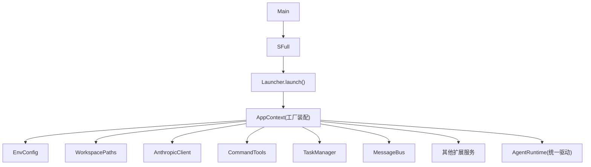
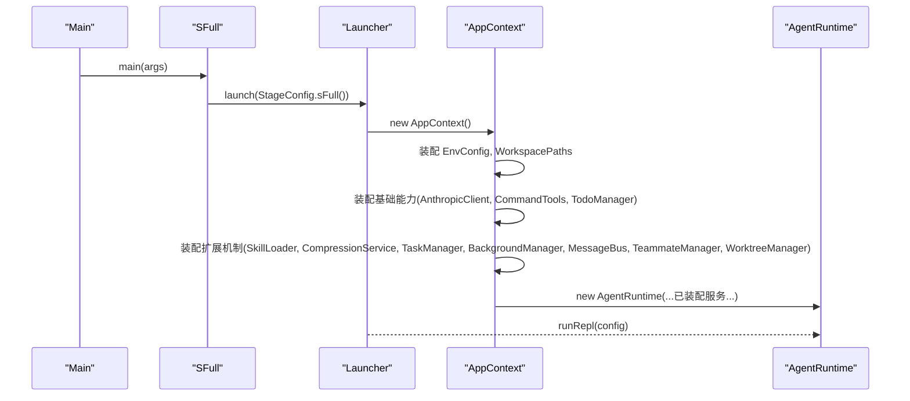
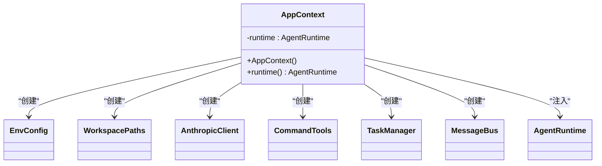
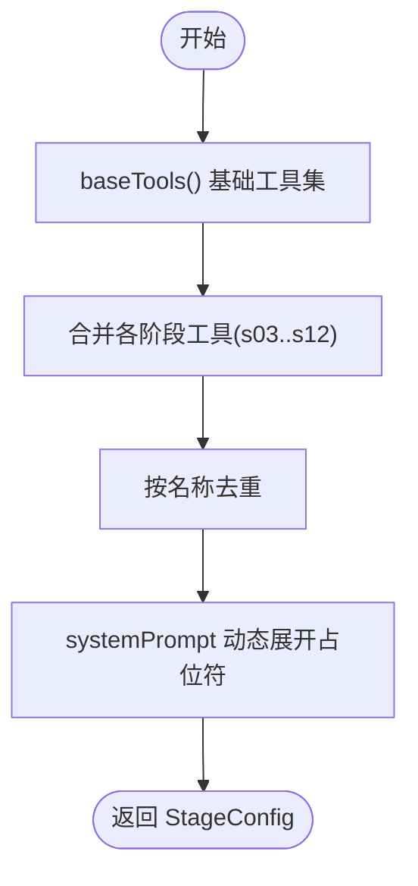
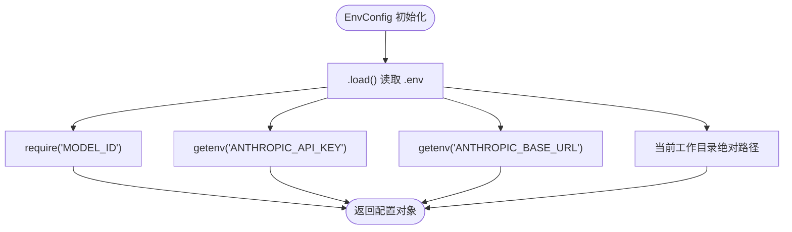
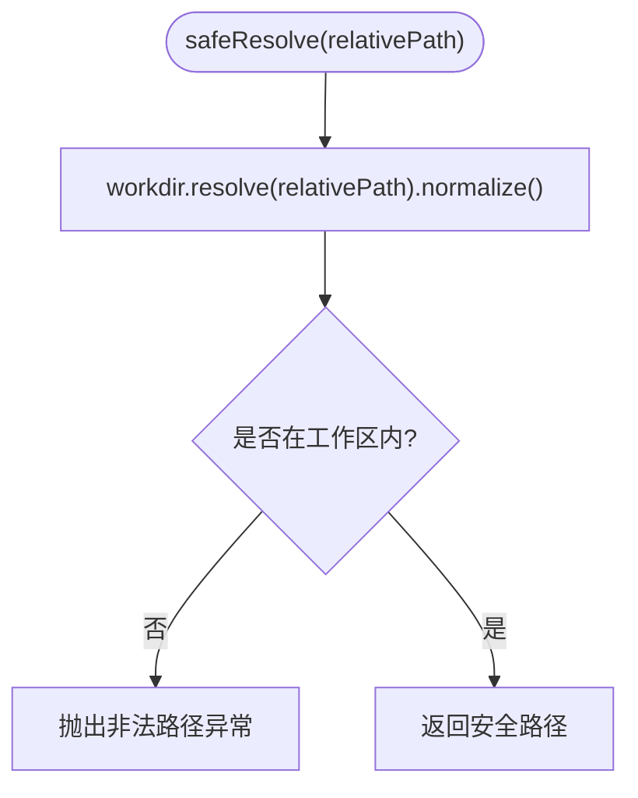
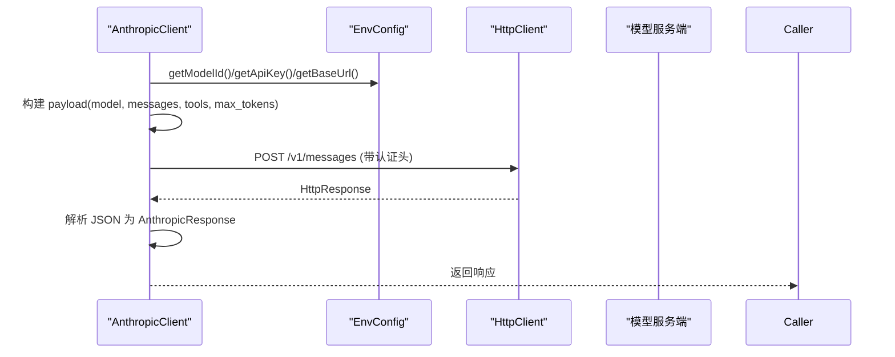
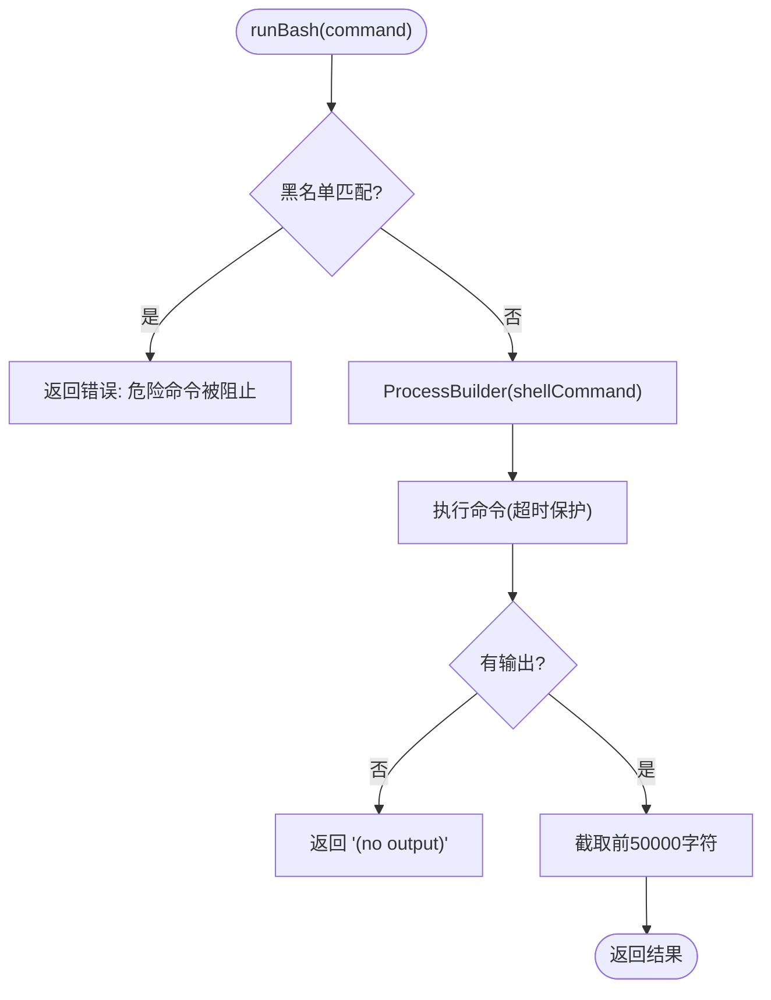
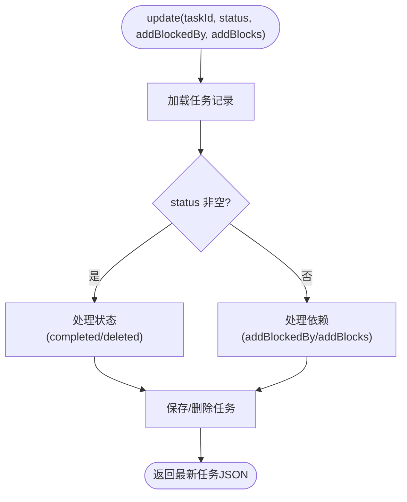
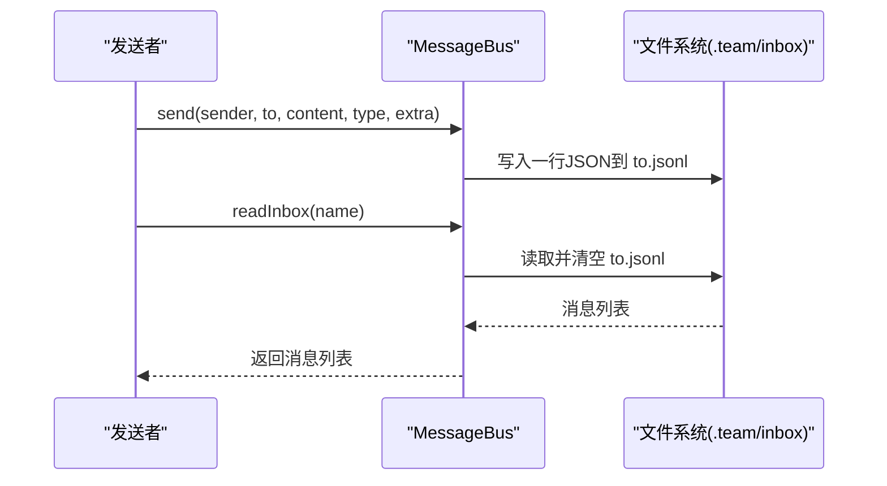

# 工厂模式应用

<cite>
**本文引用的文件**
- [AppContext.java](file://src/main/java/com/learnclaudecode/agents/AppContext.java)
- [Launcher.java](file://src/main/java/com/learnclaudecode/agents/Launcher.java)
- [StageConfig.java](file://src/main/java/com/learnclaudecode/agents/StageConfig.java)
- [SFull.java](file://src/main/java/com/learnclaudecode/agents/SFull.java)
- [EnvConfig.java](file://src/main/java/com/learnclaudecode/common/EnvConfig.java)
- [WorkspacePaths.java](file://src/main/java/com/learnclaudecode/common/WorkspacePaths.java)
- [AnthropicClient.java](file://src/main/java/com/learnclaudecode/common/AnthropicClient.java)
- [CommandTools.java](file://src/main/java/com/learnclaudecode/tools/CommandTools.java)
- [TaskManager.java](file://src/main/java/com/learnclaudecode/tasks/TaskManager.java)
- [MessageBus.java](file://src/main/java/com/learnclaudecode/team/MessageBus.java)
</cite>

## 目录
1. [简介](#简介)
2. [项目结构](#项目结构)
3. [核心组件](#核心组件)
4. [架构总览](#架构总览)
5. [详细组件分析](#详细组件分析)
6. [依赖关系分析](#依赖关系分析)
7. [性能与可维护性](#性能与可维护性)
8. [故障排查指南](#故障排查指南)
9. [结论](#结论)
10. [附录：装配清单与示例路径](#附录：装配清单与示例路径)

## 简介
本文件聚焦于“工厂模式”在本项目中的落地实践，重点解析 AppContext 如何作为集中装配器，通过构造函数参数注入的方式创建并管理所有共享服务实例。围绕环境配置加载、基础能力创建、扩展机制组装、运行时统一驱动等层次化构建过程，说明工厂模式如何实现依赖注入与控制反转，从而解耦依赖关系、简化初始化流程、提高代码可维护性与可扩展性。

## 项目结构
- 入口层：Main 指向完整能力版本 SFull；SFull 通过 Launcher 启动，最终由 AppContext 完成装配并交给 AgentRuntime 运行。
- 装配层：AppContext 是工厂式装配中心，负责按“基础能力 -> 扩展机制 -> 统一运行时”的顺序创建并注入共享服务。
- 配置层：EnvConfig 读取环境变量（支持 .env 与系统变量），提供模型 ID、API Key、Base URL、工作目录等。
- 基础设施层：WorkspacePaths 提供安全路径解析与工作区子目录访问；AnthropicClient 封装 HTTP 调用；CommandTools 提供命令执行与文件读写。
- 扩展机制层：SkillLoader、CompressionService、TaskManager、BackgroundManager、MessageBus、TeammateManager、WorktreeManager 等。
- 运行时层：AgentRuntime 作为统一驱动，接收全部已装配服务，编排“用户输入 -> 调模型 -> 工具调用 -> 本地执行 -> 回传模型”的主循环。



图表来源
- [Launcher.java:23-26](file://src/main/java/com/learnclaudecode/agents/Launcher.java#L23-L26)
- [AppContext.java:35-59](file://src/main/java/com/learnclaudecode/agents/AppContext.java#L35-L59)
- [EnvConfig.java:22-29](file://src/main/java/com/learnclaudecode/common/EnvConfig.java#L22-L29)
- [WorkspacePaths.java:21-23](file://src/main/java/com/learnclaudecode/common/WorkspacePaths.java#L21-L23)
- [AnthropicClient.java:36-41](file://src/main/java/com/learnclaudecode/common/AnthropicClient.java#L36-L41)
- [CommandTools.java:26-28](file://src/main/java/com/learnclaudecode/tools/CommandTools.java#L26-L28)
- [TaskManager.java:35-42](file://src/main/java/com/learnclaudecode/tasks/TaskManager.java#L35-L42)
- [MessageBus.java:35-42](file://src/main/java/com/learnclaudecode/team/MessageBus.java#L35-L42)

章节来源
- [Launcher.java:23-26](file://src/main/java/com/learnclaudecode/agents/Launcher.java#L23-L26)
- [AppContext.java:35-59](file://src/main/java/com/learnclaudecode/agents/AppContext.java#L35-L59)

## 核心组件
- AppContext：工厂式装配器，集中创建共享服务并按依赖顺序注入到 AgentRuntime。
- StageConfig：阶段配置器，决定不同教学脚本暴露的能力集合（工具集、开关、system prompt）。
- EnvConfig：环境配置加载器，统一从 .env 或系统环境变量获取关键配置。
- WorkspacePaths：工作区路径工具，提供安全路径解析与常用目录访问。
- AnthropicClient：模型客户端，封装 HTTP 请求与响应解析。
- CommandTools：基础工具，提供命令执行与文件读写。
- TaskManager：任务系统，基于文件持久化的任务板。
- MessageBus：消息总线，基于文件的轻量通信通道。

章节来源
- [AppContext.java:16-28](file://src/main/java/com/learnclaudecode/agents/AppContext.java#L16-L28)
- [StageConfig.java:11-25](file://src/main/java/com/learnclaudecode/agents/StageConfig.java#L11-L25)
- [EnvConfig.java:9-29](file://src/main/java/com/learnclaudecode/common/EnvConfig.java#L9-L29)
- [WorkspacePaths.java:8-23](file://src/main/java/com/learnclaudecode/common/WorkspacePaths.java#L8-L23)
- [AnthropicClient.java:15-41](file://src/main/java/com/learnclaudecode/common/AnthropicClient.java#L15-L41)
- [CommandTools.java:13-28](file://src/main/java/com/learnclaudecode/tools/CommandTools.java#L13-L28)
- [TaskManager.java:17-42](file://src/main/java/com/learnclaudecode/tasks/TaskManager.java#L17-L42)
- [MessageBus.java:16-42](file://src/main/java/com/learnclaudecode/team/MessageBus.java#L16-L42)

## 架构总览
AppContext 采用“分层装配 + 构造函数注入”的工厂模式：
- 第一层：环境配置与工作区路径（EnvConfig、WorkspacePaths）
- 第二层：基础能力（AnthropicClient、CommandTools、TodoManager）
- 第三层：扩展机制（SkillLoader、CompressionService、TaskManager、BackgroundManager、MessageBus、TeammateManager、WorktreeManager）
- 第四层：统一运行时（AgentRuntime）

这种分层使得每个阶段的依赖清晰可见，新增能力只需在 AppContext 中追加构造与注入，无需修改上层调用方，体现控制反转（IoC）与依赖注入（DI）。



图表来源
- [SFull.java:9-11](file://src/main/java/com/learnclaudecode/agents/SFull.java#L9-L11)
- [Launcher.java:23-26](file://src/main/java/com/learnclaudecode/agents/Launcher.java#L23-L26)
- [AppContext.java:35-59](file://src/main/java/com/learnclaudecode/agents/AppContext.java#L35-L59)

## 详细组件分析

### AppContext 工厂装配器
- 职责：集中创建共享服务，按依赖顺序装配，并将所有服务注入到 AgentRuntime。
- 设计要点：
  - 先装配环境与路径，再装配基础能力，最后装配扩展机制，确保依赖满足。
  - 通过构造函数参数注入，避免全局单例与隐式耦合。
  - 将“谁创建、何时创建、如何创建”集中在一个类中，降低分散初始化带来的维护成本。



图表来源
- [AppContext.java:35-59](file://src/main/java/com/learnclaudecode/agents/AppContext.java#L35-L59)

章节来源
- [AppContext.java:35-59](file://src/main/java/com/learnclaudecode/agents/AppContext.java#L35-L59)

### StageConfig 阶段配置器（能力装配）
- 职责：定义不同教学阶段的能力集合（工具集、开关、system prompt），并通过合并与去重生成完整视图。
- 设计要点：
  - baseTools 提供最小可用工具集。
  - s01..s12 逐步叠加能力，sFull 合并为完整能力视图。
  - systemPrompt 动态展开占位符（如 ${WORKDIR}、${SKILLS}），实现运行时上下文绑定。



图表来源
- [StageConfig.java:56-70](file://src/main/java/com/learnclaudecode/agents/StageConfig.java#L56-L70)
- [StageConfig.java:251-267](file://src/main/java/com/learnclaudecode/agents/StageConfig.java#L251-L267)
- [StageConfig.java:44-49](file://src/main/java/com/learnclaudecode/agents/StageConfig.java#L44-L49)

章节来源
- [StageConfig.java:44-49](file://src/main/java/com/learnclaudecode/agents/StageConfig.java#L44-L49)
- [StageConfig.java:56-70](file://src/main/java/com/learnclaudecode/agents/StageConfig.java#L56-L70)
- [StageConfig.java:251-267](file://src/main/java/com/learnclaudecode/agents/StageConfig.java#L251-L267)

### EnvConfig 环境配置加载器
- 职责：读取 .env 与系统环境变量，提供模型 ID、API Key、Base URL、工作目录。
- 设计要点：
  - 优先级：系统环境变量 > .env，便于 CI/IDEA 覆盖。
  - require/getenv 方法保证必填项校验与可选项安全获取。



图表来源
- [EnvConfig.java:22-29](file://src/main/java/com/learnclaudecode/common/EnvConfig.java#L22-L29)
- [EnvConfig.java:37-58](file://src/main/java/com/learnclaudecode/common/EnvConfig.java#L37-L58)

章节来源
- [EnvConfig.java:22-58](file://src/main/java/com/learnclaudecode/common/EnvConfig.java#L22-L58)

### WorkspacePaths 安全路径工具
- 职责：规范化工作目录、安全解析相对路径、提供常用子目录访问。
- 设计要点：
  - safeResolve 防止路径逃逸出工作区。
  - readText/writeText 统一编码与异常处理。
  - tasksDir/teamDir/inboxDir/skillsDir/transcriptDir/worktreesDir 提供约定目录。



图表来源
- [WorkspacePaths.java:42-49](file://src/main/java/com/learnclaudecode/common/WorkspacePaths.java#L42-L49)

章节来源
- [WorkspacePaths.java:21-23](file://src/main/java/com/learnclaudecode/common/WorkspacePaths.java#L21-L23)
- [WorkspacePaths.java:42-49](file://src/main/java/com/learnclaudecode/common/WorkspacePaths.java#L42-L49)

### AnthropicClient 模型客户端
- 职责：封装 HTTP 请求，发送 messages API 调用，解析响应。
- 设计要点：
  - 使用 EnvConfig 提供的 modelId、apiKey、baseUrl。
  - 兼容第三方 Anthropic-compatible 端点。
  - 错误处理：HTTP 状态码检查与网络异常包装。



图表来源
- [AnthropicClient.java:36-41](file://src/main/java/com/learnclaudecode/common/AnthropicClient.java#L36-L41)
- [AnthropicClient.java:52-101](file://src/main/java/com/learnclaudecode/common/AnthropicClient.java#L52-L101)

章节来源
- [AnthropicClient.java:52-101](file://src/main/java/com/learnclaudecode/common/AnthropicClient.java#L52-L101)

### CommandTools 基础工具
- 职责：执行 shell 命令、读取/写入/编辑文件。
- 设计要点：
  - 黑名单拦截危险命令。
  - 跨平台 shell 命令构造。
  - 限制输出长度，避免阻塞或过大上下文。



图表来源
- [CommandTools.java:36-65](file://src/main/java/com/learnclaudecode/tools/CommandTools.java#L36-L65)
- [CommandTools.java:73-78](file://src/main/java/com/learnclaudecode/tools/CommandTools.java#L73-L78)

章节来源
- [CommandTools.java:36-65](file://src/main/java/com/learnclaudecode/tools/CommandTools.java#L36-L65)

### TaskManager 任务系统
- 职责：基于文件的任务板，支持创建、更新、认领、列出、绑定 worktree 等操作。
- 设计要点：
  - 同步方法保证并发安全。
  - 任务状态流转与依赖清理。
  - 文件持久化与扫描。



图表来源
- [TaskManager.java:84-133](file://src/main/java/com/learnclaudecode/tasks/TaskManager.java#L84-L133)

章节来源
- [TaskManager.java:84-133](file://src/main/java/com/learnclaudecode/tasks/TaskManager.java#L84-L133)

### MessageBus 消息总线
- 职责：基于文件的轻量消息收发，支持点对点与广播。
- 设计要点：
  - 类型校验与时间戳。
  - 读后即清空语义。
  - 多队友广播。



图表来源
- [MessageBus.java:54-75](file://src/main/java/com/learnclaudecode/team/MessageBus.java#L54-L75)
- [MessageBus.java:83-102](file://src/main/java/com/learnclaudecode/team/MessageBus.java#L83-L102)

章节来源
- [MessageBus.java:54-75](file://src/main/java/com/learnclaudecode/team/MessageBus.java#L54-L75)
- [MessageBus.java:83-102](file://src/main/java/com/learnclaudecode/team/MessageBus.java#L83-L102)

## 依赖关系分析
- AppContext 作为装配中心，显式声明所有依赖的创建与注入，形成清晰的依赖图。
- 各服务之间通过构造函数参数传递依赖，避免全局状态与隐式耦合。
- StageConfig 通过静态工厂方法提供不同能力组合，降低运行时复杂度。

```mermaid
graph TB
AppContext["AppContext"] --> EnvConfig["EnvConfig"]
AppContext --> WorkspacePaths["WorkspacePaths"]
AppContext --> AnthropicClient["AnthropicClient"]
AppContext --> CommandTools["CommandTools"]
AppContext --> TaskManager["TaskManager"]
AppContext --> MessageBus["MessageBus"]
AppContext --> AgentRuntime["AgentRuntime"]
StageConfig --> AgentRuntime : "配置注入"
```

图表来源
- [AppContext.java:35-59](file://src/main/java/com/learnclaudecode/agents/AppContext.java#L35-L59)
- [StageConfig.java:251-267](file://src/main/java/com/learnclaudecode/agents/StageConfig.java#L251-L267)

章节来源
- [AppContext.java:35-59](file://src/main/java/com/learnclaudecode/agents/AppContext.java#L35-L59)
- [StageConfig.java:251-267](file://src/main/java/com/learnclaudecode/agents/StageConfig.java#L251-L267)

## 性能与可维护性
- 性能
  - 环境变量读取与路径解析在启动时完成，避免重复计算。
  - 命令执行设置超时，防止长时间阻塞。
  - 文件 I/O 使用 UTF-8 编码与批量操作，减少开销。
- 可维护性
  - 工厂装配集中化，新增服务只需在 AppContext 中添加构造与注入。
  - 阶段配置模块化，能力开关与工具集易于扩展。
  - 错误处理统一包装，便于调试与定位问题。

[本节为通用指导，不直接分析具体文件]

## 故障排查指南
- 环境变量缺失：EnvConfig 对必填项进行校验，若缺失将抛出异常，需检查 .env 或系统环境变量。
- 路径逃逸：WorkspacePaths.safeResolve 会拒绝不在工作区内的路径，需修正相对路径。
- 网络调用失败：AnthropicClient 对 HTTP 状态码与非零响应进行处理，需检查 API Key、Base URL 与网络连通性。
- 命令执行超时：CommandTools.runBash 设置超时，若任务过长需优化命令或增加超时。
- 任务文件损坏：TaskManager 读取/保存任务时使用 JSON 序列化，若格式错误将抛出异常，需修复任务文件。

章节来源
- [EnvConfig.java:37-39](file://src/main/java/com/learnclaudecode/common/EnvConfig.java#L37-L39)
- [WorkspacePaths.java:42-49](file://src/main/java/com/learnclaudecode/common/WorkspacePaths.java#L42-L49)
- [AnthropicClient.java:90-101](file://src/main/java/com/learnclaudecode/common/AnthropicClient.java#L90-L101)
- [CommandTools.java:47-51](file://src/main/java/com/learnclaudecode/tools/CommandTools.java#L47-L51)
- [TaskManager.java:276-285](file://src/main/java/com/learnclaudecode/tasks/TaskManager.java#L276-L285)

## 结论
本项目通过 AppContext 实现了典型的工厂模式：集中装配、分层构建、构造函数注入。该设计有效解耦了依赖关系，简化了初始化流程，提升了代码的可维护性与可扩展性。StageConfig 进一步实现了能力配置的模块化与运行时装配，使不同教学阶段能够灵活组合能力。整体架构清晰、职责明确，适合学习与扩展。

[本节为总结性内容，不直接分析具体文件]

## 附录：装配清单与示例路径
- 环境配置加载：EnvConfig 初始化与读取逻辑
  - [EnvConfig.java:22-29](file://src/main/java/com/learnclaudecode/common/EnvConfig.java#L22-L29)
- 基础能力创建：AnthropicClient、CommandTools、TodoManager
  - [AnthropicClient.java:36-41](file://src/main/java/com/learnclaudecode/common/AnthropicClient.java#L36-L41)
  - [CommandTools.java:26-28](file://src/main/java/com/learnclaudecode/tools/CommandTools.java#L26-L28)
- 扩展机制组装：SkillLoader、CompressionService、TaskManager、BackgroundManager、MessageBus、TeammateManager、WorktreeManager
  - [TaskManager.java:35-42](file://src/main/java/com/learnclaudecode/tasks/TaskManager.java#L35-L42)
  - [MessageBus.java:35-42](file://src/main/java/com/learnclaudecode/team/MessageBus.java#L35-L42)
- 运行时统一驱动：AgentRuntime 接收全部已装配服务
  - [AppContext.java:55-59](file://src/main/java/com/learnclaudecode/agents/AppContext.java#L55-L59)
- 阶段配置与能力装配：StageConfig 的 baseTools 与 sFull 合并
  - [StageConfig.java:56-70](file://src/main/java/com/learnclaudecode/agents/StageConfig.java#L56-L70)
  - [StageConfig.java:251-267](file://src/main/java/com/learnclaudecode/agents/StageConfig.java#L251-L267)

章节来源
- [AppContext.java:35-59](file://src/main/java/com/learnclaudecode/agents/AppContext.java#L35-L59)
- [StageConfig.java:56-70](file://src/main/java/com/learnclaudecode/agents/StageConfig.java#L56-L70)
- [StageConfig.java:251-267](file://src/main/java/com/learnclaudecode/agents/StageConfig.java#L251-L267)
- [EnvConfig.java:22-29](file://src/main/java/com/learnclaudecode/common/EnvConfig.java#L22-L29)
- [AnthropicClient.java:36-41](file://src/main/java/com/learnclaudecode/common/AnthropicClient.java#L36-L41)
- [CommandTools.java:26-28](file://src/main/java/com/learnclaudecode/tools/CommandTools.java#L26-L28)
- [TaskManager.java:35-42](file://src/main/java/com/learnclaudecode/tasks/TaskManager.java#L35-L42)
- [MessageBus.java:35-42](file://src/main/java/com/learnclaudecode/team/MessageBus.java#L35-L42)