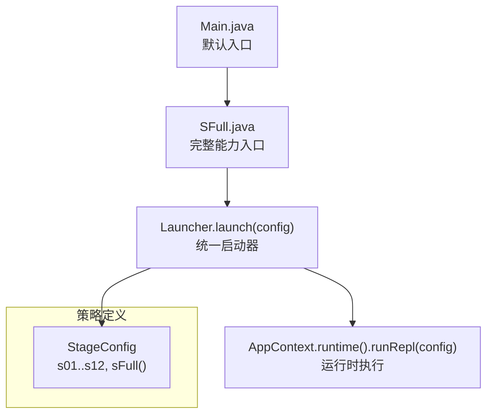
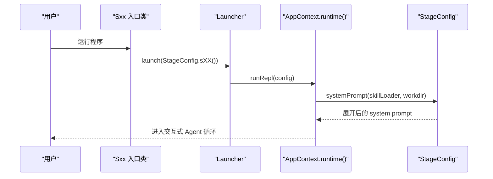
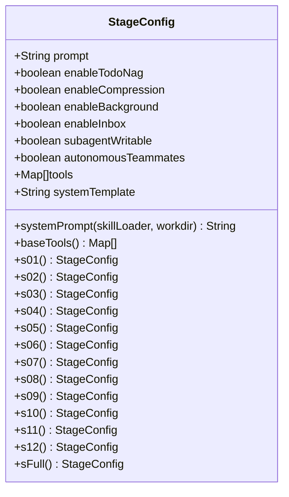
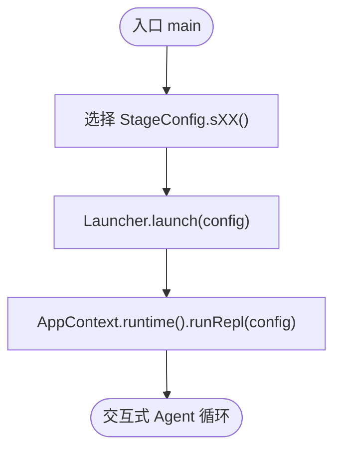
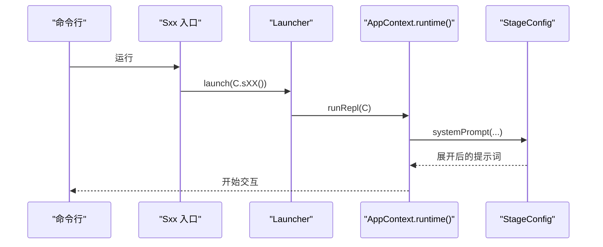
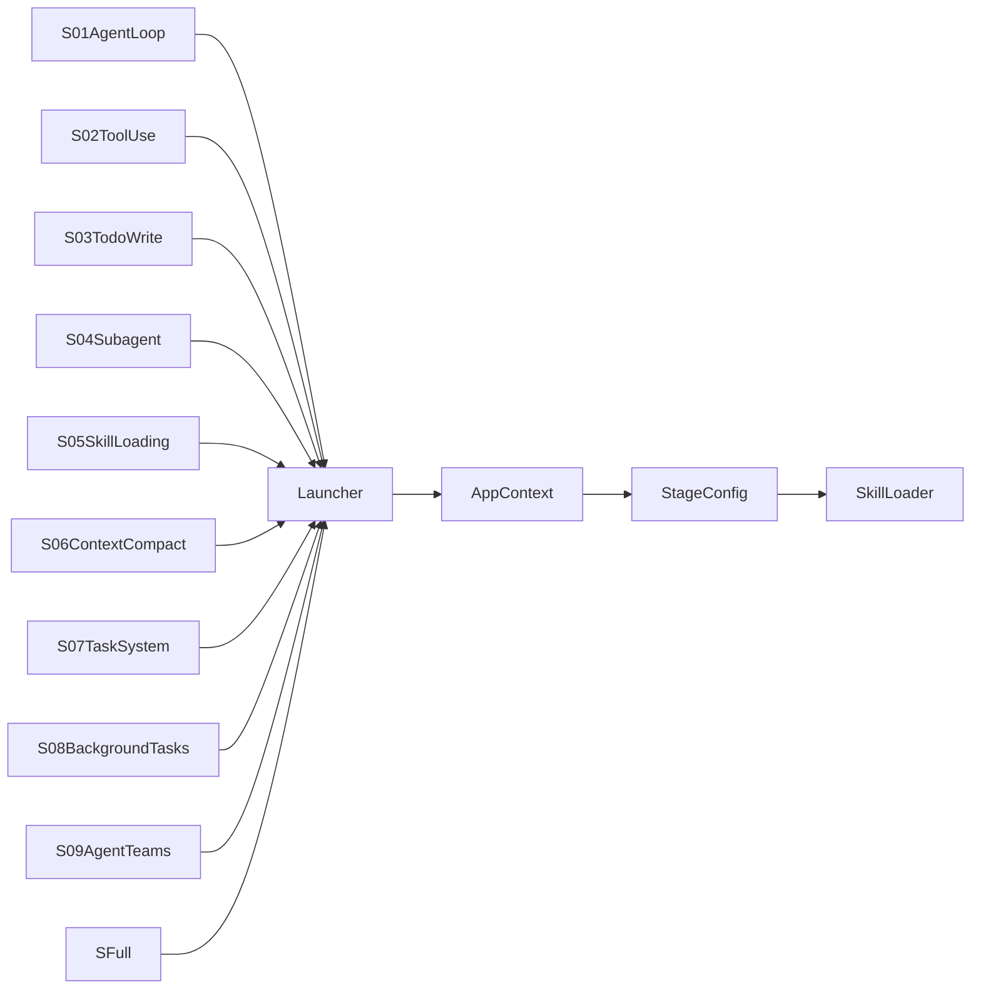

# 策略模式应用

<cite>
**本文引用的文件**
- [StageConfig.java](file://src/main/java/com/learnclaudecode/agents/StageConfig.java)
- [Launcher.java](file://src/main/java/com/learnclaudecode/agents/Launcher.java)
- [AppContext.java](file://src/main/java/com/learnclaudecode/agents/AppContext.java)
- [S01AgentLoop.java](file://src/main/java/com/learnclaudecode/agents/S01AgentLoop.java)
- [S02ToolUse.java](file://src/main/java/com/learnclaudecode/agents/S02ToolUse.java)
- [S03TodoWrite.java](file://src/main/java/com/learnclaudecode/agents/S03TodoWrite.java)
- [S04Subagent.java](file://src/main/java/com/learnclaudecode/agents/S04Subagent.java)
- [S05SkillLoading.java](file://src/main/java/com/learnclaudecode/agents/S05SkillLoading.java)
- [S06ContextCompact.java](file://src/main/java/com/learnclaudecode/agents/S06ContextCompact.java)
- [S07TaskSystem.java](file://src/main/java/com/learnclaudecode/agents/S07TaskSystem.java)
- [S08BackgroundTasks.java](file://src/main/java/com/learnclaudecode/agents/S08BackgroundTasks.java)
- [S09AgentTeams.java](file://src/main/java/com/learnclaudecode/agents/S09AgentTeams.java)
- [S12WorktreeTaskIsolation.java](file://src/main/java/com/learnclaudecode/agents/S12WorktreeTaskIsolation.java)
- [SFull.java](file://src/main/java/com/learnclaudecode/agents/SFull.java)
- [Main.java](file://src/main/java/com/learnclaudecode/Main.java)
</cite>

## 目录
1. [简介](#简介)
2. [项目结构](#项目结构)
3. [核心组件](#核心组件)
4. [架构总览](#架构总览)
5. [详细组件分析](#详细组件分析)
6. [依赖关系分析](#依赖关系分析)
7. [性能考量](#性能考量)
8. [故障排查指南](#故障排查指南)
9. [结论](#结论)
10. [附录](#附录)

## 简介
本文件围绕“策略模式”在该仓库中的落地展开，聚焦 StageConfig 如何作为“学习阶段策略”的抽象与组合中心，驱动不同阶段的 Agent 行为。通过 StageConfig，系统以“配置即策略”的方式，动态决定：
- 当前阶段暴露给模型的系统提示（system prompt）
- 可用的工具集合（tools）
- 是否启用 Todo、上下文压缩、后台任务、团队协作、自治队友等能力开关

其核心价值在于：
- 支持在运行时动态切换不同的 Agent 行为模式
- 实现渐进式学习体验（从最小闭环到完整能力）
- 便于扩展新的学习阶段或能力组合

## 项目结构
该项目的 Java 后端将“策略定义”与“策略执行”解耦：
- 策略定义：StageConfig 提供各阶段的配置快照（提示词、工具集、能力开关）
- 策略选择：每个 Sxx 入口类仅负责选择对应的 StageConfig
- 策略执行：Launcher 统一创建 AppContext 并调用运行时执行，传入所选策略

图表来源
- [Main.java:5-13](file://src/main/java/com/learnclaudecode/Main.java#L5-L13)
- [SFull.java:3-11](file://src/main/java/com/learnclaudecode/agents/SFull.java#L3-L11)
- [Launcher.java:18-26](file://src/main/java/com/learnclaudecode/agents/Launcher.java#L18-L26)
- [StageConfig.java:77-267](file://src/main/java/com/learnclaudecode/agents/StageConfig.java#L77-L267)

章节来源
- [Main.java:5-13](file://src/main/java/com/learnclaudecode/Main.java#L5-L13)
- [SFull.java:3-11](file://src/main/java/com/learnclaudecode/agents/SFull.java#L3-L11)
- [Launcher.java:18-26](file://src/main/java/com/learnclaudecode/agents/Launcher.java#L18-L26)
- [StageConfig.java:77-267](file://src/main/java/com/learnclaudecode/agents/StageConfig.java#L77-L267)

## 核心组件
- StageConfig：策略数据对象（record），封装 systemTemplate、tools、能力开关；提供 systemPrompt 方法用于运行时展开提示词；提供 s01..s12、sFull 等静态工厂方法作为具体策略实例。
- Launcher：统一启动器，接收 StageConfig 并交给运行时执行。
- 各 Sxx 入口类：极薄的主函数，仅选择对应 StageConfig 并调用 Launcher.launch。
- AppContext：承载运行时环境，最终由 runRepl 消费 StageConfig 完成交互循环。

章节来源
- [StageConfig.java:11-49](file://src/main/java/com/learnclaudecode/agents/StageConfig.java#L11-L49)
- [Launcher.java:18-26](file://src/main/java/com/learnclaudecode/agents/Launcher.java#L18-L26)
- [S01AgentLoop.java:3-11](file://src/main/java/com/learnclaudecode/agents/S01AgentLoop.java#L3-L11)
- [S02ToolUse.java:3-11](file://src/main/java/com/learnclaudecode/agents/S02ToolUse.java#L3-L11)
- [S03TodoWrite.java:3-11](file://src/main/java/com/learnclaudecode/agents/S03TodoWrite.java#L3-L11)
- [S04Subagent.java:3-11](file://src/main/java/com/learnclaudecode/agents/S04Subagent.java#L3-L11)
- [S05SkillLoading.java:3-11](file://src/main/java/com/learnclaudecode/agents/S05SkillLoading.java#L3-L11)
- [S06ContextCompact.java:3-11](file://src/main/java/com/learnclaudecode/agents/S06ContextCompact.java#L3-L11)
- [S07TaskSystem.java:3-11](file://src/main/java/com/learnclaudecode/agents/S07TaskSystem.java#L3-L11)
- [S08BackgroundTasks.java:3-11](file://src/main/java/com/learnclaudecode/agents/S08BackgroundTasks.java#L3-L11)
- [S09AgentTeams.java:3-11](file://src/main/java/com/learnclaudecode/agents/S09AgentTeams.java#L3-L11)
- [S12WorktreeTaskIsolation.java:3-11](file://src/main/java/com/learnclaudecode/agents/S12WorktreeTaskIsolation.java#L3-L11)

## 架构总览
下图展示了“策略选择—策略执行”的端到端流程：用户通过某个 Sxx 入口类选择特定 StageConfig，Launcher 将其注入运行时，运行时依据配置动态装配提示词与工具集，从而改变 Agent 的行为模式。

图表来源
- [S01AgentLoop.java:9-11](file://src/main/java/com/learnclaudecode/agents/S01AgentLoop.java#L9-L11)
- [Launcher.java:23-25](file://src/main/java/com/learnclaudecode/agents/Launcher.java#L23-L25)
- [StageConfig.java:44-49](file://src/main/java/com/learnclaudecode/agents/StageConfig.java#L44-L49)

## 详细组件分析

### 策略接口与数据模型：StageConfig
- 角色定位：StageConfig 是“策略数据对象”，而非传统意义上的接口。它通过一组静态工厂方法（s01..s12、sFull）返回不同“策略实例”。
- 关键职责：
  - 定义系统提示模板 systemTemplate，并在运行时根据工作区与技能描述展开为最终提示词。
  - 维护 tools 列表，表达当前阶段允许使用的工具集合。
  - 维护能力开关（enableTodoNag、enableCompression、enableBackground、enableInbox、subagentWritable、autonomousTeammates），控制高级机制的启用。
- 复杂度与性能：
  - systemPrompt 的时间复杂度 O(1)，仅做字符串替换。
  - 工具列表构建多为常量级拼接，合并时通过去重保证唯一性。

图表来源
- [StageConfig.java:26-36](file://src/main/java/com/learnclaudecode/agents/StageConfig.java#L26-L36)
- [StageConfig.java:44-49](file://src/main/java/com/learnclaudecode/agents/StageConfig.java#L44-L49)
- [StageConfig.java:56-69](file://src/main/java/com/learnclaudecode/agents/StageConfig.java#L56-L69)
- [StageConfig.java:77-267](file://src/main/java/com/learnclaudecode/agents/StageConfig.java#L77-L267)

章节来源
- [StageConfig.java:11-49](file://src/main/java/com/learnclaudecode/agents/StageConfig.java#L11-L49)
- [StageConfig.java:56-69](file://src/main/java/com/learnclaudecode/agents/StageConfig.java#L56-L69)
- [StageConfig.java:77-267](file://src/main/java/com/learnclaudecode/agents/StageConfig.java#L77-L267)

### 具体策略实现：各 Sxx 入口类
- 设计要点：每个 Sxx 类都是“策略选择器”，只负责选择 StageConfig 的一个具体实例，然后委托给 Launcher 执行。
- 示例路径：
  - S01AgentLoop.main → StageConfig.s01()
  - S02ToolUse.main → StageConfig.s02()
  - S03TodoWrite.main → StageConfig.s03()
  - S04Subagent.main → StageConfig.s04()
  - S05SkillLoading.main → StageConfig.s05()
  - S06ContextCompact.main → StageConfig.s06()
  - S07TaskSystem.main → StageConfig.s07()
  - S08BackgroundTasks.main → StageConfig.s08()
  - S09AgentTeams.main → StageConfig.s09()
  - S12WorktreeTaskIsolation.main → StageConfig.s12()
  - SFull.main → StageConfig.sFull()

图表来源
- [S01AgentLoop.java:9-11](file://src/main/java/com/learnclaudecode/agents/S01AgentLoop.java#L9-L11)
- [S02ToolUse.java:9-11](file://src/main/java/com/learnclaudecode/agents/S02ToolUse.java#L9-L11)
- [S03TodoWrite.java:9-11](file://src/main/java/com/learnclaudecode/agents/S03TodoWrite.java#L9-L11)
- [S04Subagent.java:9-11](file://src/main/java/com/learnclaudecode/agents/S04Subagent.java#L9-L11)
- [S05SkillLoading.java:9-11](file://src/main/java/com/learnclaudecode/agents/S05SkillLoading.java#L9-L11)
- [S06ContextCompact.java:9-11](file://src/main/java/com/learnclaudecode/agents/S06ContextCompact.java#L9-L11)
- [S07TaskSystem.java:9-11](file://src/main/java/com/learnclaudecode/agents/S07TaskSystem.java#L9-L11)
- [S08BackgroundTasks.java:9-11](file://src/main/java/com/learnclaudecode/agents/S08BackgroundTasks.java#L9-L11)
- [S09AgentTeams.java:9-11](file://src/main/java/com/learnclaudecode/agents/S09AgentTeams.java#L9-L11)
- [S12WorktreeTaskIsolation.java:9-11](file://src/main/java/com/learnclaudecode/agents/S12WorktreeTaskIsolation.java#L9-L11)
- [SFull.java:9-11](file://src/main/java/com/learnclaudecode/agents/SFull.java#L9-L11)
- [Launcher.java:23-25](file://src/main/java/com/learnclaudecode/agents/Launcher.java#L23-L25)

章节来源
- [S01AgentLoop.java:9-11](file://src/main/java/com/learnclaudecode/agents/S01AgentLoop.java#L9-L11)
- [S02ToolUse.java:9-11](file://src/main/java/com/learnclaudecode/agents/S02ToolUse.java#L9-L11)
- [S03TodoWrite.java:9-11](file://src/main/java/com/learnclaudecode/agents/S03TodoWrite.java#L9-L11)
- [S04Subagent.java:9-11](file://src/main/java/com/learnclaudecode/agents/S04Subagent.java#L9-L11)
- [S05SkillLoading.java:9-11](file://src/main/java/com/learnclaudecode/agents/S05SkillLoading.java#L9-L11)
- [S06ContextCompact.java:9-11](file://src/main/java/com/learnclaudecode/agents/S06ContextCompact.java#L9-L11)
- [S07TaskSystem.java:9-11](file://src/main/java/com/learnclaudecode/agents/S07TaskSystem.java#L9-L11)
- [S08BackgroundTasks.java:9-11](file://src/main/java/com/learnclaudecode/agents/S08BackgroundTasks.java#L9-L11)
- [S09AgentTeams.java:9-11](file://src/main/java/com/learnclaudecode/agents/S09AgentTeams.java#L9-L11)
- [S12WorktreeTaskIsolation.java:9-11](file://src/main/java/com/learnclaudecode/agents/S12WorktreeTaskIsolation.java#L9-L11)
- [SFull.java:9-11](file://src/main/java/com/learnclaudecode/agents/SFull.java#L9-L11)
- [Launcher.java:23-25](file://src/main/java/com/learnclaudecode/agents/Launcher.java#L23-L25)

### 策略选择机制：从入口到运行时
- 选择点：每个 Sxx 入口类固定绑定一个 StageConfig 静态工厂方法，形成“入口—策略”的一一对应。
- 执行点：Launcher 将 StageConfig 传递给 AppContext 的运行时，运行时据此装配提示词与工具集，驱动 Agent 行为。
- 可扩展性：新增阶段只需新增 StageConfig 静态工厂方法与对应 Sxx 入口类，无需改动运行时逻辑。

图表来源
- [S01AgentLoop.java:9-11](file://src/main/java/com/learnclaudecode/agents/S01AgentLoop.java#L9-L11)
- [Launcher.java:23-25](file://src/main/java/com/learnclaudecode/agents/Launcher.java#L23-L25)
- [StageConfig.java:44-49](file://src/main/java/com/learnclaudecode/agents/StageConfig.java#L44-L49)

章节来源
- [S01AgentLoop.java:9-11](file://src/main/java/com/learnclaudecode/agents/S01AgentLoop.java#L9-L11)
- [Launcher.java:23-25](file://src/main/java/com/learnclaudecode/agents/Launcher.java#L23-L25)
- [StageConfig.java:44-49](file://src/main/java/com/learnclaudecode/agents/StageConfig.java#L44-L49)

### 策略组合与能力演进：sFull 的聚合
- sFull 不是重新发明一套工具，而是将前面各阶段的能力进行合并与去重，形成“完整能力视图”。
- 通过 dedupe 对同名工具进行去重，保留最后一次定义，确保行为可预期。
- 这体现了策略模式的“组合优于继承”思想：通过组合多个阶段的能力来构造更复杂的策略。

图表来源
- [StageConfig.java:56-69](file://src/main/java/com/learnclaudecode/agents/StageConfig.java#L56-L69)
- [StageConfig.java:251-267](file://src/main/java/com/learnclaudecode/agents/StageConfig.java#L251-L267)
- [StageConfig.java:292-299](file://src/main/java/com/learnclaudecode/agents/StageConfig.java#L292-L299)

章节来源
- [StageConfig.java:56-69](file://src/main/java/com/learnclaudecode/agents/StageConfig.java#L56-L69)
- [StageConfig.java:251-267](file://src/main/java/com/learnclaudecode/agents/StageConfig.java#L251-L267)
- [StageConfig.java:292-299](file://src/main/java/com/learnclaudecode/agents/StageConfig.java#L292-L299)

### 代码示例：不同阶段的策略切换过程
- 最小闭环（s01）：仅开放 bash 工具，强调“思考—执行”的最小闭环。
- 文件工具（s02）：在 s01 基础上加入 read/write/edit 等文件操作工具。
- Todo 规划（s03）：引入 todo 工具，帮助模型拆分多步任务。
- 子代理（s04）：引入 task 工具，体现复杂问题的分治思想。
- 技能加载（s05）：引入 load_skill 工具，按需加载领域知识。
- 上下文压缩（s06）：引入 compact 工具，应对长对话场景。
- 任务系统（s07）：引入任务创建、更新、查询等工具。
- 后台任务（s08）：引入 background_run/check 工具，支持长时间任务。
- 多 Agent 协作（s09）：引入 spawn/list/send/read/broadcast 等团队协作工具。
- 完整能力（sFull）：合并前述能力，形成一体化策略。

以上切换均通过“更换入口类或调用不同 StageConfig 静态工厂”实现，无需修改运行时逻辑。

章节来源
- [S01AgentLoop.java:9-11](file://src/main/java/com/learnclaudecode/agents/S01AgentLoop.java#L9-L11)
- [S02ToolUse.java:9-11](file://src/main/java/com/learnclaudecode/agents/S02ToolUse.java#L9-L11)
- [S03TodoWrite.java:9-11](file://src/main/java/com/learnclaudecode/agents/S03TodoWrite.java#L9-L11)
- [S04Subagent.java:9-11](file://src/main/java/com/learnclaudecode/agents/S04Subagent.java#L9-L11)
- [S05SkillLoading.java:9-11](file://src/main/java/com/learnclaudecode/agents/S05SkillLoading.java#L9-L11)
- [S06ContextCompact.java:9-11](file://src/main/java/com/learnclaudecode/agents/S06ContextCompact.java#L9-L11)
- [S07TaskSystem.java:9-11](file://src/main/java/com/learnclaudecode/agents/S07TaskSystem.java#L9-L11)
- [S08BackgroundTasks.java:9-11](file://src/main/java/com/learnclaudecode/agents/S08BackgroundTasks.java#L9-L11)
- [S09AgentTeams.java:9-11](file://src/main/java/com/learnclaudecode/agents/S09AgentTeams.java#L9-L11)
- [SFull.java:9-11](file://src/main/java/com/learnclaudecode/agents/SFull.java#L9-L11)
- [StageConfig.java:77-267](file://src/main/java/com/learnclaudecode/agents/StageConfig.java#L77-L267)

## 依赖关系分析
- 松耦合：Sxx 入口类仅依赖 StageConfig 与 Launcher；Launcher 仅依赖 AppContext；StageConfig 不依赖运行时细节。
- 内聚性：StageConfig 集中管理“策略数据”，Launcher 集中管理“启动流程”，职责清晰。
- 外部依赖：StageConfig.systemPrompt 依赖 SkillLoader 获取技能描述，用于提示词展开。

图表来源
- [S01AgentLoop.java:9-11](file://src/main/java/com/learnclaudecode/agents/S01AgentLoop.java#L9-L11)
- [S02ToolUse.java:9-11](file://src/main/java/com/learnclaudecode/agents/S02ToolUse.java#L9-L11)
- [S03TodoWrite.java:9-11](file://src/main/java/com/learnclaudecode/agents/S03TodoWrite.java#L9-L11)
- [S04Subagent.java:9-11](file://src/main/java/com/learnclaudecode/agents/S04Subagent.java#L9-L11)
- [S05SkillLoading.java:9-11](file://src/main/java/com/learnclaudecode/agents/S05SkillLoading.java#L9-L11)
- [S06ContextCompact.java:9-11](file://src/main/java/com/learnclaudecode/agents/S06ContextCompact.java#L9-L11)
- [S07TaskSystem.java:9-11](file://src/main/java/com/learnclaudecode/agents/S07TaskSystem.java#L9-L11)
- [S08BackgroundTasks.java:9-11](file://src/main/java/com/learnclaudecode/agents/S08BackgroundTasks.java#L9-L11)
- [S09AgentTeams.java:9-11](file://src/main/java/com/learnclaudecode/agents/S09AgentTeams.java#L9-L11)
- [SFull.java:9-11](file://src/main/java/com/learnclaudecode/agents/SFull.java#L9-L11)
- [Launcher.java:23-25](file://src/main/java/com/learnclaudecode/agents/Launcher.java#L23-L25)
- [StageConfig.java:44-49](file://src/main/java/com/learnclaudecode/agents/StageConfig.java#L44-L49)

章节来源
- [Launcher.java:23-25](file://src/main/java/com/learnclaudecode/agents/Launcher.java#L23-L25)
- [StageConfig.java:44-49](file://src/main/java/com/learnclaudecode/agents/StageConfig.java#L44-L49)

## 性能考量
- 提示词展开：systemPrompt 仅做字符串替换，时间复杂度低，适合高频调用。
- 工具列表构建：各阶段工具列表为常量级拼接；sFull 合并时使用去重，避免重复定义带来的额外开销。
- 运行时装配：Launcher 一次性创建 AppContext 并传入 StageConfig，避免重复初始化成本。

[本节为通用指导，不直接分析具体文件]

## 故障排查指南
- 提示词未展开：检查 StageConfig.systemPrompt 是否正确传入 SkillLoader 与 workdir；确认 systemTemplate 占位符名称一致。
- 工具缺失：核对对应阶段的 StageConfig 静态工厂是否包含所需工具；若使用 sFull，确认合并与去重逻辑是否覆盖目标工具。
- 能力未生效：检查 StageConfig 的能力开关字段（如 enableCompression、enableBackground 等）是否与期望一致。
- 入口错误：确认 Sxx 入口类选择了正确的 StageConfig 静态工厂方法。

章节来源
- [StageConfig.java:44-49](file://src/main/java/com/learnclaudecode/agents/StageConfig.java#L44-L49)
- [StageConfig.java:77-267](file://src/main/java/com/learnclaudecode/agents/StageConfig.java#L77-L267)
- [S01AgentLoop.java:9-11](file://src/main/java/com/learnclaudecode/agents/S01AgentLoop.java#L9-L11)
- [SFull.java:9-11](file://src/main/java/com/learnclaudecode/agents/SFull.java#L9-L11)

## 结论
本项目以“配置即策略”的方式实现了策略模式：StageConfig 作为策略数据对象，集中管理不同学习阶段的提示词、工具集与能力开关；各 Sxx 入口类作为策略选择器，将策略注入统一运行时。该设计使得：
- 行为切换简单直观（换入口或换 StageConfig）
- 渐进式学习体验自然（从 s01 到 s12 逐步解锁能力）
- 扩展成本低（新增阶段仅需新增 StageConfig 与入口类）

## 附录
- 默认入口：Main 默认启动完整能力版本（SFull）。
- 统一启动：所有 Sxx 入口均通过 Launcher.launch 启动，保证一致的初始化与执行流程。

章节来源
- [Main.java:5-13](file://src/main/java/com/learnclaudecode/Main.java#L5-L13)
- [SFull.java:9-11](file://src/main/java/com/learnclaudecode/agents/SFull.java#L9-L11)
- [Launcher.java:23-25](file://src/main/java/com/learnclaudecode/agents/Launcher.java#L23-L25)