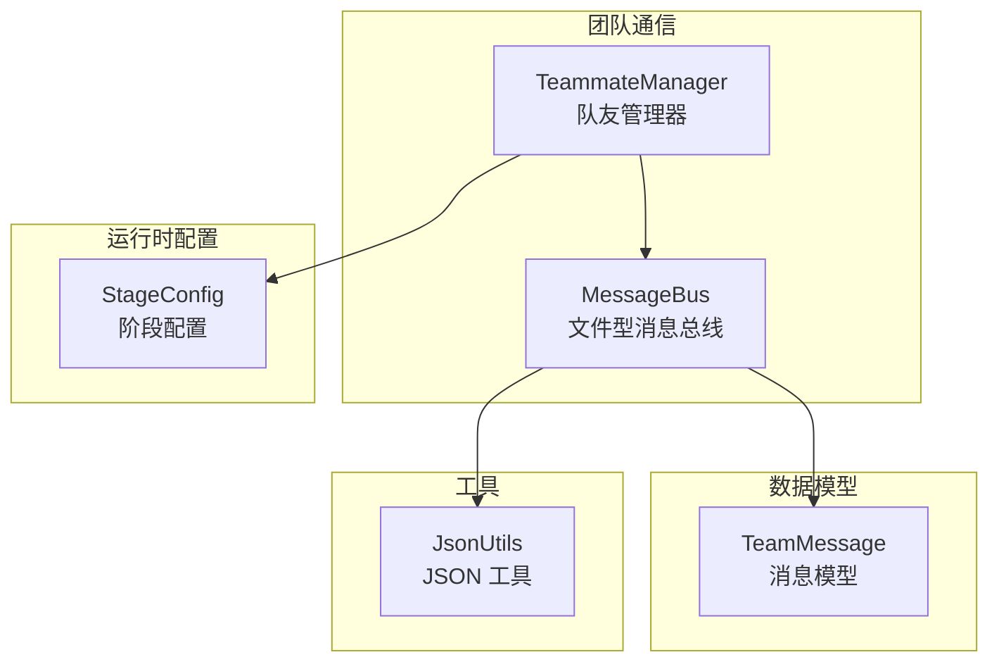
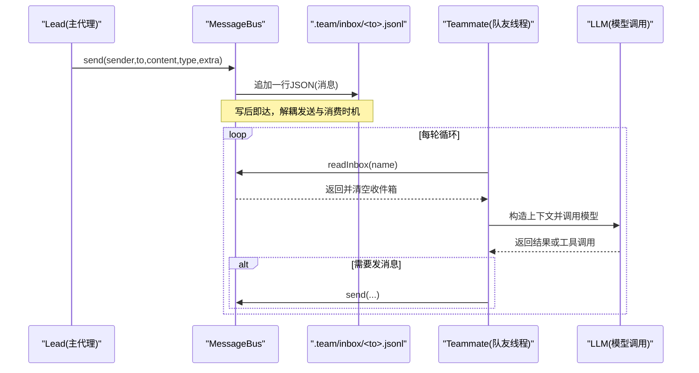
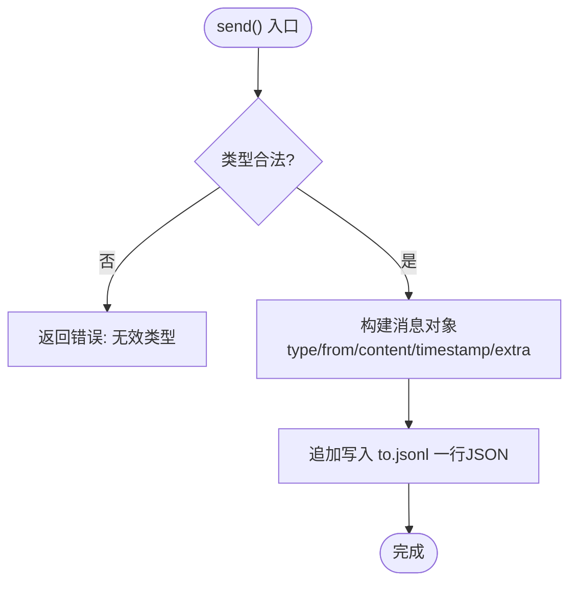
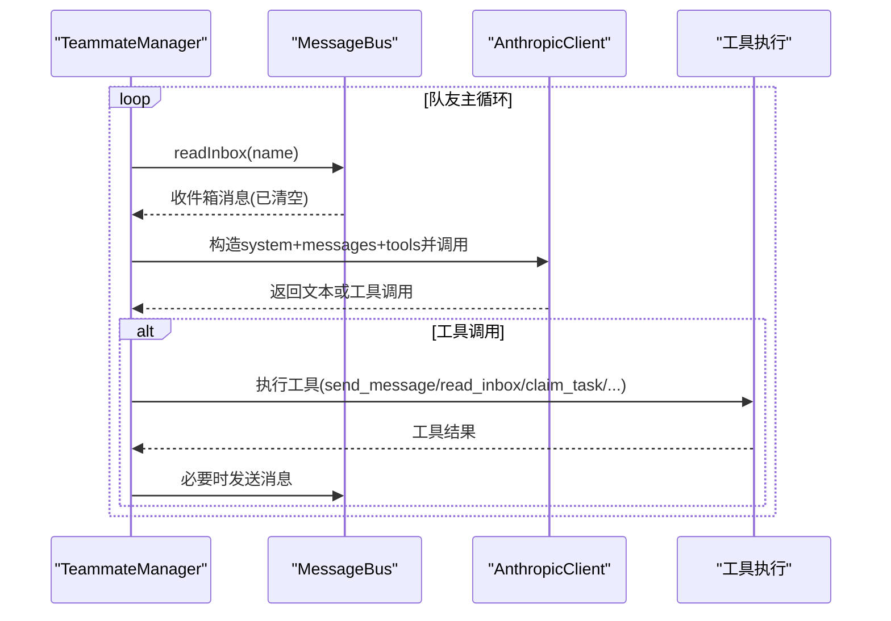
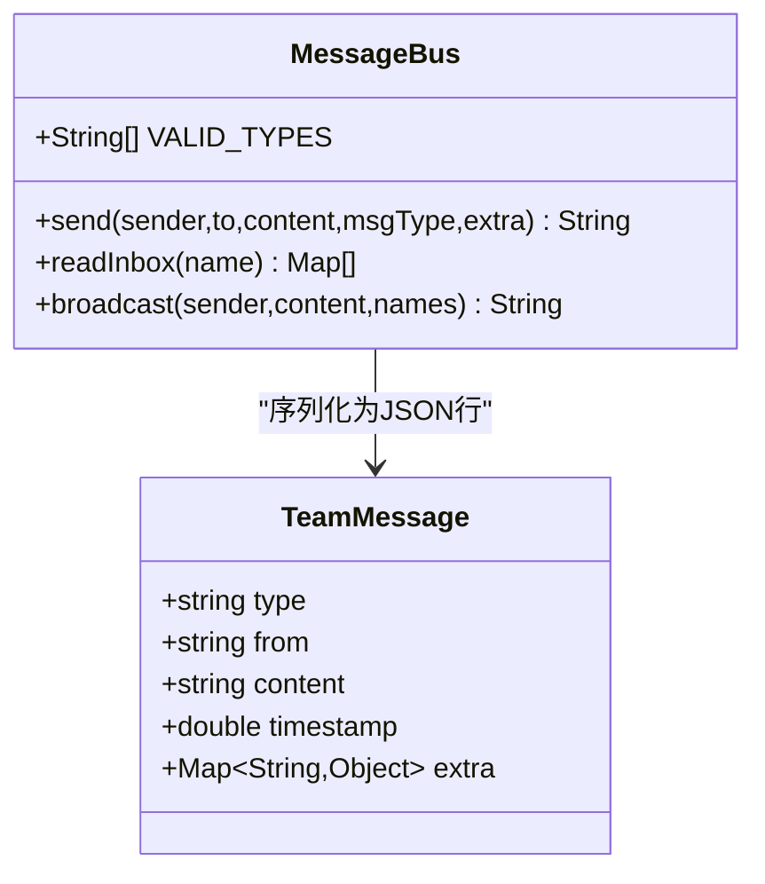
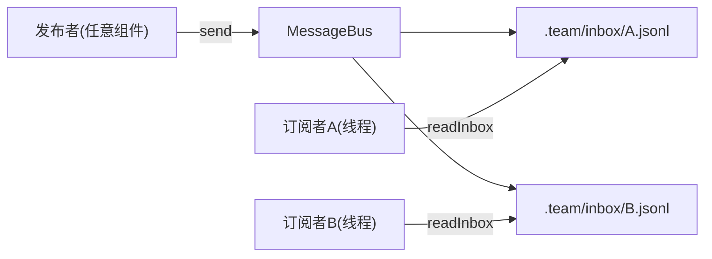
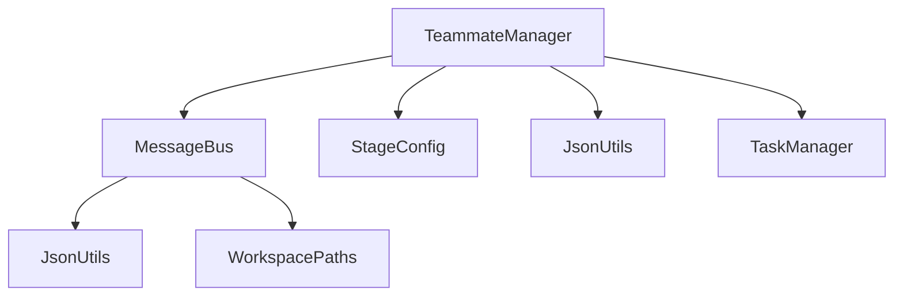

# 观察者模式应用

<cite>
**本文引用的文件**
- [MessageBus.java](file://src/main/java/com/learnclaudecode/team/MessageBus.java)
- [TeamMessage.java](file://src/main/java/com/learnclaudecode/model/TeamMessage.java)
- [TeammateManager.java](file://src/main/java/com/learnclaudecode/team/TeammateManager.java)
- [StageConfig.java](file://src/main/java/com/learnclaudecode/agents/StageConfig.java)
- [JsonUtils.java](file://src/main/java/com/learnclaudecode/common/JsonUtils.java)
- [S09AgentTeams.java](file://src/main/java/com/learnclaudecode/agents/S09AgentTeams.java)
- [S10TeamProtocols.java](file://src/main/java/com/learnclaudecode/agents/S10TeamProtocols.java)
</cite>

## 目录
1. [简介](#简介)
2. [项目结构](#项目结构)
3. [核心组件](#核心组件)
4. [架构总览](#架构总览)
5. [详细组件分析](#详细组件分析)
6. [依赖关系分析](#依赖关系分析)
7. [性能考量](#性能考量)
8. [故障排查指南](#故障排查指南)
9. [结论](#结论)
10. [附录：代码示例与使用路径](#附录代码示例与使用路径)

## 简介
本文件围绕“观察者模式”在团队协作系统中的落地展开，重点解析 MessageBus 如何通过发布-订阅机制实现组件间的松耦合通信。该系统采用“文件型消息总线 + 收件箱轮询”的异步消息传递方式，天然支持事件驱动、多订阅者、解耦协作。通过消息类型定义、订阅者注册（基于配置与线程模型）、消息分发逻辑（写入与读取），系统实现了可扩展、可观测、易调试的多 Agent 协作能力。

## 项目结构
- team 包提供消息总线与队友管理：
  - MessageBus：基于 .team/inbox/*.jsonl 的文件型消息总线，负责消息的持久化投递与消费。
  - TeammateManager：负责队友生命周期、工具编排、协议处理以及与消息总线的交互。
- model 包提供消息数据模型：
  - TeamMessage：描述消息类型、发送者、内容、时间戳和扩展字段。
- agents 包提供阶段配置与入口：
  - StageConfig：不同阶段的工具集与提示词配置，包含 s09/s10 的团队与协议能力。
  - S09AgentTeams / S10TeamProtocols：演示多 Agent 协作与团队协议的启动入口。
- common 包提供通用工具：
  - JsonUtils：统一的 JSON 序列化/反序列化能力，支撑消息体编解码。

图表来源
- [MessageBus.java:16-123](file://src/main/java/com/learnclaudecode/team/MessageBus.java#L16-L123)
- [TeammateManager.java:24-438](file://src/main/java/com/learnclaudecode/team/TeammateManager.java#L24-L438)
- [TeamMessage.java:6-35](file://src/main/java/com/learnclaudecode/model/TeamMessage.java#L6-L35)
- [StageConfig.java:181-227](file://src/main/java/com/learnclaudecode/agents/StageConfig.java#L181-L227)
- [JsonUtils.java:9-83](file://src/main/java/com/learnclaudecode/common/JsonUtils.java#L9-L83)

章节来源
- [MessageBus.java:16-123](file://src/main/java/com/learnclaudecode/team/MessageBus.java#L16-L123)
- [TeammateManager.java:24-438](file://src/main/java/com/learnclaudecode/team/TeammateManager.java#L24-L438)
- [TeamMessage.java:6-35](file://src/main/java/com/learnclaudecode/model/TeamMessage.java#L6-L35)
- [StageConfig.java:181-227](file://src/main/java/com/learnclaudecode/agents/StageConfig.java#L181-L227)
- [JsonUtils.java:9-83](file://src/main/java/com/learnclaudecode/common/JsonUtils.java#L9-L83)

## 核心组件
- 消息总线 MessageBus
  - 职责：将消息以 JSON 行追加到目标收件箱文件；读取并清空收件箱；支持广播。
  - 关键特性：线程安全（同步方法）、类型白名单校验、时间戳记录、读后即清语义。
- 队友管理器 TeammateManager
  - 职责：创建/管理队友线程；编排工具；处理关闭请求与计划审批；驱动消息循环。
  - 关键特性：每个队友独立守护线程；每轮循环先消费收件箱再调用模型；自治模式下空闲时自动认领任务。
- 消息模型 TeamMessage
  - 职责：统一描述消息的结构（类型、发送者、内容、时间戳、扩展字段）。
- 阶段配置 StageConfig
  - 职责：为不同教学阶段暴露不同的工具集与提示词；s09/s10 开启团队与协议能力。
- JSON 工具 JsonUtils
  - 职责：提供稳定可靠的 JSON 序列化/反序列化能力，支撑消息体编解码。

章节来源
- [MessageBus.java:16-123](file://src/main/java/com/learnclaudecode/team/MessageBus.java#L16-L123)
- [TeammateManager.java:24-438](file://src/main/java/com/learnclaudecode/team/TeammateManager.java#L24-L438)
- [TeamMessage.java:6-35](file://src/main/java/com/learnclaudecode/model/TeamMessage.java#L6-L35)
- [StageConfig.java:181-227](file://src/main/java/com/learnclaudecode/agents/StageConfig.java#L181-L227)
- [JsonUtils.java:9-83](file://src/main/java/com/learnclaudecode/common/JsonUtils.java#L9-L83)

## 架构总览
下图展示了“发布-订阅”在文件型消息总线上的实现：发布者通过 MessageBus 将消息写入目标收件箱；订阅者（队友）在各自线程中周期性读取并消费收件箱，形成事件驱动的响应式协作。

图表来源
- [MessageBus.java:54-121](file://src/main/java/com/learnclaudecode/team/MessageBus.java#L54-L121)
- [TeammateManager.java:177-273](file://src/main/java/com/learnclaudecode/team/TeammateManager.java#L177-L273)

章节来源
- [MessageBus.java:54-121](file://src/main/java/com/learnclaudecode/team/MessageBus.java#L54-L121)
- [TeammateManager.java:177-273](file://src/main/java/com/learnclaudecode/team/TeammateManager.java#L177-L273)

## 详细组件分析

### MessageBus：文件型消息总线（发布端）
- 设计要点
  - 消息类型白名单：仅允许 message、broadcast、shutdown_request、shutdown_response、plan_approval_response。
  - 消息落盘：每条消息作为一行 JSON 写入 to.jsonl，便于多进程/多线程最小依赖通信。
  - 读后即清：readInbox 读取后立即清空收件箱，避免重复消费。
  - 广播能力：向多个目标分别发送 broadcast 类型消息。
- 复杂度与并发
  - send/readInbox/broadcast 均为同步方法，保证同一时刻对同一文件的原子访问。
  - 时间复杂度近似 O(n)（n 为收件箱行数），空间复杂度 O(n)。
- 错误处理
  - 非法类型直接返回错误信息。
  - IO 异常捕获后返回结构化错误消息，保障健壮性。

图表来源
- [MessageBus.java:54-75](file://src/main/java/com/learnclaudecode/team/MessageBus.java#L54-L75)

章节来源
- [MessageBus.java:16-123](file://src/main/java/com/learnclaudecode/team/MessageBus.java#L16-L123)

### TeammateManager：订阅者与协议协调器（订阅端）
- 设计要点
  - 每个队友一个守护线程，独立运行主循环。
  - 每轮循环优先消费收件箱，再将消息加入上下文，随后调用模型。
  - 工具编排：根据是否自治模式提供不同工具集合（如 claim_task、idle、shutdown_response、plan_approval）。
  - 协议处理：处理 shutdown_request、plan_approval_response 等流程，维护请求状态。
- 订阅者注册机制
  - 通过 spawn 创建队友并写入团队配置；成员列表由配置文件维护。
  - 订阅关系隐式建立：只要存在 to.jsonl 文件，即可接收消息。
- 消息分发逻辑
  - 读取收件箱后，按消息类型进行分支处理（如 shutdown_request 触发退出或状态变更）。
  - 自治模式下，空闲时尝试从任务板认领任务，保持系统响应性与资源利用率。

图表来源
- [TeammateManager.java:177-273](file://src/main/java/com/learnclaudecode/team/TeammateManager.java#L177-L273)
- [StageConfig.java:181-227](file://src/main/java/com/learnclaudecode/agents/StageConfig.java#L181-L227)

章节来源
- [TeammateManager.java:177-273](file://src/main/java/com/learnclaudecode/team/TeammateManager.java#L177-L273)
- [StageConfig.java:181-227](file://src/main/java/com/learnclaudecode/agents/StageConfig.java#L181-L227)

### 消息模型与类型体系
- TeamMessage 定义了消息的核心字段：type、from、content、timestamp、extra。
- 有效类型由 MessageBus.VALID_TYPES 限定，确保协议一致性。
- 扩展字段 extra 用于承载不同类型消息所需的额外数据（如 request_id、approve、feedback 等）。

图表来源
- [TeamMessage.java:6-35](file://src/main/java/com/learnclaudecode/model/TeamMessage.java#L6-L35)
- [MessageBus.java:16-123](file://src/main/java/com/learnclaudecode/team/MessageBus.java#L16-L123)

章节来源
- [TeamMessage.java:6-35](file://src/main/java/com/learnclaudecode/model/TeamMessage.java#L6-L35)
- [MessageBus.java:16-123](file://src/main/java/com/learnclaudecode/team/MessageBus.java#L16-L123)

### 观察者模式视角下的发布-订阅
- 发布者：任意组件通过 MessageBus.send 发布消息，无需知道谁在订阅。
- 订阅者：队友线程通过 readInbox 主动拉取消息，形成“推-拉”结合的异步订阅。
- 解耦点：
  - 发送方与接收方无直接引用，仅通过文件系统约定通信。
  - 消息类型与扩展字段使订阅者可按需处理感兴趣的事件。
- 多订阅者支持：
  - 广播消息可同时投递给多个收件箱，实现一对多通知。
  - 每个收件箱独立，互不干扰。

图表来源
- [MessageBus.java:54-121](file://src/main/java/com/learnclaudecode/team/MessageBus.java#L54-L121)
- [TeammateManager.java:177-273](file://src/main/java/com/learnclaudecode/team/TeammateManager.java#L177-L273)

章节来源
- [MessageBus.java:54-121](file://src/main/java/com/learnclaudecode/team/MessageBus.java#L54-L121)
- [TeammateManager.java:177-273](file://src/main/java/com/learnclaudecode/team/TeammateManager.java#L177-L273)

## 依赖关系分析
- TeammateManager 依赖：
  - MessageBus：用于收发消息。
  - StageConfig：获取工具定义与阶段能力。
  - JsonUtils：用于序列化/反序列化。
  - TaskManager：用于任务认领与扫描。
- MessageBus 依赖：
  - JsonUtils：消息体编解码。
  - WorkspacePaths：收件箱目录定位。
- 外部约束：
  - 文件系统：消息以 JSONL 形式持久化，具备可观测性与可恢复性。
  - 线程模型：每个队友独立线程，避免阻塞主流程。

图表来源
- [TeammateManager.java:24-438](file://src/main/java/com/learnclaudecode/team/TeammateManager.java#L24-L438)
- [MessageBus.java:16-123](file://src/main/java/com/learnclaudecode/team/MessageBus.java#L16-L123)
- [StageConfig.java:181-227](file://src/main/java/com/learnclaudecode/agents/StageConfig.java#L181-L227)
- [JsonUtils.java:9-83](file://src/main/java/com/learnclaudecode/common/JsonUtils.java#L9-L83)

章节来源
- [TeammateManager.java:24-438](file://src/main/java/com/learnclaudecode/team/TeammateManager.java#L24-L438)
- [MessageBus.java:16-123](file://src/main/java/com/learnclaudecode/team/MessageBus.java#L16-L123)
- [StageConfig.java:181-227](file://src/main/java/com/learnclaudecode/agents/StageConfig.java#L181-L227)
- [JsonUtils.java:9-83](file://src/main/java/com/learnclaudecode/common/JsonUtils.java#L9-L83)

## 性能考量
- 读写开销
  - 每次 readInbox 会读取整个收件箱并清空，适合小文件场景；若收件箱过大，建议增加分页或滚动日志策略。
- 并发控制
  - 所有写操作与读操作均同步，避免竞态条件；在高并发下可能成为瓶颈，可考虑引入缓冲队列或批处理。
- 网络与模型调用
  - 每轮循环一次 LLM 调用，收件箱检查成本远低于模型调用，整体延迟主要由模型响应决定。
- 可扩展性
  - 通过广播与多收件箱实现水平扩展；新增订阅者只需创建新线程与收件箱。
- 可靠性
  - 文件持久化提供可恢复性；异常捕获确保服务不崩溃；时间戳便于审计与排序。

[本节为通用指导，不直接分析具体文件]

## 故障排查指南
- 常见问题
  - 收件箱未消费：确认队友线程是否正常运行，readInbox 是否被调用。
  - 消息丢失：检查 write 与 read 的时序，确保文件写入成功后再进行读取。
  - 类型错误：验证 msgType 是否在 VALID_TYPES 范围内。
  - 权限问题：确认 inbox 目录可写可读。
- 定位方法
  - 查看 .team/inbox/*.jsonl 文件内容，确认消息是否到达。
  - 检查 TeammateManager 的循环日志，确认是否进入消费分支。
  - 使用 JsonUtils 输出格式化消息，便于阅读与分析。

章节来源
- [MessageBus.java:54-101](file://src/main/java/com/learnclaudecode/team/MessageBus.java#L54-L101)
- [TeammateManager.java:177-273](file://src/main/java/com/learnclaudecode/team/TeammateManager.java#L177-L273)
- [JsonUtils.java:23-83](file://src/main/java/com/learnclaudecode/common/JsonUtils.java#L23-L83)

## 结论
该团队通信系统以文件型消息总线为核心，实现了基于观察者模式的发布-订阅机制。通过消息类型白名单、收件箱轮询、广播能力与协议处理，系统在多 Agent 协作场景中提供了高内聚、低耦合、可扩展且易于调试的通信基础。实际应用中需关注收件箱大小、并发写入与模型调用延迟等性能因素，并结合业务需求优化消费策略与容错机制。

[本节为总结性内容，不直接分析具体文件]

## 附录：代码示例与使用路径
- 发布消息（Lead 发送给队友）
  - 入口：TeammateManager.loop 中的工具 send_message 调用 MessageBus.send。
  - 参考路径：[TeammateManager.java:224-230](file://src/main/java/com/learnclaudecode/team/TeammateManager.java#L224-L230)
- 订阅消息（队友消费收件箱）
  - 入口：TeammateManager.loop 每轮循环调用 bus.readInbox(name)。
  - 参考路径：[TeammateManager.java:186-195](file://src/main/java/com/learnclaudecode/team/TeammateManager.java#L186-L195)
- 广播消息
  - 入口：MessageBus.broadcast 向多个目标发送 broadcast 类型消息。
  - 参考路径：[MessageBus.java:112-121](file://src/main/java/com/learnclaudecode/team/MessageBus.java#L112-L121)
- 消息类型与模型
  - 类型白名单：MessageBus.VALID_TYPES。
  - 消息模型：TeamMessage 字段定义。
  - 参考路径：[MessageBus.java:20-26](file://src/main/java/com/learnclaudecode/team/MessageBus.java#L20-L26)、[TeamMessage.java:6-35](file://src/main/java/com/learnclaudecode/model/TeamMessage.java#L6-L35)
- 阶段配置与入口
  - s09 团队协作：StageConfig.s09 暴露 spawn/list/send/read/broadcast 工具。
  - s10 团队协议：StageConfig.s10 增加 shutdown_request 与 plan_approval。
  - 入口类：S09AgentTeams.main、S10TeamProtocols.main。
  - 参考路径：[StageConfig.java:181-227](file://src/main/java/com/learnclaudecode/agents/StageConfig.java#L181-L227)、[S09AgentTeams.java:1-13](file://src/main/java/com/learnclaudecode/agents/S09AgentTeams.java#L1-L13)、[S10TeamProtocols.java:1-13](file://src/main/java/com/learnclaudecode/agents/S10TeamProtocols.java#L1-L13)

章节来源
- [TeammateManager.java:186-230](file://src/main/java/com/learnclaudecode/team/TeammateManager.java#L186-L230)
- [MessageBus.java:20-121](file://src/main/java/com/learnclaudecode/team/MessageBus.java#L20-L121)
- [TeamMessage.java:6-35](file://src/main/java/com/learnclaudecode/model/TeamMessage.java#L6-L35)
- [StageConfig.java:181-227](file://src/main/java/com/learnclaudecode/agents/StageConfig.java#L181-L227)
- [S09AgentTeams.java:1-13](file://src/main/java/com/learnclaudecode/agents/S09AgentTeams.java#L1-L13)
- [S10TeamProtocols.java:1-13](file://src/main/java/com/learnclaudecode/agents/S10TeamProtocols.java#L1-L13)