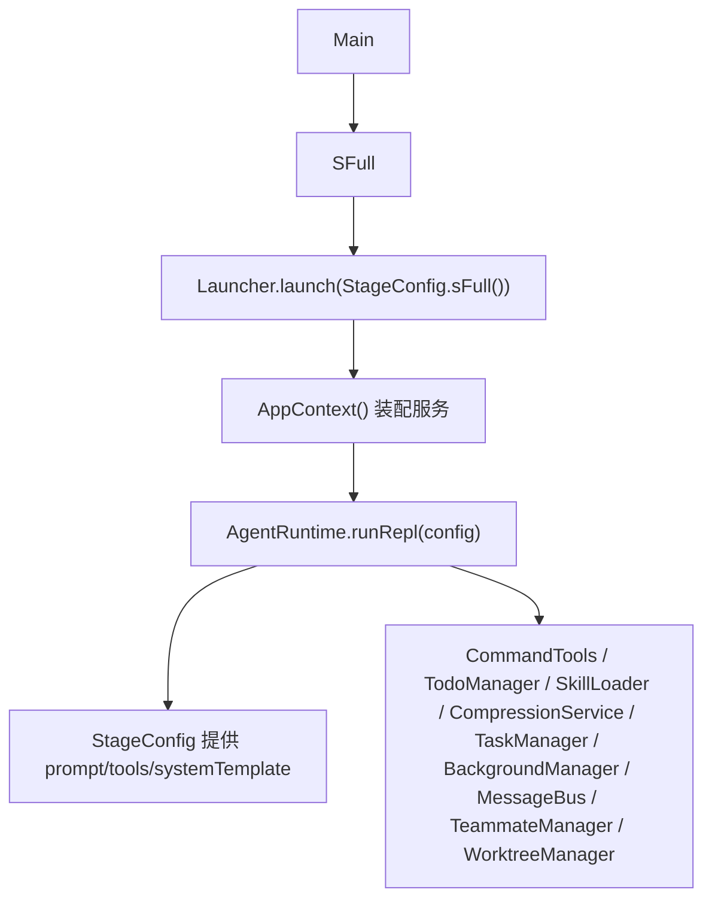
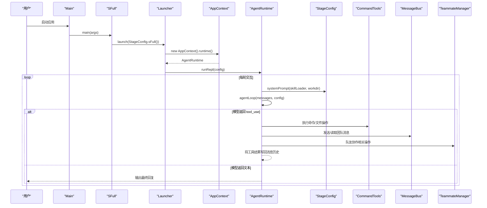
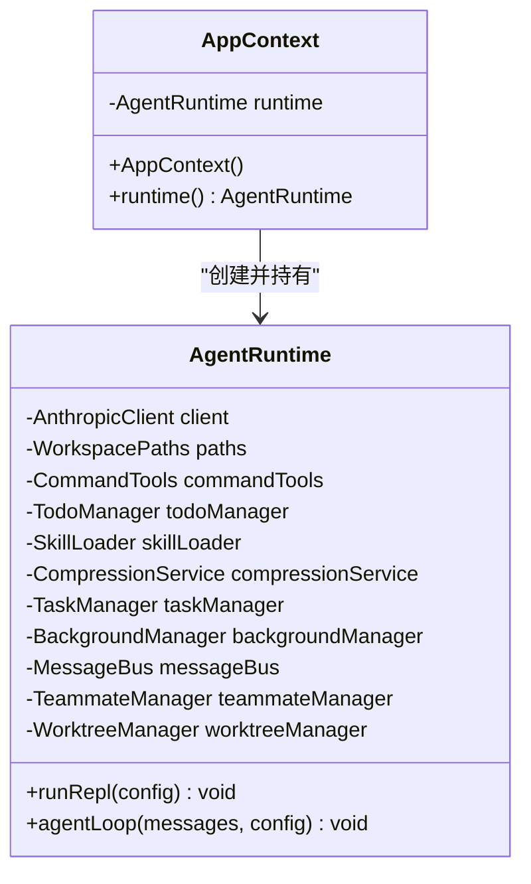
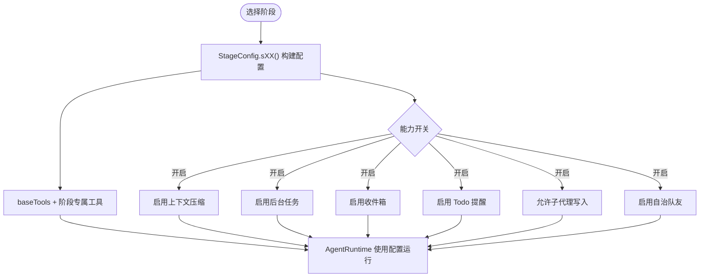
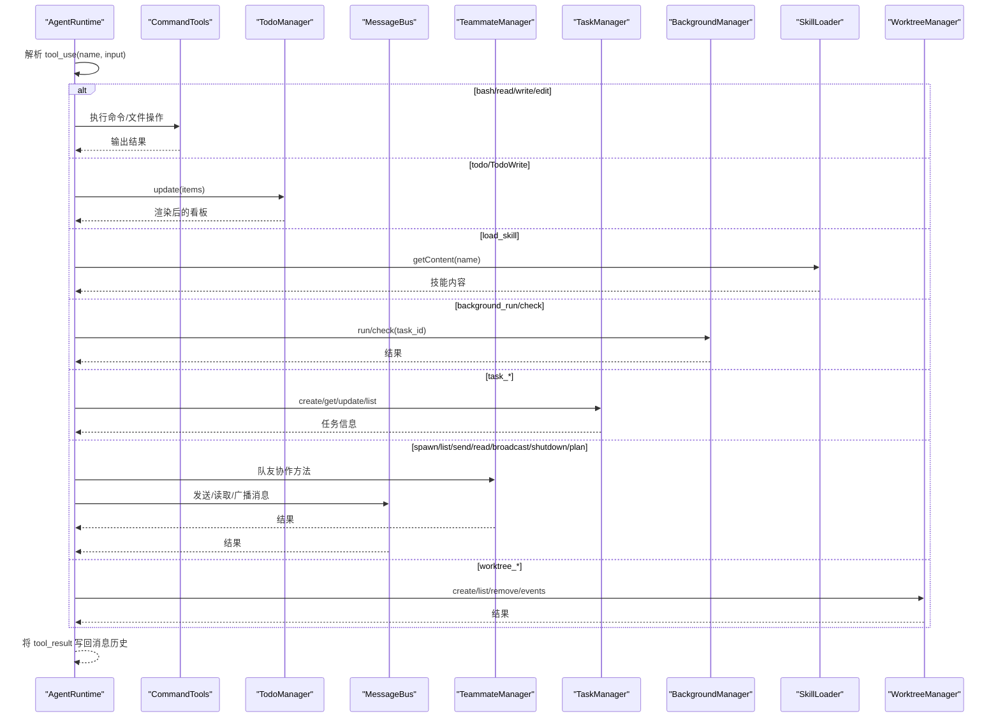
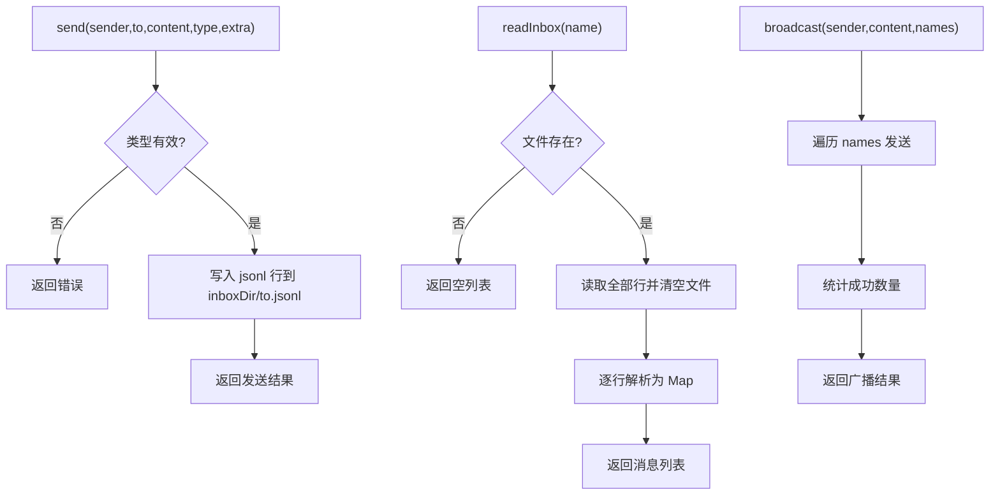
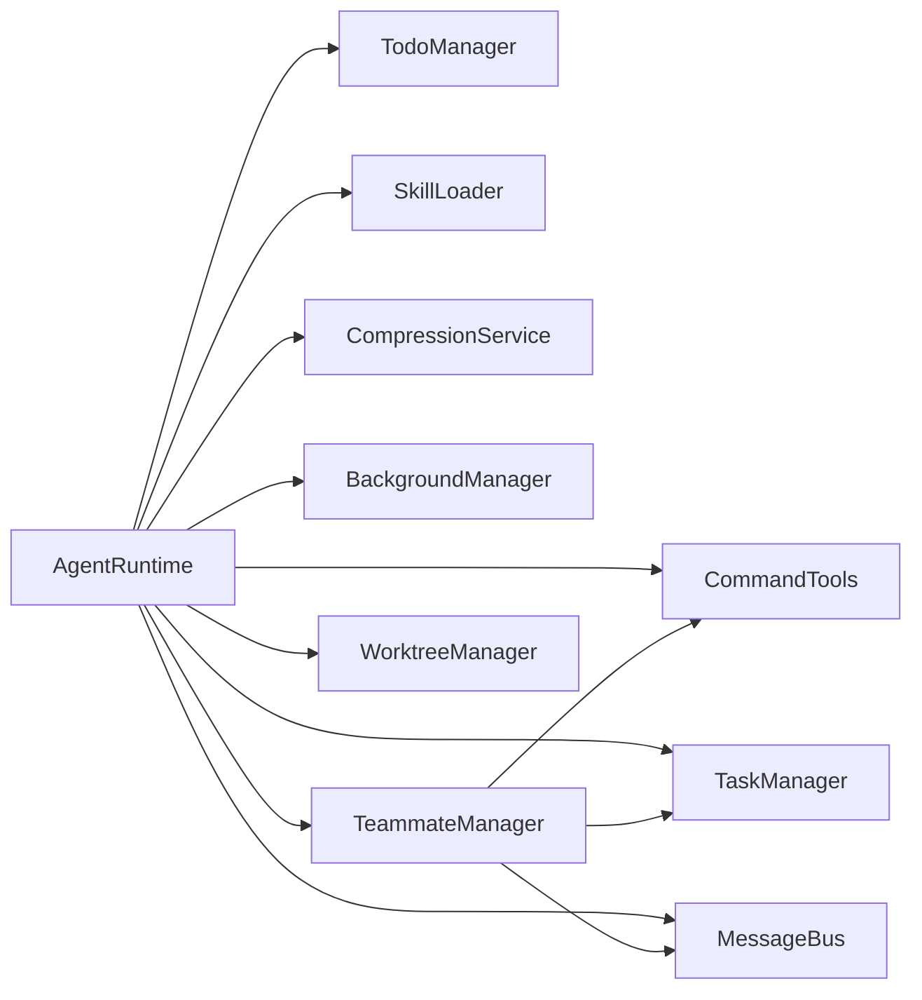

# 设计模式应用

<cite>
**本文引用的文件**
- [Main.java](file://src/main/java/com/learnclaudecode/Main.java)
- [Launcher.java](file://src/main/java/com/learnclaudecode/agents/Launcher.java)
- [AppContext.java](file://src/main/java/com/learnclaudecode/agents/AppContext.java)
- [StageConfig.java](file://src/main/java/com/learnclaudecode/agents/StageConfig.java)
- [AgentRuntime.java](file://src/main/java/com/learnclaudecode/agents/AgentRuntime.java)
- [CommandTools.java](file://src/main/java/com/learnclaudecode/tools/CommandTools.java)
- [TodoManager.java](file://src/main/java/com/learnclaudecode/tools/TodoManager.java)
- [MessageBus.java](file://src/main/java/com/learnclaudecode/team/MessageBus.java)
- [TeammateManager.java](file://src/main/java/com/learnclaudecode/team/TeammateManager.java)
</cite>

## 目录
1. [简介](#简介)
2. [项目结构](#项目结构)
3. [核心组件](#核心组件)
4. [架构总览](#架构总览)
5. [详细组件分析](#详细组件分析)
6. [依赖关系分析](#依赖关系分析)
7. [性能考量](#性能考量)
8. [故障排查指南](#故障排查指南)
9. [结论](#结论)

## 简介
本文件聚焦 Learn Claude Code Java 项目中“设计模式”的应用与落地，围绕以下目标展开：
- 工厂模式在 AppContext 中的集中装配与依赖注入
- 策略模式在 StageConfig 中的阶段能力编排与动态切换
- 命令模式在工具系统中的统一调用接口设计
- 观察者模式在 MessageBus 中的事件驱动通信思路
- 单例模式在全局服务管理中的应用与权衡
- 结合具体代码路径、流程图和时序图，解释每种模式的优势与可维护性提升

## 项目结构
项目采用分层与按功能域组织的方式：
- agents：运行时、装配器、阶段配置、启动器
- tools：命令执行、待办管理等基础工具
- team：消息总线、队友管理与协作协议
- common/context/tasks/background：环境、上下文压缩、任务与后台任务等支撑能力
- Main/SFull：应用入口，默认以完整能力版本启动

图表来源
- [Main.java:1-15](file://src/main/java/com/learnclaudecode/Main.java#L1-L15)
- [Launcher.java:1-28](file://src/main/java/com/learnclaudecode/agents/Launcher.java#L1-L28)
- [AppContext.java:32-59](file://src/main/java/com/learnclaudecode/agents/AppContext.java#L32-L59)
- [AgentRuntime.java:92-123](file://src/main/java/com/learnclaudecode/agents/AgentRuntime.java#L92-L123)
- [StageConfig.java:26-49](file://src/main/java/com/learnclaudecode/agents/StageConfig.java#L26-L49)

章节来源
- [Main.java:1-15](file://src/main/java/com/learnclaudecode/Main.java#L1-L15)
- [Launcher.java:1-28](file://src/main/java/com/learnclaudecode/agents/Launcher.java#L1-L28)
- [AppContext.java:32-59](file://src/main/java/com/learnclaudecode/agents/AppContext.java#L32-L59)
- [AgentRuntime.java:92-123](file://src/main/java/com/learnclaudecode/agents/AgentRuntime.java#L92-L123)
- [StageConfig.java:26-49](file://src/main/java/com/learnclaudecode/agents/StageConfig.java#L26-L49)

## 核心组件
- AppContext：集中创建并装配共享服务，作为“总装车间”，将环境、工作区、模型客户端、工具、任务、后台任务、消息总线、团队、worktree 等组装为 AgentRuntime。
- StageConfig：以记录（record）形式定义不同教学阶段的系统提示、工具集与能力开关，实现“同一运行时 + 不同能力视图”的策略式编排。
- AgentRuntime：统一的 Agent 主循环，负责消息历史维护、模型交互、工具调度、上下文压缩、后台任务与团队消息注入。
- CommandTools：命令执行与文件读写编辑的统一工具实现，屏蔽底层平台差异与安全限制。
- TodoManager：待办项的校验、渲染与状态约束，支持多字段风格兼容。
- MessageBus：基于文件的轻量消息总线，提供 send/readInbox/broadcast，对齐 .team/inbox/*.jsonl 协议。
- TeammateManager：队友生命周期、消息协议、自治认领与计划审批，驱动多 Agent 协作。

章节来源
- [AppContext.java:32-59](file://src/main/java/com/learnclaudecode/agents/AppContext.java#L32-L59)
- [StageConfig.java:26-49](file://src/main/java/com/learnclaudecode/agents/StageConfig.java#L26-L49)
- [AgentRuntime.java:125-261](file://src/main/java/com/learnclaudecode/agents/AgentRuntime.java#L125-L261)
- [CommandTools.java:30-145](file://src/main/java/com/learnclaudecode/tools/CommandTools.java#L30-L145)
- [TodoManager.java:15-91](file://src/main/java/com/learnclaudecode/tools/TodoManager.java#L15-L91)
- [MessageBus.java:16-122](file://src/main/java/com/learnclaudecode/team/MessageBus.java#L16-L122)
- [TeammateManager.java:24-438](file://src/main/java/com/learnclaudecode/team/TeammateManager.java#L24-L438)

## 架构总览
下图展示了从启动到运行时的装配与调用链，体现工厂装配、策略选择、命令分发与事件通信的整体协作。

图表来源
- [Main.java:1-15](file://src/main/java/com/learnclaudecode/Main.java#L1-L15)
- [Launcher.java:18-26](file://src/main/java/com/learnclaudecode/agents/Launcher.java#L18-L26)
- [AppContext.java:32-59](file://src/main/java/com/learnclaudecode/agents/AppContext.java#L32-L59)
- [AgentRuntime.java:92-123](file://src/main/java/com/learnclaudecode/agents/AgentRuntime.java#L92-L123)
- [AgentRuntime.java:125-261](file://src/main/java/com/learnclaudecode/agents/AgentRuntime.java#L125-L261)
- [StageConfig.java:44-49](file://src/main/java/com/learnclaudecode/agents/StageConfig.java#L44-L49)
- [CommandTools.java:30-145](file://src/main/java/com/learnclaudecode/tools/CommandTools.java#L30-L145)
- [MessageBus.java:54-122](file://src/main/java/com/learnclaudecode/team/MessageBus.java#L54-L122)
- [TeammateManager.java:177-273](file://src/main/java/com/learnclaudecode/team/TeammateManager.java#L177-L273)

## 详细组件分析

### 工厂模式：AppContext 的集中装配与依赖注入
- 职责：集中创建并装配所有共享服务，形成完整的 AgentRuntime。
- 优势：
  - 单一装配点，避免各阶段入口重复初始化逻辑
  - 清晰的依赖层次：基础能力 -> 扩展机制 -> 运行时
  - 便于测试替换与扩展新服务
- 关键点：
  - 先创建 EnvConfig 与 WorkspacePaths，再依次创建 AnthropicClient、CommandTools、TodoManager、SkillLoader、CompressionService、TaskManager、BackgroundManager、MessageBus、TeammateManager、WorktreeManager
  - 最终构造 AgentRuntime 并暴露 runtime() 供 Launcher 使用

图表来源
- [AppContext.java:29-69](file://src/main/java/com/learnclaudecode/agents/AppContext.java#L29-L69)
- [AgentRuntime.java:40-90](file://src/main/java/com/learnclaudecode/agents/AgentRuntime.java#L40-L90)

章节来源
- [AppContext.java:32-59](file://src/main/java/com/learnclaudecode/agents/AppContext.java#L32-L59)

### 策略模式：StageConfig 的阶段能力编排与动态切换
- 职责：以 record 形式封装每个阶段的 prompt、tools、systemTemplate 与能力开关（如 enableTodoNag、enableCompression、enableBackground、enableInbox、subagentWritable、autonomousTeammates）。
- 优势：
  - 通过静态方法 s01()..s12()/sFull() 快速构建不同能力视图
  - 同一 AgentRuntime 在不同 StageConfig 下表现不同，实现“能力即配置”
  - 易于扩展新阶段或合并能力（如 sFull 合并多阶段工具）
- 关键点：
  - systemPrompt 根据工作区与技能描述动态展开占位符
  - baseTools 提供最小可用工具集；各阶段在此基础上叠加
  - dedupe 保证合并时同名工具去重

图表来源
- [StageConfig.java:26-49](file://src/main/java/com/learnclaudecode/agents/StageConfig.java#L26-L49)
- [StageConfig.java:56-267](file://src/main/java/com/learnclaudecode/agents/StageConfig.java#L56-L267)
- [AgentRuntime.java:131-261](file://src/main/java/com/learnclaudecode/agents/AgentRuntime.java#L131-L261)

章节来源
- [StageConfig.java:26-49](file://src/main/java/com/learnclaudecode/agents/StageConfig.java#L26-L49)
- [StageConfig.java:56-267](file://src/main/java/com/learnclaudecode/agents/StageConfig.java#L56-L267)
- [AgentRuntime.java:131-261](file://src/main/java/com/learnclaudecode/agents/AgentRuntime.java#L131-L261)

### 命令模式：工具系统的统一调用接口
- 职责：将模型的工具调用意图映射到本地 Java 实现，统一处理参数解析、执行与结果包装。
- 优势：
  - 解耦“模型动作意图”与“真实执行逻辑”
  - 新增工具只需在调度处增加分支，不影响其他模块
  - 对输入进行容错解析（数字/字符串），提高鲁棒性
- 关键点：
  - AgentRuntime.agentLoop 中 switch(toolName) 将 tool_use 映射到 CommandTools、TodoManager、SkillLoader、TaskManager、BackgroundManager、MessageBus、TeammateManager、WorktreeManager 等方法
  - 工具结果统一包装为 tool_result 消息写回历史

图表来源
- [AgentRuntime.java:177-241](file://src/main/java/com/learnclaudecode/agents/AgentRuntime.java#L177-L241)
- [CommandTools.java:30-145](file://src/main/java/com/learnclaudecode/tools/CommandTools.java#L30-L145)
- [TodoManager.java:15-91](file://src/main/java/com/learnclaudecode/tools/TodoManager.java#L15-L91)
- [MessageBus.java:54-122](file://src/main/java/com/learnclaudecode/team/MessageBus.java#L54-L122)
- [TeammateManager.java:177-273](file://src/main/java/com/learnclaudecode/team/TeammateManager.java#L177-L273)

章节来源
- [AgentRuntime.java:177-241](file://src/main/java/com/learnclaudecode/agents/AgentRuntime.java#L177-L241)
- [CommandTools.java:30-145](file://src/main/java/com/learnclaudecode/tools/CommandTools.java#L30-L145)
- [TodoManager.java:15-91](file://src/main/java/com/learnclaudecode/tools/TodoManager.java#L15-L91)
- [MessageBus.java:54-122](file://src/main/java/com/learnclaudecode/team/MessageBus.java#L54-L122)
- [TeammateManager.java:177-273](file://src/main/java/com/learnclaudecode/team/TeammateManager.java#L177-L273)

### 观察者模式：MessageBus 的事件驱动通信思路
- 职责：基于文件系统实现轻量消息总线，提供 send/readInbox/broadcast，对齐 .team/inbox/*.jsonl 协议。
- 优势：
  - 松耦合：发送者与接收者无需直接引用对方，仅通过 inbox 文件通信
  - 可扩展：新增消息类型只需更新 VALID_TYPES 并在消费端处理
  - 易观测：消息持久化到文件，便于调试与审计
- 关键点：
  - send 校验类型并追加一行 JSON 到对应收件箱文件
  - readInbox 读取后清空，实现“读即消费”语义
  - broadcast 向多个队友发送广播消息

图表来源
- [MessageBus.java:54-122](file://src/main/java/com/learnclaudecode/team/MessageBus.java#L54-L122)

章节来源
- [MessageBus.java:54-122](file://src/main/java/com/learnclaudecode/team/MessageBus.java#L54-L122)

### 单例模式：全局服务管理的权衡与实践
- 现状：当前项目未显式使用传统单例类，而是通过 AppContext 在启动时集中创建一次共享实例，并通过 AgentRuntime 持有这些依赖，达到“作用域内唯一”的效果。
- 优势：
  - 避免全局可变状态带来的隐式耦合
  - 便于在测试中替换依赖（例如传入 mock 的 Client/Paths）
  - 清晰的生命周期：随应用启动创建，随运行时结束销毁
- 建议：
  - 若需跨进程或跨线程的全局访问，可考虑引入轻量级容器或注册表，但需谨慎评估并发与可测试性
  - 对于不可变配置（如 EnvConfig），可在必要时以只读单例暴露

章节来源
- [AppContext.java:32-59](file://src/main/java/com/learnclaudecode/agents/AppContext.java#L32-L59)
- [AgentRuntime.java:40-90](file://src/main/java/com/learnclaudecode/agents/AgentRuntime.java#L40-L90)

## 依赖关系分析
- 低耦合高内聚：
  - AgentRuntime 通过构造函数注入所有依赖，避免内部硬编码
  - StageConfig 仅关注配置与工具定义，不感知执行细节
  - MessageBus 仅关注消息协议，不关心业务逻辑
- 可能的循环依赖风险：
  - TeammateManager 依赖 MessageBus、TaskManager、CommandTools；AgentRuntime 也依赖这些组件，但通过装配层解耦，未见直接循环
- 外部集成点：
  - AnthropicClient 用于模型交互
  - WorkspacePaths 提供安全路径解析与工作区定位

图表来源
- [AgentRuntime.java:40-90](file://src/main/java/com/learnclaudecode/agents/AgentRuntime.java#L40-L90)
- [TeammateManager.java:40-70](file://src/main/java/com/learnclaudecode/team/TeammateManager.java#L40-L70)

章节来源
- [AgentRuntime.java:40-90](file://src/main/java/com/learnclaudecode/agents/AgentRuntime.java#L40-L90)
- [TeammateManager.java:40-70](file://src/main/java/com/learnclaudecode/team/TeammateManager.java#L40-L70)

## 性能考量
- 命令执行超时保护：runBash 设置 120 秒超时，防止长时间阻塞
- 大文件读取限制：runRead 支持 limit 参数，避免一次性加载超大文件
- 上下文压缩：enableCompression 时进行微裁剪与自动压缩，控制消息历史大小
- 后台任务异步化：background_run 将长耗时任务放入后台，主循环不被阻塞
- 工具输出截断：统一限制输出长度，减少模型上下文压力

[本节为通用指导，不直接分析具体文件]

## 故障排查指南
- 命令执行失败：检查 runBash 黑名单拦截与 shellCommand 平台适配
- 文件读写异常：确认 safeResolve 路径合法性与权限
- 消息收发问题：验证 MessageBus 的 VALID_TYPES 与 inbox 目录是否存在
- 队友协作异常：检查 TeammateManager 的配置持久化与线程状态
- Todo 校验失败：确保 status 合法且仅一个 in_progress

章节来源
- [CommandTools.java:30-145](file://src/main/java/com/learnclaudecode/tools/CommandTools.java#L30-L145)
- [MessageBus.java:54-122](file://src/main/java/com/learnclaudecode/team/MessageBus.java#L54-L122)
- [TeammateManager.java:177-273](file://src/main/java/com/learnclaudecode/team/TeammateManager.java#L177-L273)
- [TodoManager.java:15-91](file://src/main/java/com/learnclaudecode/tools/TodoManager.java#L15-L91)

## 结论
本项目通过多种经典设计模式的组合，实现了高内聚、低耦合、可扩展的 Agent 运行时：
- 工厂模式（AppContext）：集中装配，清晰依赖层次，便于测试与维护
- 策略模式（StageConfig）：能力即配置，灵活切换阶段特性
- 命令模式（AgentRuntime 工具调度）：统一接口，解耦意图与实现
- 观察者模式（MessageBus）：事件驱动、松耦合通信
- 单例模式（权衡实践）：通过作用域内唯一实例替代全局单例，兼顾可测性与安全性

这些模式共同提升了项目的可维护性、可扩展性与可观测性，为后续演进提供了坚实基础。