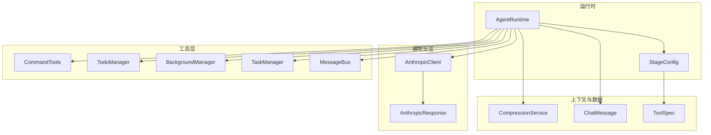
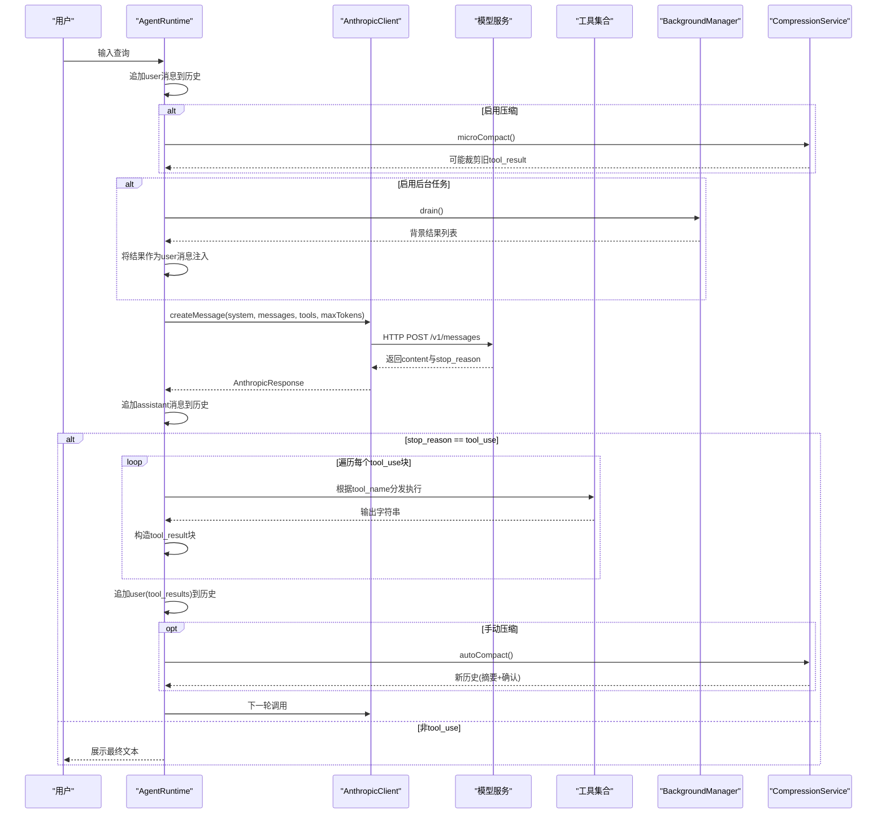
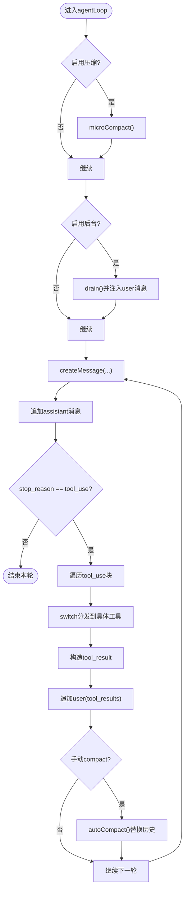
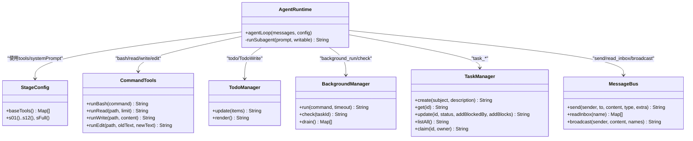
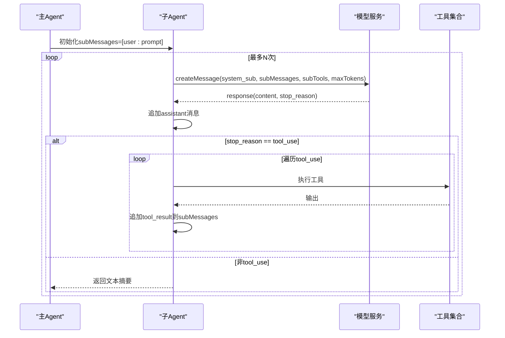
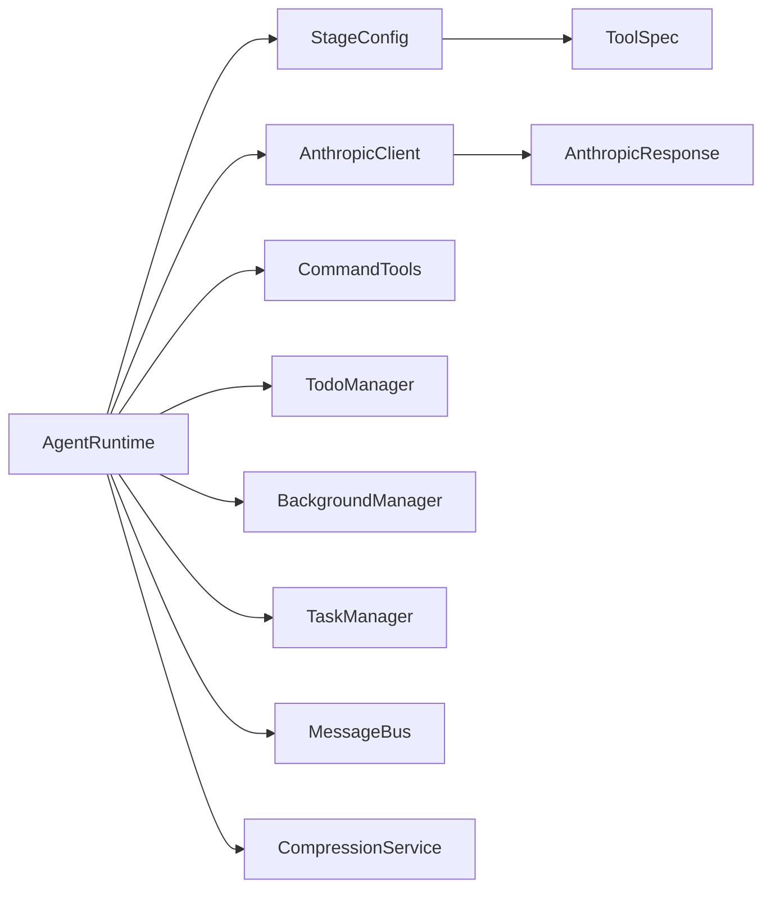

# Agent运行时核心

<cite>
**本文引用的文件**
- [AgentRuntime.java](file://src/main/java/com/learnclaudecode/agents/AgentRuntime.java)
- [StageConfig.java](file://src/main/java/com/learnclaudecode/agents/StageConfig.java)
- [AnthropicClient.java](file://src/main/java/com/learnclaudecode/common/AnthropicClient.java)
- [CommandTools.java](file://src/main/java/com/learnclaudecode/tools/CommandTools.java)
- [TodoManager.java](file://src/main/java/com/learnclaudecode/tools/TodoManager.java)
- [BackgroundManager.java](file://src/main/java/com/learnclaudecode/background/BackgroundManager.java)
- [CompressionService.java](file://src/main/java/com/learnclaudecode/context/CompressionService.java)
- [TaskManager.java](file://src/main/java/com/learnclaudecode/tasks/TaskManager.java)
- [MessageBus.java](file://src/main/java/com/learnclaudecode/team/MessageBus.java)
- [ChatMessage.java](file://src/main/java/com/learnclaudecode/model/ChatMessage.java)
- [AnthropicResponse.java](file://src/main/java/com/learnclaudecode/model/AnthropicResponse.java)
- [ToolSpec.java](file://src/main/java/com/learnclaudecode/model/ToolSpec.java)
- [Main.java](file://src/main/java/com/learnclaudecode/Main.java)
</cite>

## 目录
1. [简介](#简介)
2. [项目结构](#项目结构)
3. [核心组件](#核心组件)
4. [架构总览](#架构总览)
5. [详细组件分析](#详细组件分析)
6. [依赖关系分析](#依赖关系分析)
7. [性能考量](#性能考量)
8. [故障排查指南](#故障排查指南)
9. [结论](#结论)
10. [附录](#附录)

## 简介
本文件聚焦于Agent运行时的核心机制，围绕“while(true)主循环”展开，解释消息处理引擎如何接收用户输入、调用Claude API、处理工具调用并反馈结果；说明工具调度系统如何将模型声明的工具调用映射到本地Java实现；描述子代理执行机制与上下文隔离；并提供完整流程的代码级图示与最佳实践建议。

## 项目结构
该仓库采用分层组织：
- agents：Agent运行时、阶段配置、入口脚本
- common：HTTP客户端、环境配置、JSON工具、工作区路径
- context：上下文压缩服务
- model：消息、响应、工具定义等数据结构
- tools：命令执行、文件读写、待办管理等工具实现
- background：后台任务管理
- tasks：任务持久化与管理
- team：消息总线与队友协作
- skills：技能加载（由StageConfig动态注入）

图表来源
- [AgentRuntime.java:97-260](file://src/main/java/com/learnclaudecode/agents/AgentRuntime.java#L97-L260)
- [StageConfig.java:56-267](file://src/main/java/com/learnclaudecode/agents/StageConfig.java#L56-L267)
- [AnthropicClient.java:52-101](file://src/main/java/com/learnclaudecode/common/AnthropicClient.java#L52-L101)
- [CommandTools.java:36-144](file://src/main/java/com/learnclaudecode/tools/CommandTools.java#L36-L144)
- [BackgroundManager.java:43-158](file://src/main/java/com/learnclaudecode/background/BackgroundManager.java#L43-L158)
- [CompressionService.java:69-170](file://src/main/java/com/learnclaudecode/context/CompressionService.java#L69-L170)
- [TaskManager.java:51-338](file://src/main/java/com/learnclaudecode/tasks/TaskManager.java#L51-L338)
- [MessageBus.java:54-121](file://src/main/java/com/learnclaudecode/team/MessageBus.java#L54-L121)

章节来源
- [AgentRuntime.java:97-260](file://src/main/java/com/learnclaudecode/agents/AgentRuntime.java#L97-L260)
- [StageConfig.java:56-267](file://src/main/java/com/learnclaudecode/agents/StageConfig.java#L56-L267)
- [AnthropicClient.java:52-101](file://src/main/java/com/learnclaudecode/common/AnthropicClient.java#L52-L101)

## 核心组件
- AgentRuntime：实现REPL与Agent主循环，负责消息历史维护、工具调度、子代理执行、后台任务与团队消息注入、上下文压缩触发。
- StageConfig：按教学阶段或完整能力版本提供system prompt与可用工具集，决定Agent能力边界。
- AnthropicClient：封装对Anthropic兼容API的HTTP调用，构造请求体并解析响应。
- CommandTools：提供bash、read_file、write_file、edit_file等基础工具实现。
- TodoManager：维护待办列表，支持状态校验与渲染。
- BackgroundManager：异步执行长耗时命令，通过通知队列回灌主循环。
- CompressionService：微压缩与自动压缩，避免上下文溢出。
- TaskManager：基于文件的轻量任务板，支持创建、更新、认领、依赖清理。
- MessageBus：基于文件的收件箱协议，支持点对点与广播。

章节来源
- [AgentRuntime.java:40-90](file://src/main/java/com/learnclaudecode/agents/AgentRuntime.java#L40-L90)
- [StageConfig.java:26-49](file://src/main/java/com/learnclaudecode/agents/StageConfig.java#L26-L49)
- [AnthropicClient.java:27-41](file://src/main/java/com/learnclaudecode/common/AnthropicClient.java#L27-L41)
- [CommandTools.java:16-28](file://src/main/java/com/learnclaudecode/tools/CommandTools.java#L16-L28)
- [TodoManager.java:12-21](file://src/main/java/com/learnclaudecode/tools/TodoManager.java#L12-L21)
- [BackgroundManager.java:20-34](file://src/main/java/com/learnclaudecode/background/BackgroundManager.java#L20-L34)
- [CompressionService.java:29-48](file://src/main/java/com/learnclaudecode/context/CompressionService.java#L29-L48)
- [TaskManager.java:27-42](file://src/main/java/com/learnclaudecode/tasks/TaskManager.java#L27-L42)
- [MessageBus.java:19-42](file://src/main/java/com/learnclaudecode/team/MessageBus.java#L19-L42)

## 架构总览
下图展示了从用户输入到模型调用、工具执行、结果回灌的端到端流程。

图表来源
- [AgentRuntime.java:97-260](file://src/main/java/com/learnclaudecode/agents/AgentRuntime.java#L97-L260)
- [AnthropicClient.java:52-101](file://src/main/java/com/learnclaudecode/common/AnthropicClient.java#L52-L101)
- [BackgroundManager.java:43-158](file://src/main/java/com/learnclaudecode/background/BackgroundManager.java#L43-L158)
- [CompressionService.java:69-170](file://src/main/java/com/learnclaudecode/context/CompressionService.java#L69-L170)

## 详细组件分析

### Agent主循环（while(true)）
- REPL入口：读取用户输入，写入user消息，进入agentLoop。
- 单轮循环：
  - 可选的微压缩与自动压缩，控制上下文大小。
  - 可选的背景任务结果注入，保持对话连续性。
  - 可选的团队inbox轮询，合并外部消息。
  - 调用模型获取下一步动作。
  - 若为tool_use，则执行工具并将结果以tool_result形式写回历史，继续下一轮。
  - 若非tool_use，本轮结束并展示结果。

图表来源
- [AgentRuntime.java:131-260](file://src/main/java/com/learnclaudecode/agents/AgentRuntime.java#L131-L260)

章节来源
- [AgentRuntime.java:97-260](file://src/main/java/com/learnclaudecode/agents/AgentRuntime.java#L97-L260)

### 工具调度系统（模型工具 -> Java实现）
- StageConfig在每阶段声明tools（名称、描述、input_schema），用于模型侧工具发现。
- AgentRuntime在收到tool_use时，依据tool_name进行switch分发到对应Java方法：
  - bash/read_file/write_file/edit_file -> CommandTools
  - todo/TodoWrite -> TodoManager.update()
  - task -> runSubagent()
  - load_skill -> SkillLoader.getContent()
  - compact -> 标记manualCompact并在本轮结束后执行autoCompact()
  - background_run/check_background -> BackgroundManager
  - task_* -> TaskManager
  - spawn_teammate/list_teammates/send_message/read_inbox/broadcast/shutdown_request/plan_approval/claim_task/idle -> Team相关管理器
  - worktree_* -> WorktreeManager
- 工具输出统一包装为tool_result块，追加到历史供模型下一轮推理。

图表来源
- [AgentRuntime.java:180-234](file://src/main/java/com/learnclaudecode/agents/AgentRuntime.java#L180-L234)
- [StageConfig.java:56-267](file://src/main/java/com/learnclaudecode/agents/StageConfig.java#L56-L267)
- [CommandTools.java:36-144](file://src/main/java/com/learnclaudecode/tools/CommandTools.java#L36-L144)
- [TodoManager.java:21-91](file://src/main/java/com/learnclaudecode/tools/TodoManager.java#L21-L91)
- [BackgroundManager.java:43-158](file://src/main/java/com/learnclaudecode/background/BackgroundManager.java#L43-L158)
- [TaskManager.java:51-338](file://src/main/java/com/learnclaudecode/tasks/TaskManager.java#L51-L338)
- [MessageBus.java:54-121](file://src/main/java/com/learnclaudecode/team/MessageBus.java#L54-L121)

章节来源
- [AgentRuntime.java:180-234](file://src/main/java/com/learnclaudecode/agents/AgentRuntime.java#L180-L234)
- [StageConfig.java:56-267](file://src/main/java/com/learnclaudecode/agents/StageConfig.java#L56-L267)

### 子代理执行机制与上下文隔离
- 当模型发出task工具调用时，AgentRuntime启动runSubagent：
  - 新建独立消息历史subMessages，仅包含子任务prompt。
  - 可裁剪工具集（如禁用写操作），限制子代理权限。
  - 子代理共享同一模型客户端，但拥有完全独立的上下文，避免污染主会话。
  - 子代理内部同样遵循tool_use循环，直到返回文本摘要。
  - 超时保护：最多迭代固定次数，失败时返回占位提示。

图表来源
- [AgentRuntime.java:270-310](file://src/main/java/com/learnclaudecode/agents/AgentRuntime.java#L270-L310)

章节来源
- [AgentRuntime.java:270-310](file://src/main/java/com/learnclaudecode/agents/AgentRuntime.java#L270-L310)

### 消息历史管理与错误处理
- 消息历史：
  - user消息：用户输入、工具结果、背景任务结果、inbox消息。
  - assistant消息：模型返回的文本或工具调用内容。
- 错误处理：
  - 网络异常：AnthropicClient抛出业务异常，便于上层统一捕获。
  - 工具执行异常：各工具内部try-catch，返回错误字符串，不中断主循环。
  - 子代理失败：达到最大迭代次数后返回失败占位。
  - 压缩失败：IO异常转为业务异常，确保可观测性。

章节来源
- [AnthropicClient.java:87-101](file://src/main/java/com/learnclaudecode/common/AnthropicClient.java#L87-L101)
- [CommandTools.java:36-144](file://src/main/java/com/learnclaudecode/tools/CommandTools.java#L36-L144)
- [CompressionService.java:118-170](file://src/main/java/com/learnclaudecode/context/CompressionService.java#L118-L170)
- [AgentRuntime.java:131-260](file://src/main/java/com/learnclaudecode/agents/AgentRuntime.java#L131-L260)

## 依赖关系分析
- AgentRuntime强耦合StageConfig（工具集与system prompt）、AnthropicClient（模型通信）、以及各工具管理器。
- StageConfig聚合多阶段工具定义，并通过去重保证一致性。
- AnthropicClient依赖EnvConfig与JsonUtils，屏蔽底层HTTP细节。
- 工具层各自关注领域逻辑，通过AgentRuntime统一调度。
- 上下文压缩与后台任务作为横切能力被AgentRuntime按需启用。

图表来源
- [AgentRuntime.java:40-90](file://src/main/java/com/learnclaudecode/agents/AgentRuntime.java#L40-L90)
- [StageConfig.java:56-267](file://src/main/java/com/learnclaudecode/agents/StageConfig.java#L56-L267)
- [AnthropicClient.java:52-101](file://src/main/java/com/learnclaudecode/common/AnthropicClient.java#L52-L101)

章节来源
- [AgentRuntime.java:40-90](file://src/main/java/com/learnclaudecode/agents/AgentRuntime.java#L40-L90)
- [StageConfig.java:56-267](file://src/main/java/com/learnclaudecode/agents/StageConfig.java#L56-L267)

## 性能考量
- 上下文窗口控制：
  - 微压缩优先：仅裁剪较老的tool_result大文本，保留最近几轮完整信息。
  - 自动压缩阈值：估算token超过阈值时，落盘transcript并生成摘要，替换历史。
- 工具输出截断：
  - 命令输出与文件读取均做长度上限，避免单次响应过大。
- 后台任务：
  - 异步执行长耗时命令，主循环不阻塞；通过通知队列周期性注入结果。
- 模型调用优化：
  - 合理设置max_tokens，减少无效输出。
  - 复用HttpClient连接，降低握手开销。
- 并发与锁：
  - 任务管理器关键方法加同步，避免并发写冲突。

[本节为通用指导，不直接分析具体文件]

## 故障排查指南
- 模型调用失败：
  - 检查HTTP状态码与响应体，AnthropicClient会抛出包含详情信息的异常。
  - 确认环境变量中的Base URL、API Key是否正确。
- 工具执行错误：
  - 查看工具返回的错误字符串，定位具体原因（如命令超时、文件不存在）。
  - 对于bash命令，注意黑名单拦截与安全策略。
- 上下文溢出：
  - 观察是否需要开启压缩；检查transcript是否生成成功。
  - 调整阈值与keepRecent参数，平衡上下文质量与体积。
- 后台任务无结果：
  - 使用check工具查询任务状态；确认通知队列是否被消费。
- 团队消息未送达：
  - 检查inbox目录是否存在；确认消息类型是否在白名单内。

章节来源
- [AnthropicClient.java:87-101](file://src/main/java/com/learnclaudecode/common/AnthropicClient.java#L87-L101)
- [CommandTools.java:36-144](file://src/main/java/com/learnclaudecode/tools/CommandTools.java#L36-L144)
- [CompressionService.java:118-170](file://src/main/java/com/learnclaudecode/context/CompressionService.java#L118-L170)
- [BackgroundManager.java:131-158](file://src/main/java/com/learnclaudecode/background/BackgroundManager.java#L131-L158)
- [MessageBus.java:54-121](file://src/main/java/com/learnclaudecode/team/MessageBus.java#L54-L121)

## 结论
Agent运行时通过清晰的职责划分与可扩展的工具调度机制，实现了“模型决策 + 本地执行”的核心闭环。结合上下文压缩、后台任务与团队协作能力，能够在复杂任务中保持稳定与高效。建议在生产环境中强化安全策略、完善日志追踪与监控指标，并根据实际负载调优压缩阈值与模型参数。

[本节为总结性内容，不直接分析具体文件]

## 附录
- 入口与默认能力：
  - Main以完整能力版本启动，便于快速体验全部功能。
- 数据模型：
  - ChatMessage：角色与内容（文本或结构化块）。
  - AnthropicResponse：stop_reason与content块列表。
  - ToolSpec：工具名称、描述与输入schema。

章节来源
- [Main.java:5-13](file://src/main/java/com/learnclaudecode/Main.java#L5-L13)
- [ChatMessage.java:4-7](file://src/main/java/com/learnclaudecode/model/ChatMessage.java#L4-L7)
- [AnthropicResponse.java:8-13](file://src/main/java/com/learnclaudecode/model/AnthropicResponse.java#L8-L13)
- [ToolSpec.java:5-9](file://src/main/java/com/learnclaudecode/model/ToolSpec.java#L5-L9)