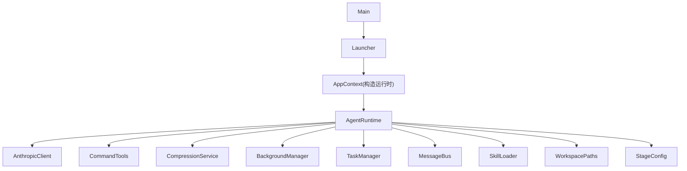
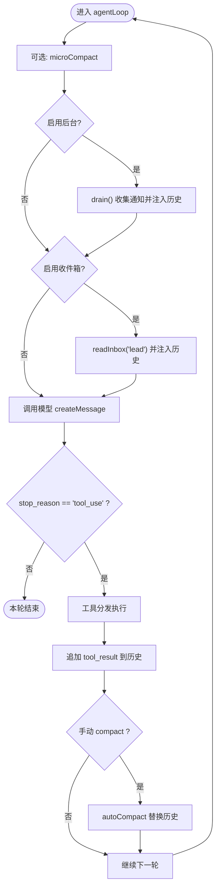
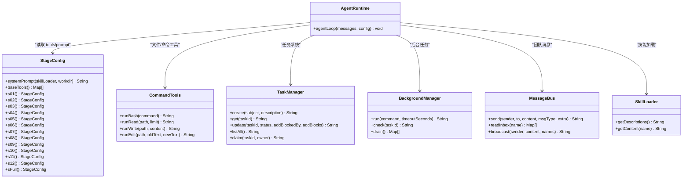
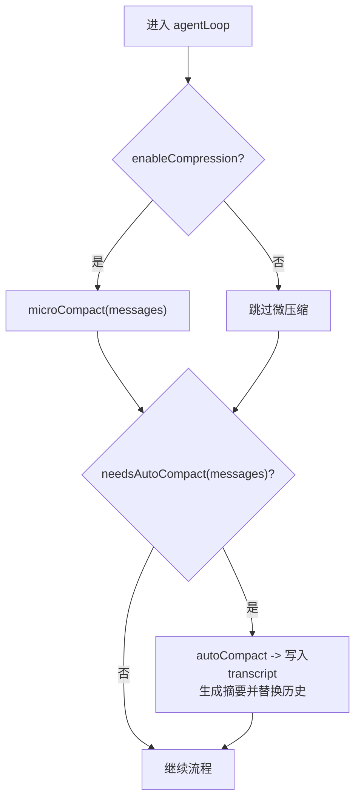
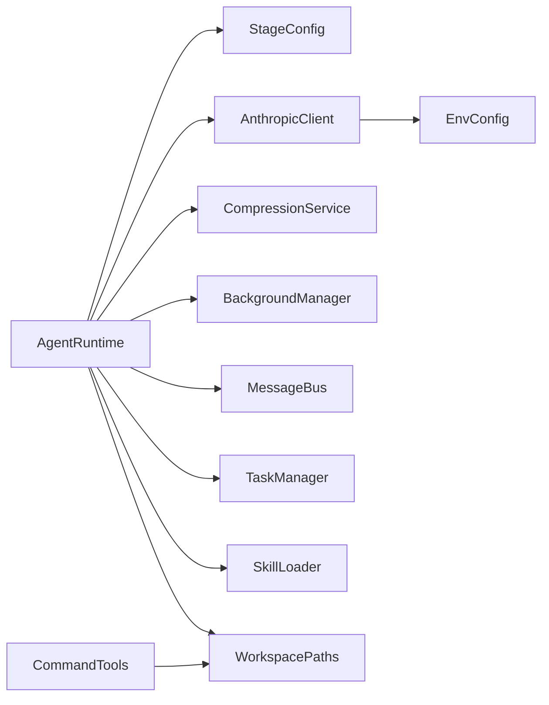

# 核心运行时系统

<cite>
**本文引用的文件**
- [AgentRuntime.java](file://src/main/java/com/learnclaudecode/agents/AgentRuntime.java)
- [StageConfig.java](file://src/main/java/com/learnclaudecode/agents/StageConfig.java)
- [Launcher.java](file://src/main/java/com/learnclaudecode/agents/Launcher.java)
- [S01AgentLoop.java](file://src/main/java/com/learnclaudecode/agents/S01AgentLoop.java)
- [EnvConfig.java](file://src/main/java/com/learnclaudecode/common/EnvConfig.java)
- [AnthropicClient.java](file://src/main/java/com/learnclaudecode/common/AnthropicClient.java)
- [CommandTools.java](file://src/main/java/com/learnclaudecode/tools/CommandTools.java)
- [CompressionService.java](file://src/main/java/com/learnclaudecode/context/CompressionService.java)
- [BackgroundManager.java](file://src/main/java/com/learnclaudecode/background/BackgroundManager.java)
- [TaskManager.java](file://src/main/java/com/learnclaudecode/tasks/TaskManager.java)
- [MessageBus.java](file://src/main/java/com/learnclaudecode/team/MessageBus.java)
- [SkillLoader.java](file://src/main/java/com/learnclaudecode/skills/SkillLoader.java)
- [WorkspacePaths.java](file://src/main/java/com/learnclaudecode/common/WorkspacePaths.java)
- [ChatMessage.java](file://src/main/java/com/learnclaudecode/model/ChatMessage.java)
- [Main.java](file://src/main/java/com/learnclaudecode/Main.java)
</cite>

## 目录
1. [简介](#简介)
2. [项目结构](#项目结构)
3. [核心组件](#核心组件)
4. [架构总览](#架构总览)
5. [详细组件分析](#详细组件分析)
6. [依赖关系分析](#依赖关系分析)
7. [性能考虑](#性能考虑)
8. [故障排查指南](#故障排查指南)
9. [结论](#结论)
10. [附录：扩展与自定义示例](#附录：扩展与自定义示例)

## 简介
本文件面向希望深入理解 Agent 运行时系统的开发者，聚焦以下主题：
- Agent 主循环（while(true)）如何驱动“观察—推理—执行—反馈”的闭环
- 消息处理引擎如何统一调度工具、后台任务、团队收件箱与上下文压缩
- 工具调度系统如何将模型输出的 tool_use 映射到本地 Java 实现
- 上下文管理机制如何实现微压缩与自动压缩，避免上下文爆炸
- StageConfig 的配置方式与各阶段差异化行为
- 环境配置加载机制与变量管理
- 扩展与自定义运行时的实践建议与最佳实践

## 项目结构
本项目采用分层与能力开关组合的组织方式：
- agents：运行时核心（AgentRuntime）、阶段配置（StageConfig）、启动器（Launcher）与各教学入口（S01..S12）
- common：环境配置（EnvConfig）、HTTP 客户端（AnthropicClient）、工作区路径（WorkspacePaths）
- tools：基础命令与文件操作（CommandTools）
- context：上下文压缩服务（CompressionService）
- background：后台任务管理（BackgroundManager）
- tasks：任务板与持久化（TaskManager）
- team：团队协作与消息总线（MessageBus）
- skills：技能加载（SkillLoader）
- model：数据模型（如 ChatMessage）



图表来源
- [Main.java:1-15](file://src/main/java/com/learnclaudecode/Main.java#L1-L15)
- [Launcher.java:1-28](file://src/main/java/com/learnclaudecode/agents/Launcher.java#L1-L28)
- [AgentRuntime.java:1-351](file://src/main/java/com/learnclaudecode/agents/AgentRuntime.java#L1-L351)
- [StageConfig.java:1-301](file://src/main/java/com/learnclaudecode/agents/StageConfig.java#L1-L301)
- [AnthropicClient.java:1-103](file://src/main/java/com/learnclaudecode/common/AnthropicClient.java#L1-L103)
- [CommandTools.java:1-146](file://src/main/java/com/learnclaudecode/tools/CommandTools.java#L1-L146)
- [CompressionService.java:1-172](file://src/main/java/com/learnclaudecode/context/CompressionService.java#L1-L172)
- [BackgroundManager.java:1-160](file://src/main/java/com/learnclaudecode/background/BackgroundManager.java#L1-L160)
- [TaskManager.java:1-338](file://src/main/java/com/learnclaudecode/tasks/TaskManager.java#L1-L338)
- [MessageBus.java:1-123](file://src/main/java/com/learnclaudecode/team/MessageBus.java#L1-L123)
- [SkillLoader.java:1-106](file://src/main/java/com/learnclaudecode/skills/SkillLoader.java#L1-L106)
- [WorkspacePaths.java:1-150](file://src/main/java/com/learnclaudecode/common/WorkspacePaths.java#L1-L150)

章节来源
- [Main.java:1-15](file://src/main/java/com/learnclaudecode/Main.java#L1-L15)
- [Launcher.java:1-28](file://src/main/java/com/learnclaudecode/agents/Launcher.java#L1-L28)
- [AgentRuntime.java:1-351](file://src/main/java/com/learnclaudecode/agents/AgentRuntime.java#L1-L351)

## 核心组件
- AgentRuntime：实现 REPL 交互与 Agent 主循环；负责消息历史维护、工具调度、后台任务注入、团队收件箱轮询、上下文压缩触发。
- StageConfig：以记录类型表达阶段能力开关（提示词、工具集、功能开关），并提供 systemPrompt 动态展开。
- AnthropicClient：封装 HTTP 调用，将 messages/system/tools 组装为请求并解析响应。
- CommandTools：提供 bash、read_file、write_file、edit_file 等基础工具实现。
- CompressionService：实现 microCompact 与 autoCompact，保障长对话不超出上下文窗口。
- BackgroundManager：异步执行长耗时命令，通过通知队列回灌主循环。
- TaskManager：基于文件的轻量任务板，支持创建、更新、认领、列表与依赖清理。
- MessageBus：基于 .team/inbox/*.jsonl 的文件型消息总线，支持点对点与广播。
- SkillLoader：扫描 skills 目录下的 SKILL.md，生成描述并在运行时注入 system prompt。
- WorkspacePaths：安全路径解析与工作区子目录访问。
- ChatMessage：统一的消息载体，content 可为文本或结构化块列表。

章节来源
- [AgentRuntime.java:23-39](file://src/main/java/com/learnclaudecode/agents/AgentRuntime.java#L23-L39)
- [StageConfig.java:11-25](file://src/main/java/com/learnclaudecode/agents/StageConfig.java#L11-L25)
- [AnthropicClient.java:15-26](file://src/main/java/com/learnclaudecode/common/AnthropicClient.java#L15-L26)
- [CommandTools.java:13-28](file://src/main/java/com/learnclaudecode/tools/CommandTools.java#L13-L28)
- [CompressionService.java:18-28](file://src/main/java/com/learnclaudecode/context/CompressionService.java#L18-L28)
- [BackgroundManager.java:17-34](file://src/main/java/com/learnclaudecode/background/BackgroundManager.java#L17-L34)
- [TaskManager.java:17-26](file://src/main/java/com/learnclaudecode/tasks/TaskManager.java#L17-L26)
- [MessageBus.java:16-42](file://src/main/java/com/learnclaudecode/team/MessageBus.java#L16-L42)
- [SkillLoader.java:15-38](file://src/main/java/com/learnclaudecode/skills/SkillLoader.java#L15-L38)
- [WorkspacePaths.java:8-23](file://src/main/java/com/learnclaudecode/common/WorkspacePaths.java#L8-L23)
- [ChatMessage.java:1-8](file://src/main/java/com/learnclaudecode/model/ChatMessage.java#L1-L8)

## 架构总览
Agent 运行时围绕“主循环 + 工具调度 + 上下文管理”构建，各阶段通过 StageConfig 控制能力开放程度。

```mermaid
sequenceDiagram
participant User as "用户"
participant REPL as "AgentRuntime.runRepl"
participant Loop as "AgentRuntime.agentLoop"
participant Model as "AnthropicClient"
participant Tools as "CommandTools/其他工具"
participant Comp as "CompressionService"
participant BG as "BackgroundManager"
participant Bus as "MessageBus"
User->>REPL : 输入指令
REPL->>Loop : 追加 user 消息并进入主循环
Loop->>Comp : 可选 microCompact
Loop->>BG : 可选 drain() 注入后台结果
Loop->>Bus : 可选 readInbox("lead")
Loop->>Model : createMessage(system, messages, tools, maxTokens)
Model-->>Loop : 返回 content 与 stop_reason
alt stop_reason == "tool_use"
Loop->>Tools : 按工具名分发执行
Tools-->>Loop : 工具输出
Loop->>Loop : 将 tool_result 作为 user 消息追加
Loop->>Loop : 可能触发手动/自动 compact
Loop->>Model : 下一轮继续
else 非 tool_use
Loop-->>REPL : 本轮结束，展示文本
end
```

图表来源
- [AgentRuntime.java:97-261](file://src/main/java/com/learnclaudecode/agents/AgentRuntime.java#L97-L261)
- [AnthropicClient.java:52-101](file://src/main/java/com/learnclaudecode/common/AnthropicClient.java#L52-L101)
- [CompressionService.java:69-170](file://src/main/java/com/learnclaudecode/context/CompressionService.java#L69-L170)
- [BackgroundManager.java:43-157](file://src/main/java/com/learnclaudecode/background/BackgroundManager.java#L43-L157)
- [MessageBus.java:54-121](file://src/main/java/com/learnclaudecode/team/MessageBus.java#L54-L121)

## 详细组件分析

### Agent 主循环与消息处理引擎
- 主循环位于 agentLoop，使用 while(true) 持续迭代，直到模型停止调用工具。
- 每轮先做可选的微压缩，再注入后台任务结果与团队收件箱消息，随后统一调用模型获取下一步动作。
- 若模型返回 tool_use，则通过 switch 映射到具体工具执行，并将 tool_result 作为新的 user 消息写回历史，继续下一轮。
- 支持多轮未更新 Todo 时主动提醒，以及手动 compact 后即时替换上下文。



图表来源
- [AgentRuntime.java:131-261](file://src/main/java/com/learnclaudecode/agents/AgentRuntime.java#L131-L261)

章节来源
- [AgentRuntime.java:97-261](file://src/main/java/com/learnclaudecode/agents/AgentRuntime.java#L97-L261)

### 工具调度系统
- 工具定义由 StageConfig.baseTools 及各阶段方法组合而成，并通过 tool(...) 构造标准 schema。
- 运行时通过工具名进行分发，覆盖 bash、文件读写编辑、Todo、子代理、技能加载、任务系统、后台任务、团队协作、worktree 等。
- 工具输出统一包装为 tool_result 块，重新注入消息历史供模型继续决策。



图表来源
- [StageConfig.java:56-284](file://src/main/java/com/learnclaudecode/agents/StageConfig.java#L56-L284)
- [AgentRuntime.java:189-234](file://src/main/java/com/learnclaudecode/agents/AgentRuntime.java#L189-L234)
- [CommandTools.java:36-144](file://src/main/java/com/learnclaudecode/tools/CommandTools.java#L36-L144)
- [TaskManager.java:51-175](file://src/main/java/com/learnclaudecode/tasks/TaskManager.java#L51-L175)
- [BackgroundManager.java:43-157](file://src/main/java/com/learnclaudecode/background/BackgroundManager.java#L43-L157)
- [MessageBus.java:54-121](file://src/main/java/com/learnclaudecode/team/MessageBus.java#L54-L121)
- [SkillLoader.java:79-104](file://src/main/java/com/learnclaudecode/skills/SkillLoader.java#L79-L104)

章节来源
- [StageConfig.java:56-284](file://src/main/java/com/learnclaudecode/agents/StageConfig.java#L56-L284)
- [AgentRuntime.java:189-234](file://src/main/java/com/learnclaudecode/agents/AgentRuntime.java#L189-L234)

### 上下文管理机制
- microCompact：仅清理较老的 tool_result 大文本，保留最近若干条完整结果，降低上下文体积而不打断对话。
- autoCompact：当估算 token 超过阈值时，将完整历史落盘至 transcript，并调用模型生成摘要，用“摘要 + 确认消息”替换旧历史。
- 手动 compact：在工具执行后延迟执行，确保本轮结果先被模型看到，再进行压缩。



图表来源
- [AgentRuntime.java:136-145](file://src/main/java/com/learnclaudecode/agents/AgentRuntime.java#L136-L145)
- [CompressionService.java:56-170](file://src/main/java/com/learnclaudecode/context/CompressionService.java#L56-L170)

章节来源
- [CompressionService.java:56-170](file://src/main/java/com/learnclaudecode/context/CompressionService.java#L56-L170)
- [AgentRuntime.java:136-145](file://src/main/java/com/learnclaudecode/agents/AgentRuntime.java#L136-L145)

### StageConfig 配置与阶段差异
- 每个阶段通过静态工厂方法返回不同的 StageConfig，控制：
  - prompt/systemTemplate：不同阶段的引导语与占位符
  - tools：逐步开放文件/命令、Todo、子代理、技能加载、压缩、任务、后台、团队、worktree 等能力
  - 开关：enableTodoNag、enableCompression、enableBackground、enableInbox、subagentWritable、autonomousTeammates
- s_full 合并所有阶段能力，形成完整视图。

章节来源
- [StageConfig.java:77-267](file://src/main/java/com/learnclaudecode/agents/StageConfig.java#L77-L267)

### 环境配置加载与变量管理
- EnvConfig 优先从系统环境变量读取，其次回退到 .env；MODEL_ID 为必填项，API Key 与 Base URL 可配置。
- AnthropicClient 使用 EnvConfig 提供的模型 ID、Base URL、认证头发起 HTTP 请求，兼容官方与第三方兼容端点。
- WorkspacePaths 提供安全路径解析与工作区子目录访问，防止路径逃逸。

章节来源
- [EnvConfig.java:22-95](file://src/main/java/com/learnclaudecode/common/EnvConfig.java#L22-L95)
- [AnthropicClient.java:36-101](file://src/main/java/com/learnclaudecode/common/AnthropicClient.java#L36-L101)
- [WorkspacePaths.java:21-49](file://src/main/java/com/learnclaudecode/common/WorkspacePaths.java#L21-L49)

### 后台任务与团队通信
- BackgroundManager 使用独立线程执行命令，超时保护，完成后将状态与结果写入任务表与通知队列，主循环周期性 drain 注入上下文。
- MessageBus 基于 .team/inbox/*.jsonl 实现“读即消费”的收件箱语义，支持点对点与广播。

章节来源
- [BackgroundManager.java:43-157](file://src/main/java/com/learnclaudecode/background/BackgroundManager.java#L43-L157)
- [MessageBus.java:54-121](file://src/main/java/com/learnclaudecode/team/MessageBus.java#L54-L121)

### 任务系统与 Worktree 隔离
- TaskManager 以 JSON 文件形式持久化任务，支持创建、更新、认领、列表、依赖清理与 worktree 绑定。
- 完成的任务会清理其他任务的 blockedBy 依赖，保证任务流转正确性。

章节来源
- [TaskManager.java:51-336](file://src/main/java/com/learnclaudecode/tasks/TaskManager.java#L51-L336)

## 依赖关系分析
- AgentRuntime 强依赖 StageConfig（能力开关）、AnthropicClient（模型调用）、CompressionService（上下文管理）、BackgroundManager（异步执行）、MessageBus（团队通信）、TaskManager（任务板）、SkillLoader（技能加载）、WorkspacePaths（路径安全）。
- StageConfig 依赖 SkillLoader 以动态注入技能描述。
- AnthropicClient 依赖 EnvConfig 获取模型与网络参数。
- 工具层（CommandTools）依赖 WorkspacePaths 进行安全路径解析。



图表来源
- [AgentRuntime.java:41-90](file://src/main/java/com/learnclaudecode/agents/AgentRuntime.java#L41-L90)
- [StageConfig.java:44-49](file://src/main/java/com/learnclaudecode/agents/StageConfig.java#L44-L49)
- [AnthropicClient.java:27-41](file://src/main/java/com/learnclaudecode/common/AnthropicClient.java#L27-L41)
- [CommandTools.java:16-28](file://src/main/java/com/learnclaudecode/tools/CommandTools.java#L16-L28)

章节来源
- [AgentRuntime.java:41-90](file://src/main/java/com/learnclaudecode/agents/AgentRuntime.java#L41-L90)
- [AnthropicClient.java:27-41](file://src/main/java/com/learnclaudecode/common/AnthropicClient.java#L27-L41)
- [StageConfig.java:44-49](file://src/main/java/com/learnclaudecode/agents/StageConfig.java#L44-L49)
- [CommandTools.java:16-28](file://src/main/java/com/learnclaudecode/tools/CommandTools.java#L16-L28)

## 性能考虑
- 上下文压缩：优先 microCompact 减少不必要的全量压缩；合理设置阈值以避免频繁调用模型生成摘要。
- 工具输出裁剪：对命令与文件读取输出限制长度，避免单次结果过大导致上下文膨胀。
- 后台任务超时：为长耗时命令设置超时，避免资源占用与阻塞。
- 并发与锁：任务管理器关键方法加同步，避免并发修改导致状态不一致。
- 网络超时与重试：客户端设置连接与请求超时，异常统一抛出便于上层处理。

[本节为通用指导，不直接分析具体文件]

## 故障排查指南
- API 调用失败：检查环境变量 MODEL_ID、ANTHROPIC_API_KEY、ANTHROPIC_BASE_URL 是否正确；查看 HTTP 状态码与响应体。
- 路径逃逸错误：确保所有文件操作通过 WorkspacePaths.safeResolve，避免 ../ 越界。
- 命令执行超时：检查后台任务超时设置与命令复杂度，必要时拆分任务。
- 上下文压缩失败：确认 .transcripts 目录可写；检查磁盘空间与权限。
- 任务状态异常：查看 .tasks 目录下 JSON 文件是否损坏；确认依赖关系是否闭环。

章节来源
- [AnthropicClient.java:87-101](file://src/main/java/com/learnclaudecode/common/AnthropicClient.java#L87-L101)
- [WorkspacePaths.java:42-49](file://src/main/java/com/learnclaudecode/common/WorkspacePaths.java#L42-L49)
- [BackgroundManager.java:68-123](file://src/main/java/com/learnclaudecode/background/BackgroundManager.java#L68-L123)
- [CompressionService.java:118-160](file://src/main/java/com/learnclaudecode/context/CompressionService.java#L118-L160)
- [TaskManager.java:276-336](file://src/main/java/com/learnclaudecode/tasks/TaskManager.java#L276-L336)

## 结论
该运行时以 AgentRuntime 为核心，结合 StageConfig 的能力开关，实现了可扩展、可演进的 Agent 生命周期管理。通过工具调度、后台任务、团队通信与上下文压缩，系统在保持简洁的同时覆盖了复杂协作场景。遵循本文的最佳实践与故障排查建议，可稳定扩展与定制运行时行为。

[本节为总结，不直接分析具体文件]

## 附录：扩展与自定义示例
- 新增工具
  - 在 StageConfig.tools 中注册新工具的 schema（name、description、input_schema）。
  - 在 AgentRuntime.agentLoop 的工具分发 switch 中添加对应分支，调用具体实现。
  - 参考路径：[StageConfig.tool(...):277-284](file://src/main/java/com/learnclaudecode/agents/StageConfig.java#L277-L284)、[AgentRuntime 工具分发:189-234](file://src/main/java/com/learnclaudecode/agents/AgentRuntime.java#L189-L234)。

- 自定义阶段
  - 在 StageConfig 中新增静态工厂方法，组合所需 tools 与开关，并编写合适的 systemTemplate。
  - 参考路径：[s01-s12 与 sFull:77-267](file://src/main/java/com/learnclaudecode/agents/StageConfig.java#L77-L267)。

- 调整上下文压缩策略
  - 修改 CompressionService 的 threshold 与 keepRecent，或重写 microCompact/autoCompact 逻辑。
  - 参考路径：[CompressionService:43-170](file://src/main/java/com/learnclaudecode/context/CompressionService.java#L43-L170)。

- 接入第三方兼容端点
  - 通过 EnvConfig 配置 ANTHROPIC_BASE_URL 与 ANTHROPIC_API_KEY，AnthropicClient 会自动拼接 /v1/messages。
  - 参考路径：[EnvConfig.getenv:47-58](file://src/main/java/com/learnclaudecode/common/EnvConfig.java#L47-L58)、[AnthropicClient.createMessage:52-101](file://src/main/java/com/learnclaudecode/common/AnthropicClient.java#L52-L101)。

- 扩展团队协议
  - 在 MessageBus.VALID_TYPES 中增加新消息类型，并在 AgentRuntime 的工具分发中处理相应工具。
  - 参考路径：[MessageBus 类型定义:20-26](file://src/main/java/com/learnclaudecode/team/MessageBus.java#L20-L26)、[AgentRuntime 团队工具:220-227](file://src/main/java/com/learnclaudecode/agents/AgentRuntime.java#L220-L227)。

- 启动指定阶段
  - 通过 S01..S12 或 SFull 的 main 调用 Launcher.launch(StageConfig.xxx())。
  - 参考路径：[S01AgentLoop.main:9-11](file://src/main/java/com/learnclaudecode/agents/S01AgentLoop.java#L9-L11)、[Launcher.launch:23-26](file://src/main/java/com/learnclaudecode/agents/Launcher.java#L23-L26)。