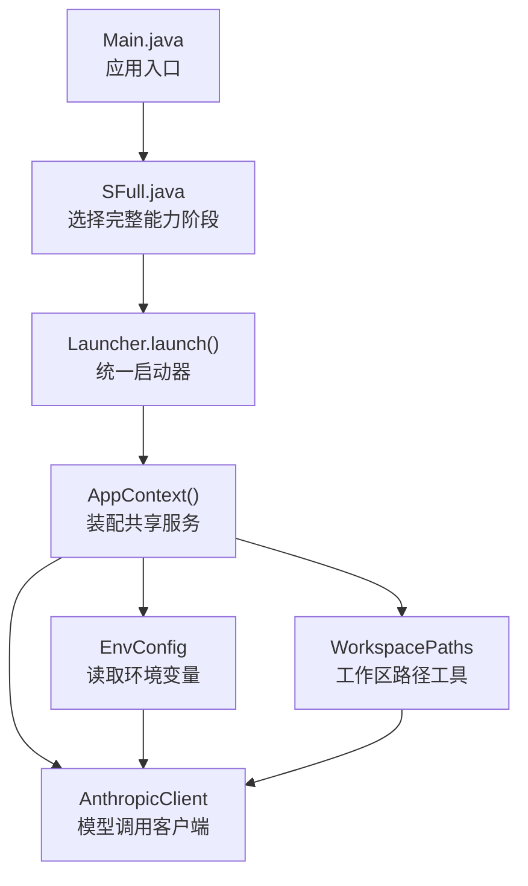
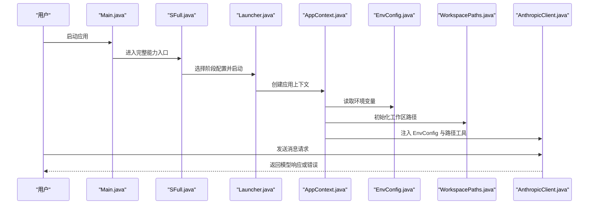
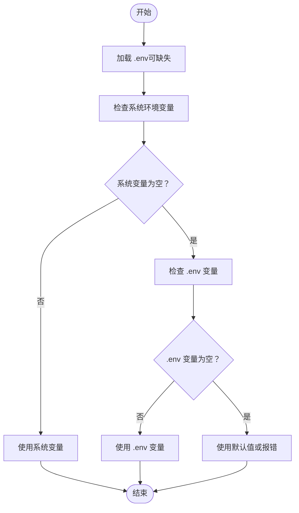
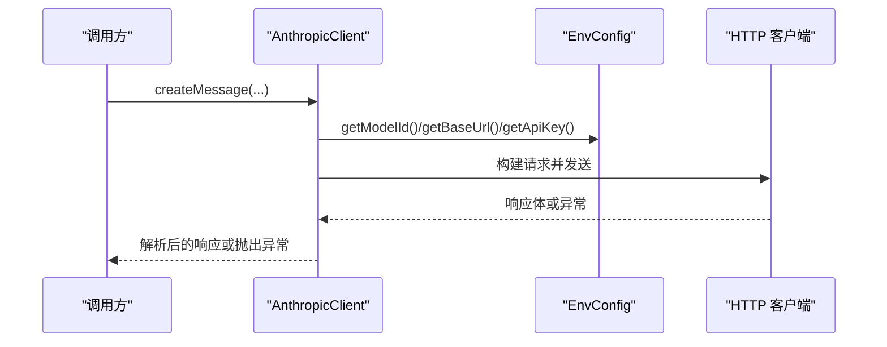
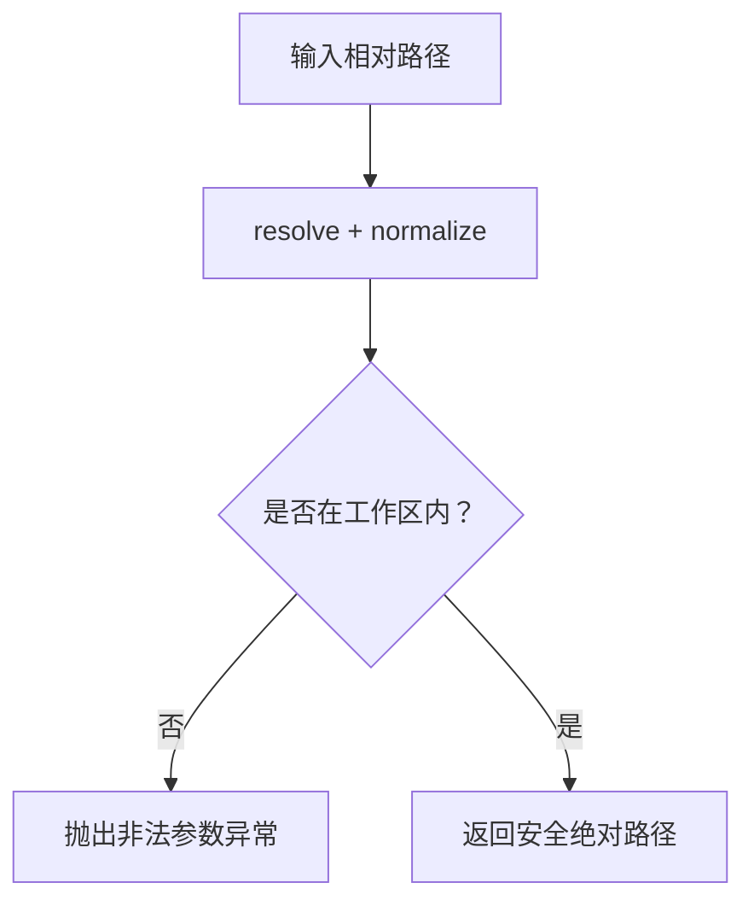
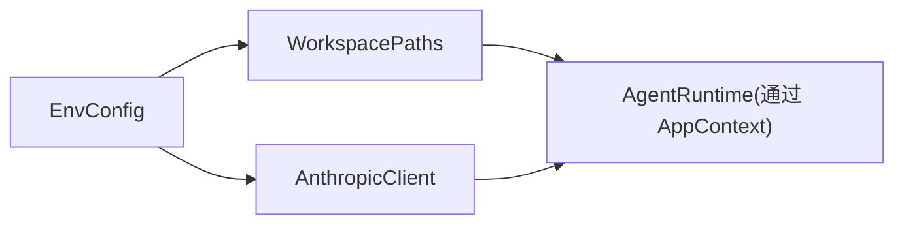

# 环境配置管理

<cite>
**本文引用的文件**
- [EnvConfig.java](file://src/main/java/com/learnclaudecode/common/EnvConfig.java)
- [AnthropicClient.java](file://src/main/java/com/learnclaudecode/common/AnthropicClient.java)
- [WorkspacePaths.java](file://src/main/java/com/learnclaudecode/common/WorkspacePaths.java)
- [AppContext.java](file://src/main/java/com/learnclaudecode/agents/AppContext.java)
- [Launcher.java](file://src/main/java/com/learnclaudecode/agents/Launcher.java)
- [StageConfig.java](file://src/main/java/com/learnclaudecode/agents/StageConfig.java)
- [Main.java](file://src/main/java/com/learnclaudecode/Main.java)
- [pom.xml](file://pom.xml)
</cite>

## 目录
1. [简介](#简介)
2. [项目结构](#项目结构)
3. [核心组件](#核心组件)
4. [架构总览](#架构总览)
5. [详细组件分析](#详细组件分析)
6. [依赖关系分析](#依赖关系分析)
7. [性能与可靠性考虑](#性能与可靠性考虑)
8. [故障排查指南](#故障排查指南)
9. [结论](#结论)
10. [附录：环境变量清单与环境示例](#附录环境变量清单与环境示例)

## 简介
本文件聚焦于应用的环境配置管理机制，围绕 EnvConfig 如何加载、合并、校验并暴露环境变量展开。文档涵盖 API 密钥管理、工作目录配置、调试选项（通过外部化配置实现）、配置文件优先级与覆盖机制、不同环境的配置差异示例、默认值处理与错误处理策略，并提供最佳实践与命名规范建议。

## 项目结构
本项目采用分层组织方式：
- common 层提供通用能力，包括环境配置读取、HTTP 客户端封装、工作区路径工具等。
- agents 层负责装配应用上下文、编排阶段能力、驱动运行时。
- 启动入口 Main 将请求转发到完整能力版本 SFull，再由 Launcher 创建 AppContext 并运行 AgentRuntime。

图表来源
- [Main.java:1-15](file://src/main/java/com/learnclaudecode/Main.java#L1-L15)
- [SFull.java:1-13](file://src/main/java/com/learnclaudecode/agents/SFull.java#L1-L13)
- [Launcher.java:1-28](file://src/main/java/com/learnclaudecode/agents/Launcher.java#L1-L28)
- [AppContext.java:1-70](file://src/main/java/com/learnclaudecode/agents/AppContext.java#L1-L70)
- [EnvConfig.java:1-96](file://src/main/java/com/learnclaudecode/common/EnvConfig.java#L1-L96)
- [WorkspacePaths.java:1-150](file://src/main/java/com/learnclaudecode/common/WorkspacePaths.java#L1-L150)
- [AnthropicClient.java:1-103](file://src/main/java/com/learnclaudecode/common/AnthropicClient.java#L1-L103)

章节来源
- [Main.java:1-15](file://src/main/java/com/learnclaudecode/Main.java#L1-L15)
- [Launcher.java:1-28](file://src/main/java/com/learnclaudecode/agents/Launcher.java#L1-L28)
- [AppContext.java:1-70](file://src/main/java/com/learnclaudecode/agents/AppContext.java#L1-L70)

## 核心组件
- EnvConfig：集中负责从 .env 与系统环境变量中读取配置，定义必填项、可选项及默认值，并暴露模型 ID、API Key、基础 URL、工作目录等关键配置。
- AnthropicClient：基于 EnvConfig 构建 HTTP 客户端，组装消息请求体与认证头，调用兼容的 Messages API。
- WorkspacePaths：以 EnvConfig 提供的 workdir 为根，提供安全的路径解析与工作区子目录访问。
- AppContext：装配 EnvConfig、WorkspacePaths、AnthropicClient 及其他运行时组件，形成统一的 AgentRuntime。
- Launcher / StageConfig：决定当前阶段的能力开关与工具集，配合环境配置共同决定最终行为。

章节来源
- [EnvConfig.java:1-96](file://src/main/java/com/learnclaudecode/common/EnvConfig.java#L1-L96)
- [AnthropicClient.java:1-103](file://src/main/java/com/learnclaudecode/common/AnthropicClient.java#L1-L103)
- [WorkspacePaths.java:1-150](file://src/main/java/com/learnclaudecode/common/WorkspacePaths.java#L1-L150)
- [AppContext.java:1-70](file://src/main/java/com/learnclaudecode/agents/AppContext.java#L1-L70)
- [Launcher.java:1-28](file://src/main/java/com/learnclaudecode/agents/Launcher.java#L1-L28)
- [StageConfig.java:1-301](file://src/main/java/com/learnclaudecode/agents/StageConfig.java#L1-L301)

## 架构总览
下图展示了从应用启动到模型调用的整体流程，以及环境配置在各环节中的作用点。

图表来源
- [Main.java:1-15](file://src/main/java/com/learnclaudecode/Main.java#L1-L15)
- [SFull.java:1-13](file://src/main/java/com/learnclaudecode/agents/SFull.java#L1-L13)
- [Launcher.java:1-28](file://src/main/java/com/learnclaudecode/agents/Launcher.java#L1-L28)
- [AppContext.java:1-70](file://src/main/java/com/learnclaudecode/agents/AppContext.java#L1-L70)
- [EnvConfig.java:1-96](file://src/main/java/com/learnclaudecode/common/EnvConfig.java#L1-L96)
- [WorkspacePaths.java:1-150](file://src/main/java/com/learnclaudecode/common/WorkspacePaths.java#L1-L150)
- [AnthropicClient.java:1-103](file://src/main/java/com/learnclaudecode/common/AnthropicClient.java#L1-L103)

## 详细组件分析

### EnvConfig：环境变量加载与管理
- 加载顺序与优先级
  - 系统环境变量优先于 .env 中的同名变量。
  - 若系统环境变量为空或空白，则回退到 .env。
  - 使用 dotenv-java 库加载 .env，且允许缺失时继续执行。
- 必填项与默认值
  - MODEL_ID：必填，缺失时抛出异常。
  - ANTHROPIC_API_KEY：可选，空字符串作为默认。
  - ANTHROPIC_BASE_URL：可选，默认指向官方地址。
- 工作目录
  - 使用当前进程工作目录的绝对路径并规范化，供后续工作区路径工具使用。
- 错误处理
  - 对必填项缺失进行严格校验，尽早失败，便于快速定位配置问题。

图表来源
- [EnvConfig.java:22-58](file://src/main/java/com/learnclaudecode/common/EnvConfig.java#L22-L58)

章节来源
- [EnvConfig.java:1-96](file://src/main/java/com/learnclaudecode/common/EnvConfig.java#L1-L96)

### AnthropicClient：基于配置的模型调用
- 配置来源
  - 使用 EnvConfig 提供的 modelId、baseUrl、apiKey。
- 请求构造
  - 拼接 /v1/messages 端点，设置必要头部与超时。
  - 当 apiKey 非空时，同时附加 x-api-key 与 authorization 头，兼容多种提供方。
- 错误处理
  - 网络异常或中断统一转换为业务异常，便于上层捕获与记录。
  - HTTP 状态码 >= 400 时直接抛出包含响应体的异常，便于调试兼容接口。

图表来源
- [AnthropicClient.java:36-101](file://src/main/java/com/learnclaudecode/common/AnthropicClient.java#L36-L101)
- [EnvConfig.java:60-94](file://src/main/java/com/learnclaudecode/common/EnvConfig.java#L60-L94)

章节来源
- [AnthropicClient.java:1-103](file://src/main/java/com/learnclaudecode/common/AnthropicClient.java#L1-L103)

### WorkspacePaths：工作区路径与安全控制
- 工作目录来源
  - 由 EnvConfig.getWorkdir() 提供，确保所有文件操作都在指定工作区内。
- 安全解析
  - safeResolve 会规范化路径并防止逃逸出工作区，避免越权访问。
- 常用目录
  - 提供 .tasks、.team、skills、.transcripts、.worktrees 等子目录的便捷访问方法。

图表来源
- [WorkspacePaths.java:21-49](file://src/main/java/com/learnclaudecode/common/WorkspacePaths.java#L21-L49)

章节来源
- [WorkspacePaths.java:1-150](file://src/main/java/com/learnclaudecode/common/WorkspacePaths.java#L1-L150)

### AppContext：装配与依赖注入
- 装配顺序
  - 先创建 EnvConfig 与 WorkspacePaths。
  - 再创建 AnthropicClient、CommandTools、SkillLoader、CompressionService、TaskManager、BackgroundManager、MessageBus、TeammateManager、WorktreeManager。
  - 最后将这些组件注入 AgentRuntime，形成统一运行时。
- 作用
  - 将环境配置与工作区信息贯穿到所有子系统，保证一致性与可测试性。

章节来源
- [AppContext.java:1-70](file://src/main/java/com/learnclaudecode/agents/AppContext.java#L1-L70)

### 启动链路：Main -> SFull -> Launcher -> AppContext
- Main 仅作为入口，转发到 SFull。
- SFull 选择完整能力阶段配置。
- Launcher 统一创建 AppContext 并运行。
- 该链路确保环境配置在最早阶段被加载并传播到各组件。

章节来源
- [Main.java:1-15](file://src/main/java/com/learnclaudecode/Main.java#L1-L15)
- [SFull.java:1-13](file://src/main/java/com/learnclaudecode/agents/SFull.java#L1-L13)
- [Launcher.java:1-28](file://src/main/java/com/learnclaudecode/agents/Launcher.java#L1-L28)

## 依赖关系分析
- 运行时依赖
  - dotenv-java：用于加载 .env 文件。
  - jackson：用于 JSON 序列化/反序列化（在 AnthropicClient 中通过 JsonUtils 使用）。
- 模块耦合
  - AnthropicClient 强依赖 EnvConfig 提供的模型与认证信息。
  - WorkspacePaths 依赖 EnvConfig 的工作目录，确保所有 I/O 安全可控。
  - AppContext 聚合上述组件，形成高内聚、低耦合的装配中心。

图表来源
- [EnvConfig.java:1-96](file://src/main/java/com/learnclaudecode/common/EnvConfig.java#L1-L96)
- [AnthropicClient.java:1-103](file://src/main/java/com/learnclaudecode/common/AnthropicClient.java#L1-L103)
- [WorkspacePaths.java:1-150](file://src/main/java/com/learnclaudecode/common/WorkspacePaths.java#L1-L150)
- [AppContext.java:1-70](file://src/main/java/com/learnclaudecode/agents/AppContext.java#L1-L70)

章节来源
- [pom.xml:19-35](file://pom.xml#L19-L35)

## 性能与可靠性考虑
- 网络超时与重试
  - 连接超时与请求超时已设置，建议在更高层增加重试与熔断策略以提升鲁棒性。
- 配置加载开销
  - .env 加载仅在应用启动时进行一次，开销可忽略。
- 路径安全
  - 通过 safeResolve 防止路径穿越，减少安全风险与潜在的性能损耗。
- 日志与可观测性
  - 建议在异常路径添加结构化日志，便于追踪配置与网络问题。

[本节为通用指导，不直接分析具体文件]

## 故障排查指南
- 启动时报“缺少环境变量”
  - 检查 MODEL_ID 是否已在系统环境变量或 .env 中正确设置。
  - 确认环境变量名大小写与拼写无误。
- 模型调用失败
  - 检查 ANTHROPIC_API_KEY 是否为空；如为空，服务端可能拒绝请求。
  - 检查 ANTHROPIC_BASE_URL 是否正确，尤其是使用第三方兼容端点时。
  - 查看异常响应体，定位服务端返回的错误详情。
- 工作区路径异常
  - 确认当前工作目录是否符合预期。
  - 检查相对路径是否会导致路径逃逸，必要时调整路径或使用安全解析方法。

章节来源
- [EnvConfig.java:37-39](file://src/main/java/com/learnclaudecode/common/EnvConfig.java#L37-L39)
- [AnthropicClient.java:87-101](file://src/main/java/com/learnclaudecode/common/AnthropicClient.java#L87-L101)
- [WorkspacePaths.java:42-49](file://src/main/java/com/learnclaudecode/common/WorkspacePaths.java#L42-L49)

## 结论
EnvConfig 提供了简洁而健壮的环境配置管理能力，通过明确的优先级与默认值策略，使应用在开发、测试与生产环境中都能稳定运行。结合 AnthropicClient 与 WorkspacePaths，形成了从配置到网络调用与文件操作的完整闭环。遵循本文的最佳实践与命名规范，可以显著降低配置错误风险并提升可维护性。

[本节为总结，不直接分析具体文件]

## 附录：环境变量清单与环境示例

### 环境变量清单
- MODEL_ID（必填）
  - 用途：指定要使用的模型标识。
  - 默认：无（缺失即报错）。
- ANTHROPIC_API_KEY（可选）
  - 用途：API 认证密钥。
  - 默认：空字符串。
- ANTHROPIC_BASE_URL（可选）
  - 用途：兼容服务的 Base URL。
  - 默认：官方地址。
- 工作目录
  - 来源：当前进程工作目录的绝对路径。
  - 用途：作为所有工作区文件的根目录。

章节来源
- [EnvConfig.java:22-29](file://src/main/java/com/learnclaudecode/common/EnvConfig.java#L22-L29)
- [EnvConfig.java:60-94](file://src/main/java/com/learnclaudecode/common/EnvConfig.java#L60-L94)

### 不同环境的配置差异示例
- 开发环境
  - 可在项目根目录放置 .env 文件，设置 MODEL_ID、ANTHROPIC_API_KEY、ANTHROPIC_BASE_URL。
  - 本地 IDE 运行时可通过运行配置覆盖系统环境变量，实现更高优先级。
- 测试环境
  - 建议使用独立的 CI 环境变量注入，避免提交敏感信息。
  - 可使用不同的 BASE_URL 指向沙箱或测试端点。
- 生产环境
  - 必须通过平台级环境变量注入，严禁将密钥写入代码仓库。
  - 建议启用更严格的监控与告警，并对网络异常进行重试与降级。

[本节为概念性说明，不直接分析具体文件]

### 配置验证、默认值与错误处理机制
- 验证
  - 必填项缺失立即抛出异常，确保启动失败早于业务逻辑执行。
- 默认值
  - API Key 与 Base URL 提供合理默认，便于最小化配置即可运行。
- 错误处理
  - 网络异常统一转换为业务异常，附带上下文信息，便于上层捕获与记录。

章节来源
- [EnvConfig.java:37-39](file://src/main/java/com/learnclaudecode/common/EnvConfig.java#L37-L39)
- [AnthropicClient.java:87-101](file://src/main/java/com/learnclaudecode/common/AnthropicClient.java#L87-L101)

### 最佳实践与命名规范
- 命名规范
  - 使用全大写、下划线分隔的常量风格，如 MODEL_ID、ANTHROPIC_API_KEY、ANTHROPIC_BASE_URL。
  - 保持键名稳定，避免频繁变更导致迁移成本。
- 优先级与覆盖
  - 系统环境变量始终优先于 .env，便于在 CI 或容器环境中覆盖本地配置。
- 安全建议
  - 不要将真实密钥提交到代码仓库；使用 .env 仅用于本地开发。
  - 在生产环境使用平台提供的密钥管理服务注入环境变量。
- 可观测性
  - 对配置加载与网络调用添加结构化日志，便于问题定位。
- 扩展性
  - 如需新增配置项，建议在 EnvConfig 中集中管理，并提供清晰的默认值与校验逻辑。

[本节为通用指导，不直接分析具体文件]