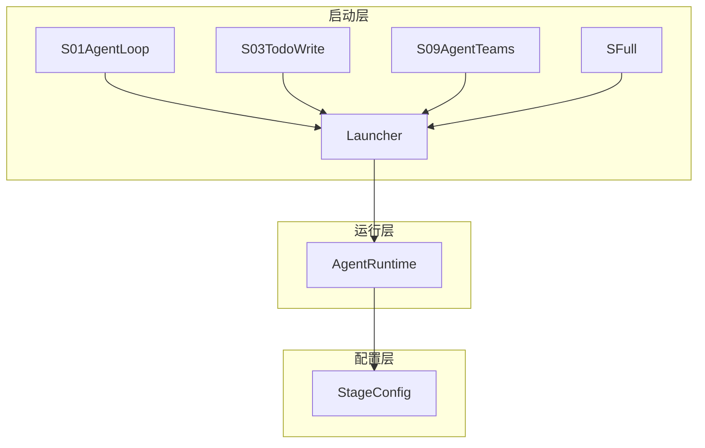
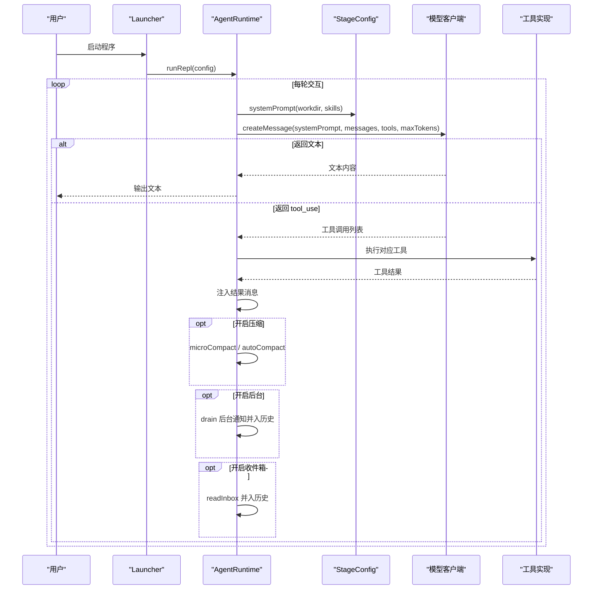
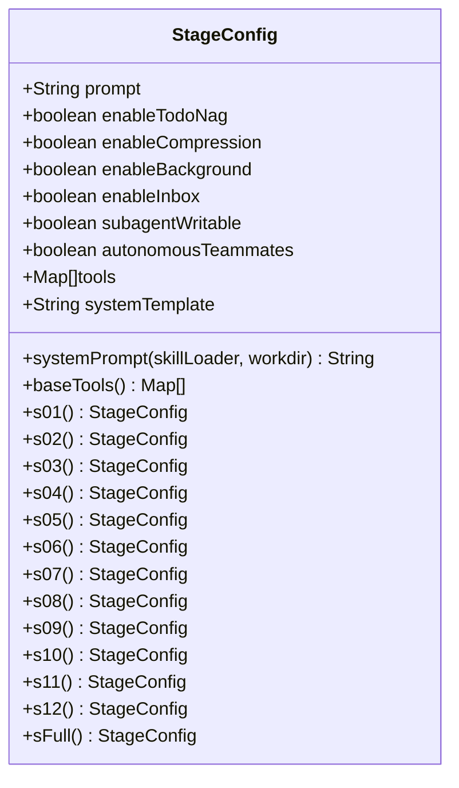
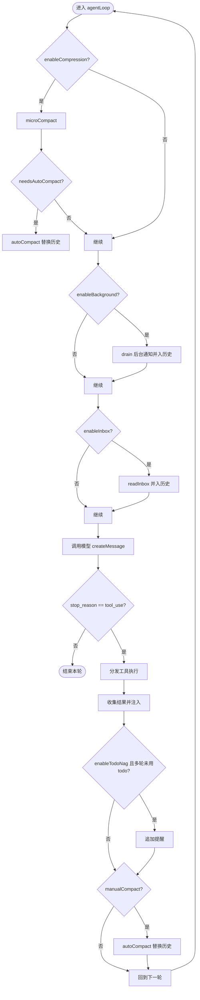
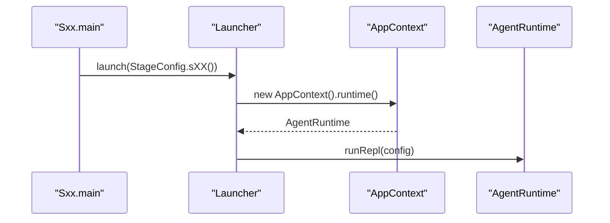
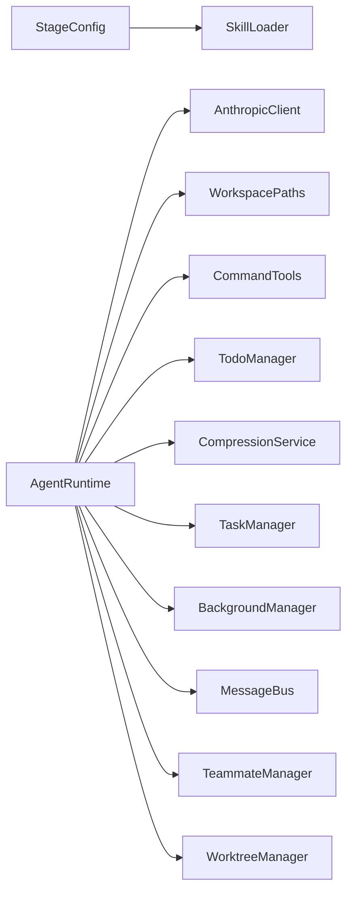

# 阶段配置系统

<cite>
**本文引用的文件**
- [StageConfig.java](file://src/main/java/com/learnclaudecode/agents/StageConfig.java)
- [AgentRuntime.java](file://src/main/java/com/learnclaudecode/agents/AgentRuntime.java)
- [Launcher.java](file://src/main/java/com/learnclaudecode/agents/Launcher.java)
- [SFull.java](file://src/main/java/com/learnclaudecode/agents/SFull.java)
- [S01AgentLoop.java](file://src/main/java/com/learnclaudecode/agents/S01AgentLoop.java)
- [S03TodoWrite.java](file://src/main/java/com/learnclaudecode/agents/S03TodoWrite.java)
- [S09AgentTeams.java](file://src/main/java/com/learnclaudecode/agents/S09AgentTeams.java)
</cite>

## 目录
1. [简介](#简介)
2. [项目结构](#项目结构)
3. [核心组件](#核心组件)
4. [架构总览](#架构总览)
5. [详细组件分析](#详细组件分析)
6. [依赖关系分析](#依赖关系分析)
7. [性能考量](#性能考量)
8. [故障排查指南](#故障排查指南)
9. [结论](#结论)
10. [附录](#附录)

## 简介
本章节面向“阶段配置系统”，解释 StageConfig 如何定义不同学习阶段的能力集与行为差异。该系统通过统一的运行时（AgentRuntime）与可插拔的配置（StageConfig），将 Claude Code 风格的 Agent 能力以“开关 + 工具集 + 提示词模板”的方式逐步解锁，从最小闭环到完整协作，覆盖命令执行、文件操作、任务管理、后台任务、团队通信、自治队友与工作区隔离等主题。

## 项目结构
- 配置层：StageConfig 提供各阶段的提示词、工具集合与功能开关。
- 运行层：AgentRuntime 根据配置驱动模型调用、工具调度、上下文压缩、后台任务与团队协作。
- 启动层：每个 Sxx 入口类选择特定 StageConfig，并通过 Launcher 统一启动。

图表来源
- [Launcher.java:18-26](file://src/main/java/com/learnclaudecode/agents/Launcher.java#L18-L26)
- [AgentRuntime.java:97-123](file://src/main/java/com/learnclaudecode/agents/AgentRuntime.java#L97-L123)
- [StageConfig.java:77-267](file://src/main/java/com/learnclaudecode/agents/StageConfig.java#L77-L267)

章节来源
- [Launcher.java:1-28](file://src/main/java/com/learnclaudecode/agents/Launcher.java#L1-L28)
- [S01AgentLoop.java:1-12](file://src/main/java/com/learnclaudecode/agents/S01AgentLoop.java#L1-L12)
- [S03TodoWrite.java:1-13](file://src/main/java/com/learnclaudecode/agents/S03TodoWrite.java#L1-L13)
- [S09AgentTeams.java:1-13](file://src/main/java/com/learnclaudecode/agents/S09AgentTeams.java#L1-L13)
- [SFull.java:1-13](file://src/main/java/com/learnclaudecode/agents/SFull.java#L1-L13)

## 核心组件
- StageConfig：记录当前阶段的 system prompt 模板、工具列表、以及 enableCompression、enableBackground、enableInbox、subagentWritable、autonomousTeammates、enableTodoNag 等功能开关；提供 baseTools() 默认工具集与各阶段工厂方法 s01-s12、sFull。
- AgentRuntime：实现 REPL 交互循环与 agentLoop，依据配置动态启用压缩、后台任务、收件箱轮询、子代理、任务系统、工作区隔离等能力，并将工具调用映射到具体实现。
- Launcher：统一入口，接收 StageConfig 并交给 AppContext.runtime().runRepl(config) 启动。

章节来源
- [StageConfig.java:26-36](file://src/main/java/com/learnclaudecode/agents/StageConfig.java#L26-L36)
- [AgentRuntime.java:23-39](file://src/main/java/com/learnclaudecode/agents/AgentRuntime.java#L23-L39)
- [Launcher.java:18-26](file://src/main/java/com/learnclaudecode/agents/Launcher.java#L18-L26)

## 架构总览
下图展示了从用户输入到模型决策、工具执行与结果回注的完整流程，以及配置项如何影响行为分支。

图表来源
- [AgentRuntime.java:97-261](file://src/main/java/com/learnclaudecode/agents/AgentRuntime.java#L97-L261)
- [StageConfig.java:44-49](file://src/main/java/com/learnclaudecode/agents/StageConfig.java#L44-L49)

## 详细组件分析

### StageConfig：阶段能力编排器
- 数据模型
  - prompt：阶段提示前缀，用于 REPL 显示。
  - enableTodoNag：多轮未更新 Todo 时是否追加提醒。
  - enableCompression：是否启用自动/手动上下文压缩。
  - enableBackground：是否启用后台任务结果回注。
  - enableInbox：是否启用团队收件箱轮询。
  - subagentWritable：子代理是否允许写文件。
  - autonomousTeammates：队友是否具备自主认领任务能力。
  - tools：当前阶段暴露给模型的 tool 定义列表。
  - systemTemplate：system prompt 模板，支持 ${WORKDIR} 与 ${SKILLS} 占位符。

- 关键方法
  - systemPrompt(skillLoader, workdir)：按当前工作区与技能描述展开模板。
  - baseTools()：基础工具集（bash、read_file、write_file、edit_file）。
  - s01-s12、sFull：各阶段工厂方法，组合不同的 tools 与开关。
  - tool(name, description, schema)：构造 messages API 兼容的工具定义。
  - dedupe(tools)：合并阶段时按工具名去重，保留最后一次定义。

- 阶段差异化要点
  - s01：仅 bash，最小闭环。
  - s02：加入文件读写编辑工具。
  - s03：引入 todo，开启 enableTodoNag。
  - s04：引入 task（子代理），控制 subagentWritable。
  - s05：引入 load_skill，结合 ${SKILLS} 动态能力加载。
  - s06：引入 compact，开启 enableCompression。
  - s07：任务系统（task_create/update/list/get）。
  - s08：后台任务（background_run/check），开启 enableBackground。
  - s09：团队通信（spawn_teammate/send_message/read_inbox/broadcast），开启 enableInbox。
  - s10：团队协议（shutdown_request/plan_approval）。
  - s11：自治队友（claim_task/idle），开启 autonomousTeammates。
  - s12：worktree 隔离（create/list/remove/events）。
  - sFull：合并全部能力，开启所有相关开关。

图表来源
- [StageConfig.java:26-36](file://src/main/java/com/learnclaudecode/agents/StageConfig.java#L26-L36)
- [StageConfig.java:56-69](file://src/main/java/com/learnclaudecode/agents/StageConfig.java#L56-L69)
- [StageConfig.java:77-267](file://src/main/java/com/learnclaudecode/agents/StageConfig.java#L77-L267)

章节来源
- [StageConfig.java:44-49](file://src/main/java/com/learnclaudecode/agents/StageConfig.java#L44-L49)
- [StageConfig.java:56-69](file://src/main/java/com/learnclaudecode/agents/StageConfig.java#L56-L69)
- [StageConfig.java:77-267](file://src/main/java/com/learnclaudecode/agents/StageConfig.java#L77-L267)

### AgentRuntime：基于配置的运行时调度
- REPL 循环
  - 读取用户输入，写入 user 消息，进入 agentLoop。
  - 根据 config.prompt 打印提示前缀。

- 单轮主循环（agentLoop）
  - 若 enableCompression：先 microCompact，再按需 autoCompact。
  - 若 enableBackground：drain 后台通知并作为 user 消息注入。
  - 若 enableInbox：读取 lead 收件箱并注入。
  - 调用模型：传入 systemPrompt、messages、tools、maxTokens。
  - 若 stop_reason 为 tool_use：解析工具调用，分发到具体实现，收集结果并回注。
  - 若 enableTodoNag：连续多轮未使用 todo 则追加提醒。
  - 若触发 manualCompact：执行 autoCompact 替换上下文。

- 子代理执行（runSubagent）
  - 基于 baseTools 构建子代理工具集。
  - 若 subagentWritable=false：移除 write_file/edit_file，限制写权限。
  - 独立消息上下文，最多固定轮次后返回摘要或失败标记。

图表来源
- [AgentRuntime.java:131-261](file://src/main/java/com/learnclaudecode/agents/AgentRuntime.java#L131-L261)

章节来源
- [AgentRuntime.java:97-123](file://src/main/java/com/learnclaudecode/agents/AgentRuntime.java#L97-L123)
- [AgentRuntime.java:131-261](file://src/main/java/com/learnclaudecode/agents/AgentRuntime.java#L131-L261)
- [AgentRuntime.java:270-310](file://src/main/java/com/learnclaudecode/agents/AgentRuntime.java#L270-L310)

### 启动链路：从入口到运行时
- 每个 Sxx 类 main 方法选择对应的 StageConfig，调用 Launcher.launch(config)。
- Launcher 创建 AppContext 并获取 runtime，调用 runRepl(config) 启动交互。

图表来源
- [S01AgentLoop.java:9-11](file://src/main/java/com/learnclaudecode/agents/S01AgentLoop.java#L9-L11)
- [S03TodoWrite.java:9-11](file://src/main/java/com/learnclaudecode/agents/S03TodoWrite.java#L9-L11)
- [S09AgentTeams.java:9-11](file://src/main/java/com/learnclaudecode/agents/S09AgentTeams.java#L9-L11)
- [SFull.java:9-11](file://src/main/java/com/learnclaudecode/agents/SFull.java#L9-L11)
- [Launcher.java:18-26](file://src/main/java/com/learnclaudecode/agents/Launcher.java#L18-L26)

章节来源
- [Launcher.java:18-26](file://src/main/java/com/learnclaudecode/agents/Launcher.java#L18-L26)

## 依赖关系分析
- StageConfig 依赖 SkillLoader 以生成 systemPrompt 中的技能描述。
- AgentRuntime 依赖多个子系统：
  - AnthropicClient：模型调用。
  - WorkspacePaths：工作区路径。
  - CommandTools：命令与文件工具。
  - TodoManager：Todo 管理。
  - CompressionService：上下文压缩。
  - TaskManager：任务系统。
  - BackgroundManager：后台任务。
  - MessageBus/TeammateManager：团队协作。
  - WorktreeManager：工作区隔离。

图表来源
- [StageConfig.java:44-49](file://src/main/java/com/learnclaudecode/agents/StageConfig.java#L44-L49)
- [AgentRuntime.java:41-51](file://src/main/java/com/learnclaudecode/agents/AgentRuntime.java#L41-L51)

章节来源
- [AgentRuntime.java:41-51](file://src/main/java/com/learnclaudecode/agents/AgentRuntime.java#L41-L51)

## 性能考量
- 上下文压缩：在长对话中通过 microCompact 与 autoCompact 降低 token 消耗，避免超出窗口。
- 后台任务：将耗时操作移出主循环，提升响应性；结果异步回注，不阻塞主流程。
- 工具去重：合并阶段时使用 dedupe 减少冗余工具定义，降低模型理解负担。
- 子代理隔离：限制子代理工具集（如禁用写操作）可减少误改风险与上下文污染。

[本节为通用性能讨论，无需引用具体文件]

## 故障排查指南
- 未知工具错误：当模型调用了未在 tools 列表中声明的工具时，会返回“Unknown tool”。检查 StageConfig.tools 是否正确包含该工具定义。
- 工具参数类型不一致：AgentRuntime 对数字型参数做了 numberOrNull/numberOrDefault 容错处理；若仍失败，检查模型输出字段命名与类型。
- 子代理无写权限：当 subagentWritable=false 时，write_file/edit_file 会被移除；如需写操作，请在相应阶段配置中启用。
- 后台任务无结果：确认 enableBackground=true 且后台任务已正确注册；检查 drain 是否被调用。
- 收件箱为空：确认 enableInbox=true 且 messageBus 中有待读消息；lead 角色需有权限读取。

章节来源
- [AgentRuntime.java:189-233](file://src/main/java/com/learnclaudecode/agents/AgentRuntime.java#L189-L233)
- [AgentRuntime.java:270-310](file://src/main/java/com/learnclaudecode/agents/AgentRuntime.java#L270-L310)

## 结论
StageConfig 通过“提示词模板 + 工具集 + 功能开关”的组合，实现了从最小闭环到完整协作的渐进式能力解锁。AgentRuntime 作为统一运行时，依据配置动态启用压缩、后台任务、收件箱、子代理、任务系统与隔离机制，确保同一套代码可以支撑多种教学场景。通过 baseTools() 与各阶段工厂方法，开发者可以快速扩展新的学习阶段，并以最小成本验证新能力。

[本节为总结性内容，无需引用具体文件]

## 附录

### 如何创建新的学习阶段配置
- 步骤概览
  - 在 StageConfig 中添加新的静态工厂方法，例如 sNew()。
  - 基于 baseTools() 构建初始工具集，按需添加新工具定义。
  - 设置合适的功能开关：
    - enableCompression：需要上下文压缩时设为 true。
    - enableBackground：需要后台任务时设为 true。
    - enableInbox：需要团队收件箱时设为 true。
    - subagentWritable：子代理是否需要写权限。
    - autonomousTeammates：队友是否可自主认领任务。
    - enableTodoNag：是否需要多轮未用 Todo 的提醒。
  - 编写 systemTemplate，使用 ${WORKDIR} 与 ${SKILLS} 占位符。
  - 如需合并已有阶段能力，参考 sFull 的合并策略并使用 dedupe 去重。
  - 新增一个 Sxx 入口类，调用 Launcher.launch(StageConfig.sNew())。

- 示例说明（概念性）
  - 自定义提示词：在 systemTemplate 中加入针对新能力的指导语。
  - 工具集合：在 tools 中添加新工具定义，遵循 tool(name, description, schema) 格式。
  - 功能开关：根据能力需求打开对应开关，例如启用 background_run 时需同时开启 enableBackground。
  - 子代理权限：若新能力涉及子代理，请根据安全策略设置 subagentWritable。

[本节为概念性指导，无需引用具体文件]

### 配置验证与错误处理机制
- 工具定义校验：tool() 方法构造的消息 API 兼容结构，确保 name、description、input_schema 齐全。
- 工具调用分发：AgentRuntime 的 switch 分支对已知工具进行映射；未知工具返回错误信息，便于定位。
- 参数容错：numberOrNull/numberOrDefault/stringOrNull 对模型输出进行容错解析，降低失败概率。
- 子代理权限控制：当 subagentWritable=false 时，自动移除写工具，防止不受控修改。
- 后台与收件箱：仅在对应开关开启时执行 drain/readInbox，避免空转与无效 I/O。

章节来源
- [StageConfig.java:277-284](file://src/main/java/com/learnclaudecode/agents/StageConfig.java#L277-L284)
- [AgentRuntime.java:189-233](file://src/main/java/com/learnclaudecode/agents/AgentRuntime.java#L189-L233)
- [AgentRuntime.java:318-349](file://src/main/java/com/learnclaudecode/agents/AgentRuntime.java#L318-L349)
- [AgentRuntime.java:270-310](file://src/main/java/com/learnclaudecode/agents/AgentRuntime.java#L270-L310)