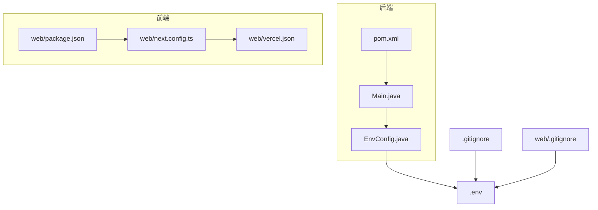
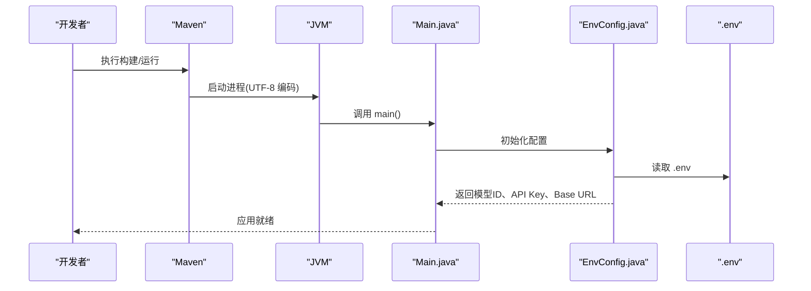
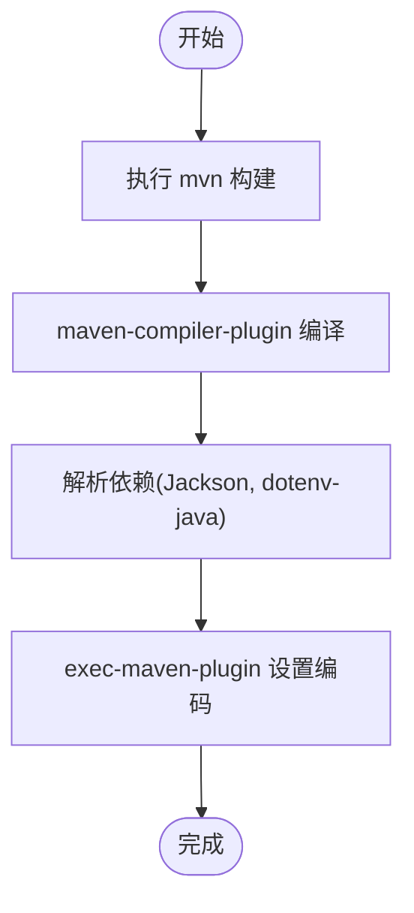
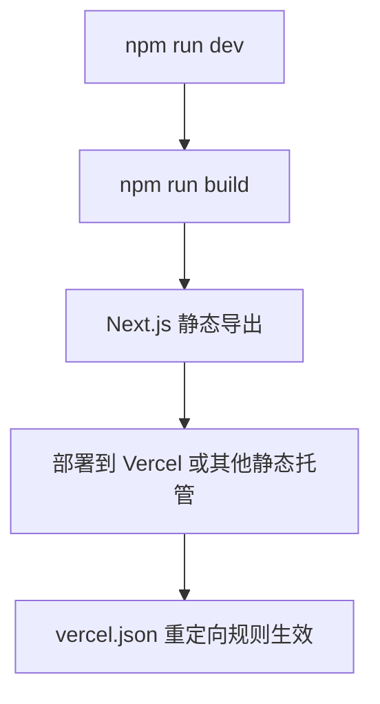
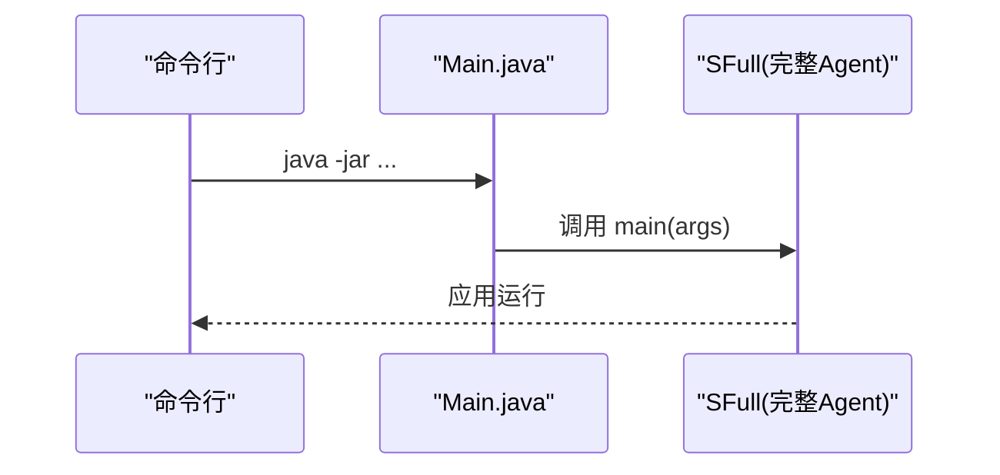
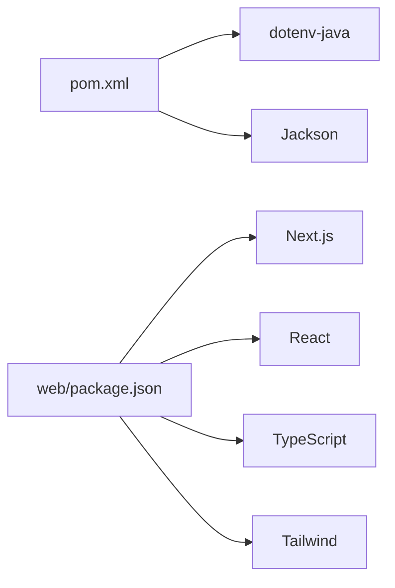

# 部署和配置

<cite>
**本文引用的文件**
- [pom.xml](file://pom.xml)
- [Main.java](file://src/main/java/com/learnclaudecode/Main.java)
- [EnvConfig.java](file://src/main/java/com/learnclaudecode/common/EnvConfig.java)
- [.env](file://.env)
- [.gitignore](file://.gitignore)
- [web/.gitignore](file://web/.gitignore)
- [package.json](file://web/package.json)
- [next.config.ts](file://web/next.config.ts)
- [vercel.json](file://web/vercel.json)
- [README.md](file://web/README.md)
</cite>

## 更新摘要
**所做更改**
- 增强了安全考虑部分，重点关注 .env 文件在版本控制中的跟踪问题
- 添加了生产环境部署的最佳实践，包括适当的密钥管理
- 更新了环境变量管理的详细说明和安全建议
- 强化了 CI/CD 流水线中的敏感信息处理指南

## 目录
1. [简介](#简介)
2. [项目结构](#项目结构)
3. [核心组件](#核心组件)
4. [架构总览](#架构总览)
5. [详细组件分析](#详细组件分析)
6. [依赖分析](#依赖分析)
7. [性能考虑](#性能考虑)
8. [故障排查指南](#故障排查指南)
9. [结论](#结论)
10. [附录](#附录)

## 简介
本指南面向生产环境的构建、部署与环境配置，覆盖以下方面：
- Maven 后端构建与依赖管理
- Next.js 前端静态导出与 Vercel 部署
- **增强的环境变量与安全配置最佳实践**
- Docker 容器化方案（建议）
- CI/CD 流水线（建议）

本项目包含：
- Java 后端：基于 Maven 的命令行应用，读取 .env 与系统环境变量，启动完整 Agent 能力入口。
- Web 前端：Next.js 静态站点导出，配合 Vercel 进行托管与路由重定向。

## 项目结构
- 根目录
  - pom.xml：Maven 工程描述、依赖与插件配置
  - src/main/java：Java 源码，入口 Main.java 调用完整 Agent 实现
  - web：Next.js 前端工程
    - package.json：脚本与依赖
    - next.config.ts：静态导出与路径后缀等配置
    - vercel.json：Vercel 重定向规则
    - README.md：本地开发与部署说明
  - **.env：本地开发环境变量（⚠️ 需添加到 .gitignore）**
  - .gitignore：排除敏感与生成文件
  - web/.gitignore：前端项目的忽略规则（已正确配置）



**图示来源**
- [pom.xml:1-68](file://pom.xml#L1-L68)
- [Main.java:1-15](file://src/main/java/com/learnclaudecode/Main.java#L1-L15)
- [EnvConfig.java:1-96](file://src/main/java/com/learnclaudecode/common/EnvConfig.java#L1-L96)
- [package.json:1-39](file://web/package.json#L1-L39)
- [next.config.ts:1-10](file://web/next.config.ts#L1-L10)
- [vercel.json:1-21](file://web/vercel.json#L1-L21)
- [.env:1-10](file://.env#L1-L10)
- [.gitignore:1-8](file://.gitignore#L1-L8)
- [web/.gitignore:33-34](file://web/.gitignore#L33-L34)

**章节来源**
- [pom.xml:1-68](file://pom.xml#L1-L68)
- [Main.java:1-15](file://src/main/java/com/learnclaudecode/Main.java#L1-L15)
- [EnvConfig.java:1-96](file://src/main/java/com/learnclaudecode/common/EnvConfig.java#L1-L96)
- [package.json:1-39](file://web/package.json#L1-L39)
- [next.config.ts:1-10](file://web/next.config.ts#L1-L10)
- [vercel.json:1-21](file://web/vercel.json#L1-L21)
- [.env:1-10](file://.env#L1-L10)
- [.gitignore:1-8](file://.gitignore#L1-L8)
- [web/.gitignore:33-34](file://web/.gitignore#L33-L34)

## 核心组件
- Maven 构建与运行
  - 使用 maven-compiler-plugin 编译 Java 17 源码
  - 使用 exec-maven-plugin 设置 UTF-8 编码的系统属性，确保日志与输出一致
- 环境变量加载
  - EnvConfig 优先从系统环境变量读取，其次回退到 .env；缺失必填项时抛出异常
  - 支持 ANTHROPIC_API_KEY、ANTHROPIC_BASE_URL、MODEL_ID
- 前端构建与部署
  - Next.js 配置为静态导出 output: export，并启用 trailingSlash
  - 通过 vercel.json 定义域名重定向与默认语言跳转

**章节来源**
- [pom.xml:37-66](file://pom.xml#L37-L66)
- [EnvConfig.java:22-58](file://src/main/java/com/learnclaudecode/common/EnvConfig.java#L22-L58)
- [next.config.ts:3-7](file://web/next.config.ts#L3-L7)
- [vercel.json:1-21](file://web/vercel.json#L1-L21)

## 架构总览
后端以命令行方式启动，读取环境配置后进入 Agent 主循环；前端为静态站点，部署至 Vercel，并通过重定向将特定域名流量转发到目标站点。



**图示来源**
- [pom.xml:37-66](file://pom.xml#L37-L66)
- [Main.java:1-15](file://src/main/java/com/learnclaudecode/Main.java#L1-L15)
- [EnvConfig.java:22-58](file://src/main/java/com/learnclaudecode/common/EnvConfig.java#L22-L58)
- [.env:1-10](file://.env#L1-L10)

## 详细组件分析

### Maven 构建与依赖管理
- 编译器与版本
  - 指定 Java 17 源与目标版本
  - 统一项目编码为 UTF-8
- 依赖
  - dotenv-java：用于读取 .env
  - Jackson：JSON 序列化/反序列化
- 插件
  - maven-compiler-plugin：编译阶段
  - exec-maven-plugin：运行时设置 UTF-8 相关系统属性，保证控制台输出一致性



**图示来源**
- [pom.xml:12-35](file://pom.xml#L12-L35)
- [pom.xml:37-66](file://pom.xml#L37-L66)

**章节来源**
- [pom.xml:12-35](file://pom.xml#L12-L35)
- [pom.xml:37-66](file://pom.xml#L37-L66)

### 环境变量与配置安全

**重要安全更新** ⚠️

当前项目存在严重的安全风险：**根目录的 `.gitignore` 文件没有忽略 `.env` 文件**，这意味着敏感的环境变量可能被提交到版本控制系统中。

#### 环境变量优先级机制
- 系统环境变量 > .env 文件
- 这种设计允许在 CI/CD 环境中覆盖本地配置

#### 安全最佳实践

**立即修复措施：**
1. **添加 .env 到根目录的 .gitignore**
   ```
   # 在根目录 .gitignore 中添加
   .env
   .env.local
   .env.*.local
   ```

2. **检查并提交历史中的敏感信息**
   - 如果 .env 已被提交，需要清理 Git 历史
   - 轮换所有泄露的 API 密钥

3. **使用环境变量模板**
   - 创建 `.env.example` 作为模板
   - 不包含实际值，只包含变量名和注释

#### 生产环境部署策略

**推荐的环境变量管理方式：**

1. **云平台环境变量注入**
   - Vercel：使用平台设置中的环境变量功能
   - AWS：使用 Systems Manager Parameter Store 或 Secrets Manager
   - Azure：使用 Key Vault
   - Google Cloud：使用 Secret Manager

2. **容器化部署**
   - Docker：使用 `docker run -e` 或 docker-compose secrets
   - Kubernetes：使用 ConfigMap 和 Secret
   - 永远不要将敏感信息打包进镜像

3. **CI/CD 流水线**
   - 使用平台的加密环境变量功能
   - 避免在日志中打印敏感信息
   - 实施最小权限原则


**图示来源**
- [EnvConfig.java:22-58](file://src/main/java/com/learnclaudecode/common/EnvConfig.java#L22-L58)
- [.env:1-10](file://.env#L1-L10)
- [.gitignore:1-8](file://.gitignore#L1-L8)
- [web/.gitignore:33-34](file://web/.gitignore#L33-L34)

**章节来源**
- [EnvConfig.java:22-58](file://src/main/java/com/learnclaudecode/common/EnvConfig.java#L22-L58)
- [.env:1-10](file://.env#L1-L10)
- [.gitignore:1-8](file://.gitignore#L1-L8)
- [web/.gitignore:33-34](file://web/.gitignore#L33-L34)

### Next.js 前端构建与部署
- 构建产物
  - 静态导出 output: export，适合托管于任意静态站点服务
  - 启用 trailingSlash，便于 CDN/网关路由匹配
  - images.unoptimized: true，适配静态导出场景
- 脚本
  - dev：本地开发
  - build：构建生产包
  - start：启动静态服务器（可选）
- Vercel 部署
  - vercel.json 定义域名重定向与默认语言跳转
  - 可通过平台环境变量注入前端所需配置（如 API 基础地址）
- **前端环境变量安全** ✅
  - web/.gitignore 已正确配置忽略 .env* 文件
  - 前端环境变量应通过 Vercel 平台管理



**图示来源**
- [package.json:5-11](file://web/package.json#L5-L11)
- [next.config.ts:3-7](file://web/next.config.ts#L3-L7)
- [vercel.json:1-21](file://web/vercel.json#L1-L21)

**章节来源**
- [package.json:5-11](file://web/package.json#L5-L11)
- [next.config.ts:3-7](file://web/next.config.ts#L3-L7)
- [vercel.json:1-21](file://web/vercel.json#L1-L21)
- [README.md:33-37](file://web/README.md#L33-L37)

### 应用入口与控制流
- 入口类 Main.java 直接委托给完整 Agent 实现，简化启动流程
- 启动后由 EnvConfig 加载配置，后续逻辑由 Agent 子系统驱动



**图示来源**
- [Main.java:1-15](file://src/main/java/com/learnclaudecode/Main.java#L1-L15)

**章节来源**
- [Main.java:1-15](file://src/main/java/com/learnclaudecode/Main.java#L1-L15)

## 依赖分析
- 后端依赖
  - dotenv-java：读取 .env
  - Jackson：JSON 处理
- 前端依赖
  - Next.js、React、TypeScript、Tailwind 等
- 构建工具
  - Maven（后端）、Node/npm（前端）



**图示来源**
- [pom.xml:19-35](file://pom.xml#L19-L35)
- [package.json:13-37](file://web/package.json#L13-L37)

**章节来源**
- [pom.xml:19-35](file://pom.xml#L19-L35)
- [package.json:13-37](file://web/package.json#L13-L37)

## 性能考虑
- 后端
  - 使用 UTF-8 编码避免字符集转换开销
  - 合理设置模型请求参数与重试策略（由上层 Agent 逻辑控制）
- 前端
  - 静态导出减少服务端渲染成本
  - 图片未优化模式适用于静态托管，注意资源体积
  - 合理使用缓存与 CDN 提升首屏速度

[本节为通用指导，不直接分析具体文件]

## 故障排查指南
- 启动时报缺少环境变量
  - 检查 .env 是否存在且包含 MODEL_ID
  - 确认系统环境变量未被错误覆盖
- **安全相关问题** 🔒
  - 如果发现 .env 被提交到仓库，立即轮换所有 API 密钥
  - 检查 Git 历史记录是否包含敏感信息
  - 验证 .gitignore 配置是否正确
- 构建失败
  - 确认 Java 17 已安装且 PATH 正确
  - 网络问题导致依赖下载失败时，检查镜像源
- 前端构建或部署异常
  - 检查 Node 版本与 npm 缓存
  - 确认 vercel.json 重定向规则与域名绑定

**章节来源**
- [EnvConfig.java:22-58](file://src/main/java/com/learnclaudecode/common/EnvConfig.java#L22-L58)
- [pom.xml:37-66](file://pom.xml#L37-L66)
- [package.json:5-11](file://web/package.json#L5-L11)
- [vercel.json:1-21](file://web/vercel.json#L1-L21)

## 结论
- 后端通过 Maven 构建，使用 dotenv 与系统环境变量管理配置，启动简单明确
- 前端采用 Next.js 静态导出，结合 Vercel 重定向规则，易于托管与维护
- **生产环境应严格管理环境变量，遵循最小权限与密钥隔离原则**
- **必须确保 .env 文件不被提交到版本控制系统**
- 建议引入 Docker 与 CI/CD 以提升可重复性与交付效率

[本节为总结性内容，不直接分析具体文件]

## 附录

### 本地快速开始
- 后端
  - 准备 .env 并设置必要变量
  - **确保 .env 不在版本控制中**
  - 使用 Maven 编译与运行
- 前端
  - 安装依赖后执行开发或构建命令
  - 部署到 Vercel 或其他静态托管平台

**章节来源**
- [.env:1-10](file://.env#L1-L10)
- [pom.xml:37-66](file://pom.xml#L37-L66)
- [package.json:5-11](file://web/package.json#L5-L11)
- [README.md:3-15](file://web/README.md#L3-L15)

### 生产环境配置最佳实践

**🔒 安全配置增强**

1. **环境变量管理**
   - 使用平台或编排系统的密钥管理服务注入敏感信息
   - 区分不同环境（开发/测试/生产）的配置
   - **立即修复：将 .env 添加到根目录的 .gitignore**

2. **安全配置**
   - **禁止提交 .env 到版本库**（当前配置不完整）
   - 限制对外访问与最小权限原则
   - 定期轮换 API 密钥
   - 使用 HTTPS 传输敏感数据

3. **性能优化**
   - 开启 CDN 缓存静态资源
   - 对大资源进行压缩与懒加载

### Docker 容器化方案（建议）
- 多阶段构建
  - 第一阶段：使用 Maven 构建后端 JAR
  - 第二阶段：使用精简镜像运行应用
- **环境变量注入**
  - 通过 docker run -e 或编排平台注入
  - **不要在 Dockerfile 中硬编码敏感信息**
- 示例步骤（概念性）
  - 构建后端镜像
  - 构建前端静态资源并放入 Nginx 镜像（如需）
  - 编排服务并暴露端口

### CI/CD 流水线（建议）
- 触发条件
  - 推送至主干或创建合并请求
- **安全增强任务**
  - 扫描代码中的敏感信息
  - 验证 .gitignore 配置
  - 检查是否有 .env 文件被意外提交
- 常规任务
  - 后端：Maven 构建与单元测试
  - 前端：安装依赖、构建静态资源
  - 制品：打包镜像或上传静态资源
  - 部署：发布到预发/生产环境

[本节为概念性指导，不直接映射到具体代码文件]

### 紧急安全修复步骤

**如果发现 .env 文件已被提交到版本控制：**

1. **立即轮换所有 API 密钥**
   - 访问 https://console.anthropic.com/ 获取新的 API 密钥
   - 更新所有使用旧密钥的服务

2. **清理 Git 历史**
   ```bash
   # 移除 .env 文件的历史记录
   git filter-branch --force --index-filter \
     'git rm --cached --ignore-unmatch .env' \
     --prune-empty --tag-name-filter cat -- --all
   
   # 强制推送到远程仓库
   git push --force --all
   git push --force --tags
   ```

3. **更新 .gitignore**
   ```
   # 在根目录 .gitignore 中添加
   .env
   .env.local
   .env.*.local
   *.env
   ```

4. **通知团队成员**
   - 要求所有克隆仓库的开发者重新拉取最新代码
   - 提醒他们更新本地环境变量配置

**章节来源**
- [.env:1-10](file://.env#L1-L10)
- [.gitignore:1-8](file://.gitignore#L1-L8)
- [web/.gitignore:33-34](file://web/.gitignore#L33-L34)