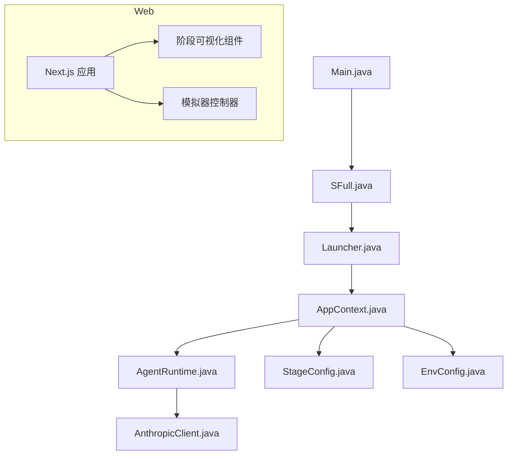
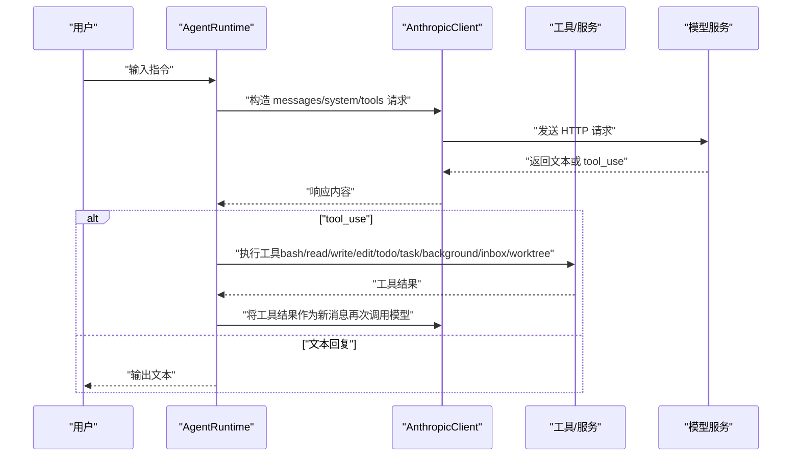
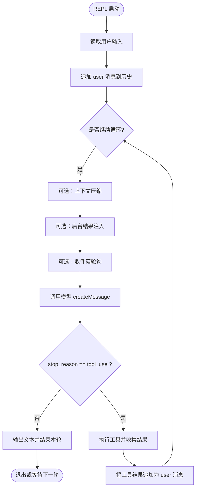
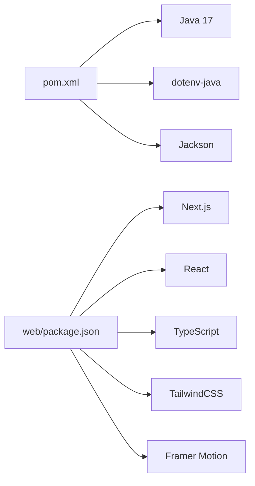

# 项目概述

<cite>
**本文引用的文件**
- [pom.xml](file://pom.xml)
- [Main.java](file://src/main/java/com/learnclaudecode/Main.java)
- [Launcher.java](file://src/main/java/com/learnclaudecode/agents/Launcher.java)
- [SFull.java](file://src/main/java/com/learnclaudecode/agents/SFull.java)
- [AppContext.java](file://src/main/java/com/learnclaudecode/agents/AppContext.java)
- [StageConfig.java](file://src/main/java/com/learnclaudecode/agents/StageConfig.java)
- [AgentRuntime.java](file://src/main/java/com/learnclaudecode/agents/AgentRuntime.java)
- [AnthropicClient.java](file://src/main/java/com/learnclaudecode/common/AnthropicClient.java)
- [EnvConfig.java](file://src/main/java/com/learnclaudecode/common/EnvConfig.java)
- [web/package.json](file://web/package.json)
- [web/README.md](file://web/README.md)
</cite>

## 目录
1. [简介](#简介)
2. [项目结构](#项目结构)
3. [核心组件](#核心组件)
4. [架构总览](#架构总览)
5. [详细组件分析](#详细组件分析)
6. [依赖关系分析](#依赖关系分析)
7. [性能考量](#性能考量)
8. [故障排查指南](#故障排查指南)
9. [结论](#结论)
10. [附录：快速开始](#附录快速开始)

## 简介
Learn Claude Code Java 是一个渐进式 AI Agent 学习框架，通过 12 个递进的学习阶段，从最基础的“Agent 循环”逐步演进到复杂的多代理协作与任务隔离系统。后端基于 Java 17，提供交互式 REPL 运行环境与可扩展的工具调用机制；前端采用 Next.js（React + TypeScript），提供 Web 可视化界面、分步模拟器与各阶段架构图示，帮助初学者直观理解 Agent 的运行流程，同时为有经验的开发者提供清晰的技术细节与扩展点。

该项目的核心思想是：同一个 Agent 运行时，在不同阶段通过配置开关逐步启用更多能力（如工具集、Todo 规划、上下文压缩、后台任务、团队通信、自治队友、Worktree 隔离等），从而以最小认知成本掌握 Claude Code 风格的 Agent 设计与实现。

## 项目结构
- 后端（Java）
  - 入口与启动器：Main、Launcher、SFull
  - 应用装配：AppContext（集中创建共享服务）
  - 阶段配置：StageConfig（定义各阶段的能力开关与工具集）
  - 运行时：AgentRuntime（实现主循环、工具调度、消息历史管理）
  - 模型客户端：AnthropicClient（HTTP 调用 Anthropic-compatible API）
  - 环境配置：EnvConfig（读取 .env 与环境变量）
  - 其他模块：tools、tasks、team、context、skills、background 等
- 前端（Next.js）
  - 可视化与模拟器：按阶段拆分的可视化组件与场景数据
  - 交互控制：播放/暂停/步进/速度调节
  - 构建与脚本：extract、dev、build、start

图表来源
- [Main.java:5-13](file://src/main/java/com/learnclaudecode/Main.java#L5-L13)
- [SFull.java:3-11](file://src/main/java/com/learnclaudecode/agents/SFull.java#L3-L11)
- [Launcher.java:11-26](file://src/main/java/com/learnclaudecode/agents/Launcher.java#L11-L26)
- [AppContext.java:16-68](file://src/main/java/com/learnclaudecode/agents/AppContext.java#L16-L68)
- [AgentRuntime.java:23-39](file://src/main/java/com/learnclaudecode/agents/AgentRuntime.java#L23-L39)
- [AnthropicClient.java:15-26](file://src/main/java/com/learnclaudecode/common/AnthropicClient.java#L15-L26)
- [StageConfig.java:11-25](file://src/main/java/com/learnclaudecode/agents/StageConfig.java#L11-L25)
- [EnvConfig.java:9-29](file://src/main/java/com/learnclaudecode/common/EnvConfig.java#L9-L29)
- [web/package.json:1-39](file://web/package.json#L1-L39)

章节来源
- [pom.xml:1-68](file://pom.xml#L1-L68)
- [web/README.md:1-37](file://web/README.md#L1-L37)

## 核心组件
- 统一入口与启动器
  - Main：默认以完整能力版本作为应用入口
  - SFull：启动完整能力版本
  - Launcher：统一启动器，避免重复初始化，将 StageConfig 交给运行时执行
- 应用装配器
  - AppContext：集中创建并注入共享服务（命令工具、Todo、技能加载、上下文压缩、任务管理、后台任务、消息总线、队友管理、Worktree 等），最终组装 AgentRuntime
- 阶段配置
  - StageConfig：定义每个阶段的 system prompt、工具集、能力开关（Todo 提醒、上下文压缩、后台任务、收件箱、子代理可写、自治队友等），并提供 s01-s12 与 s_full 的构建方法
- 运行时
  - AgentRuntime：实现 REPL 交互与 Agent 主循环，负责消息历史维护、模型调用、工具调度、后台结果注入、收件箱轮询、手动/自动上下文压缩、子代理执行等
- 模型客户端
  - AnthropicClient：封装 HTTP 请求，构造 messages API 负载，支持兼容端点与认证头
- 环境配置
  - EnvConfig：读取 MODEL_ID、ANTHROPIC_API_KEY、ANTHROPIC_BASE_URL 与工作目录，支持 .env 与系统环境变量覆盖

章节来源
- [Main.java:5-13](file://src/main/java/com/learnclaudecode/Main.java#L5-L13)
- [SFull.java:3-11](file://src/main/java/com/learnclaudecode/agents/SFull.java#L3-L11)
- [Launcher.java:11-26](file://src/main/java/com/learnclaudecode/agents/Launcher.java#L11-L26)
- [AppContext.java:16-68](file://src/main/java/com/learnclaudecode/agents/AppContext.java#L16-L68)
- [StageConfig.java:11-301](file://src/main/java/com/learnclaudecode/agents/StageConfig.java#L11-L301)
- [AgentRuntime.java:23-351](file://src/main/java/com/learnclaudecode/agents/AgentRuntime.java#L23-L351)
- [AnthropicClient.java:15-103](file://src/main/java/com/learnclaudecode/common/AnthropicClient.java#L15-L103)
- [EnvConfig.java:9-96](file://src/main/java/com/learnclaudecode/common/EnvConfig.java#L9-L96)

## 架构总览
整体架构分为三层：
- 表现层（Web）：Next.js 应用提供可视化与模拟器，展示各阶段执行流程与关键概念
- 控制层（AgentRuntime）：统一的主循环与工具调度，驱动“用户输入 -> 模型推理 -> 工具执行 -> 反馈”的闭环
- 基础设施层（EnvConfig、AnthropicClient、工具与服务）：环境配置、模型网关、命令执行、任务管理、后台任务、消息总线、队友管理、Worktree 等

图表来源
- [AgentRuntime.java:97-261](file://src/main/java/com/learnclaudecode/agents/AgentRuntime.java#L97-L261)
- [AnthropicClient.java:52-101](file://src/main/java/com/learnclaudecode/common/AnthropicClient.java#L52-L101)

## 详细组件分析

### 启动链路与运行时
- 启动链路
  - Main 调用 SFull.main
  - SFull 使用 Launcher.launch(StageConfig.sFull())
  - Launcher 创建 AppContext 并调用 runtime().runRepl(config)
- 运行时主循环
  - runRepl：读取用户输入，追加到消息历史，进入 agentLoop
  - agentLoop：根据配置进行上下文压缩、后台结果注入、收件箱轮询，调用模型，解析 tool_use 并执行对应工具，将结果回写消息历史，直到模型停止调用工具

图表来源
- [AgentRuntime.java:97-261](file://src/main/java/com/learnclaudecode/agents/AgentRuntime.java#L97-L261)

章节来源
- [Main.java:5-13](file://src/main/java/com/learnclaudecode/Main.java#L5-L13)
- [SFull.java:3-11](file://src/main/java/com/learnclaudecode/agents/SFull.java#L3-L11)
- [Launcher.java:11-26](file://src/main/java/com/learnclaudecode/agents/Launcher.java#L11-L26)
- [AgentRuntime.java:97-261](file://src/main/java/com/learnclaudecode/agents/AgentRuntime.java#L97-L261)

### 阶段配置与能力演进
- 基础能力
  - s01：最小闭环，仅 bash 工具
  - s02：加入文件读写编辑工具
  - s03：引入 TodoWrite，辅助多步骤任务规划
- 高级机制
  - s04：子代理（task），分治复杂问题
  - s05：技能加载（load_skill），动态注入领域知识
  - s06：上下文压缩（compact），解决长对话窗口限制
  - s07：任务系统（task_create/update/list/get），结构化工作流
  - s08：后台任务（background_run/check），异步执行与状态查询
  - s09：多 Agent 协作（spawn_teammate/send_message/read_inbox/broadcast）
  - s10：团队协议（shutdown_request/plan_approval）
  - s11：自治队友（claim_task/idle），主动认领任务
  - s12：Worktree 隔离（worktree_create/list/remove/events），任务级目录隔离
- 完整版本
  - s_full：合并上述能力，打开所有开关，形成完整视图

章节来源
- [StageConfig.java:56-301](file://src/main/java/com/learnclaudecode/agents/StageConfig.java#L56-L301)

### 工具调度与执行
- 工具映射
  - 将模型返回的 tool_use 名称映射到本地 Java 实现（bash、read_file、write_file、edit_file、todo、task、load_skill、compact、background_*、task_*、spawn_teammate、send_message、read_inbox、broadcast、shutdown_request、plan_approval、claim_task、idle、worktree_*）
- 执行策略
  - 工具执行后生成 tool_result，重新注入消息历史，供模型下一轮决策
  - 支持容错解析（数字/字符串字段兼容）

章节来源
- [AgentRuntime.java:177-261](file://src/main/java/com/learnclaudecode/agents/AgentRuntime.java#L177-L261)

### 模型客户端与环境配置
- 模型客户端
  - 构造 payload：model、max_tokens、messages、system、tools
  - 发送 HTTP 请求至 /v1/messages，支持兼容端点与多种认证头
  - 错误处理：非 2xx 直接抛出异常，便于调试
- 环境配置
  - 读取 MODEL_ID、ANTHROPIC_API_KEY、ANTHROPIC_BASE_URL 与工作目录
  - 优先级：系统环境变量 > .env

章节来源
- [AnthropicClient.java:52-101](file://src/main/java/com/learnclaudecode/common/AnthropicClient.java#L52-L101)
- [EnvConfig.java:22-96](file://src/main/java/com/learnclaudecode/common/EnvConfig.java#L22-L96)

### Web 可视化与模拟器
- 可视化组件
  - 按阶段拆分（s01-s12），懒加载渲染
  - 提供架构图、设计决策、执行流、消息流等可视化
- 模拟器
  - 场景数据：每个阶段对应的步骤序列
  - 控制器：播放/暂停/步进/重置/速度调节
  - 钩子：useSimulator、useSteppedVisualization 管理状态与动画

章节来源
- [web/src/components/visualizations/index.tsx:1-39](file://web/src/components/visualizations/index.tsx#L1-L39)
- [web/src/components/simulator/agent-loop-simulator.tsx:1-96](file://web/src/components/simulator/agent-loop-simulator.tsx#L1-L96)
- [web/src/hooks/useSimulator.ts:1-53](file://web/src/hooks/useSimulator.ts#L1-L53)
- [web/src/hooks/useSteppedVisualization.ts:1-53](file://web/src/hooks/useSteppedVisualization.ts#L1-L53)

## 依赖关系分析
- 后端依赖
  - Maven 编译目标 Java 17
  - 依赖 dotenv-java（环境配置）、Jackson（JSON 序列化/反序列化）
- 前端依赖
  - Next.js、React、TypeScript、TailwindCSS、Framer Motion、rehype/remark 系列（文档渲染）
- 组件耦合
  - AppContext 集中装配，降低耦合度
  - AgentRuntime 依赖多个服务，但通过接口化服务保持内聚
  - StageConfig 解耦能力开关与工具集，便于教学演进

图表来源
- [pom.xml:12-35](file://pom.xml#L12-L35)
- [web/package.json:13-37](file://web/package.json#L13-L37)

章节来源
- [pom.xml:12-35](file://pom.xml#L12-L35)
- [web/package.json:13-37](file://web/package.json#L13-L37)

## 性能考量
- 上下文压缩
  - 自动压缩阈值触发，减少消息历史长度，降低 token 消耗与延迟
  - 手动压缩可在关键节点立即生效
- 后台任务
  - 长时间命令在后台线程执行，不阻塞主循环
  - 结果通过通知机制注入主上下文，避免丢失
- 工具去重与合并
  - 多阶段合并时按工具名去重，避免重复定义带来的冗余
- 网络超时与重试
  - HTTP 客户端设置连接与请求超时，提升稳定性

[本节为通用指导，无需特定文件引用]

## 故障排查指南
- 环境变量缺失
  - 检查 MODEL_ID、ANTHROPIC_API_KEY、ANTHROPIC_BASE_URL 是否正确配置
  - 确认 .env 文件或系统环境变量已生效
- 模型调用失败
  - 查看 HTTP 状态码与响应体，定位兼容端点差异
  - 确认认证头格式（x-api-key、authorization）
- 工具执行异常
  - 检查工具参数类型与必填字段
  - 关注日志中工具名与输出前缀，定位具体工具
- 前端模拟器无显示
  - 确认场景数据已正确加载
  - 检查浏览器控制台是否有模块加载错误

章节来源
- [EnvConfig.java:22-58](file://src/main/java/com/learnclaudecode/common/EnvConfig.java#L22-L58)
- [AnthropicClient.java:74-101](file://src/main/java/com/learnclaudecode/common/AnthropicClient.java#L74-L101)
- [AgentRuntime.java:177-261](file://src/main/java/com/learnclaudecode/agents/AgentRuntime.java#L177-L261)

## 结论
Learn Claude Code Java 通过清晰的分层与模块化设计，将复杂的 Agent 行为拆解为可学习的阶段。后端以 AgentRuntime 为核心，结合 StageConfig 的能力开关，实现了从简单循环到多代理协作的渐进式演进；前端以可视化与模拟器增强理解，使初学者能够直观把握 Agent 的运行机制。该项目既适合入门学习，也为有经验开发者提供了可扩展的实践平台。

[本节为总结性内容，无需特定文件引用]

## 附录：快速开始
- 环境要求
  - Java 17（Maven 构建）
  - Node.js（用于前端开发）
  - 有效的 Anthropic API Key 与模型 ID
- 安装步骤
  - 克隆仓库
  - 配置环境变量（MODEL_ID、ANTHROPIC_API_KEY、ANTHROPIC_BASE_URL）
  - 后端：使用 Maven 编译并运行 Main
  - 前端：进入 web 目录，安装依赖并启动开发服务器
- 基本使用方法
  - 运行后端 REPL，输入指令观察 Agent 行为
  - 访问前端可视化页面，选择不同阶段查看执行流程与架构图
  - 使用模拟器逐步演示各阶段的关键步骤

章节来源
- [pom.xml:12-17](file://pom.xml#L12-L17)
- [EnvConfig.java:22-58](file://src/main/java/com/learnclaudecode/common/EnvConfig.java#L22-L58)
- [web/README.md:3-17](file://web/README.md#L3-L17)